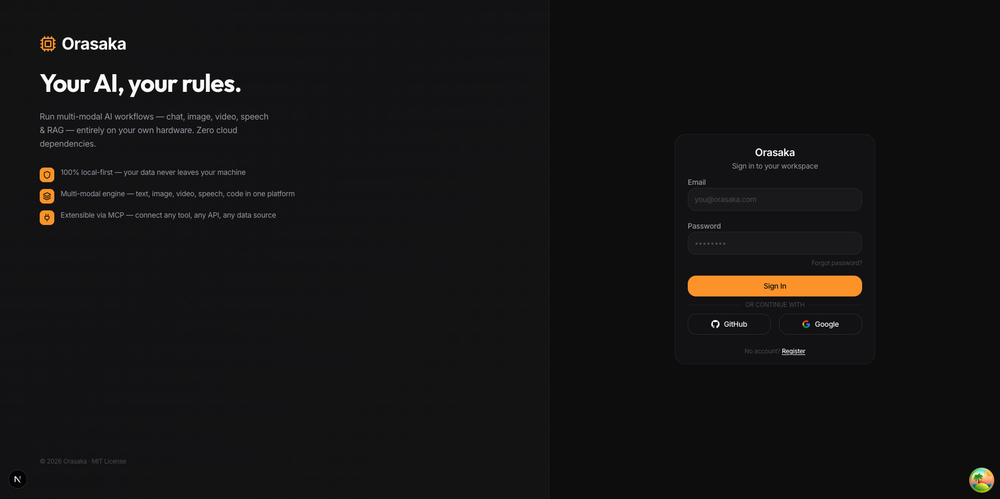

# 🚧 Under Construction / En cours de construction 🚧

> [!WARNING]
> **This repository is currently under active construction.**

<p align="center">
  
</p>

<p align="center">
  <strong>Production-grade, multi-modal AI orchestration engine for Java 21.</strong><br/>
  Chat · Image · Video · Speech · RAG · Automations · Feature-to-Code · Tool Calling · MCP — all running locally.
</p>

<p align="center">
  
  <a href="https://sonarcloud.io/dashboard?id=oussamaABID_orasaka"></a>
  
  
</p>

---

## ✨ Product Vision

Orasaka is a premier, enterprise-grade multi-agent orchestration framework designed for uncompromising privacy and on-device execution. Built on a resilient Java 21 core, it seamlessly unifies complex agentic logic with our flagship localized, hardware-accelerated video generation pipeline, empowering teams to build sovereign AI solutions without external cloud dependencies.

---

## 📊 Production Inference Showcase

Experience real-time, local generation seamlessly integrated into our Next.js Server-Driven UI, backed by our real infrastructure executing physical proofs.

### 1. The 4.0-Second Cinematic Video Pipeline (AnimateDiff-Lightning)
Our Python worker leverages Metal Performance Shaders (MPS) to render high-fidelity, temporal 3D attention directly on Apple Silicon unified memory in record time.

<div align="center">
  <video src="https://github.com/user-attachments/assets/4a643384-358b-4b6d-b02f-1a4c037bbc0b" autoplay loop muted playsinline controls width="100%" style="max-width: 600px;"></video>
</div>

### 2. High-Fidelity Image Generation (Stable Diffusion 1.5)
Orasaka's optimized inference engine produces production-grade imagery natively on MPS without OOM failures.
<p align="center">
  
</p>

### 3. Next.js UI Agentic Workflow
The dynamic React interface acts as a robust BFF proxy, securely channeling requests to the backend orchestration pipeline while visualizing intermediate reasoning steps.
<p align="center">
  
</p>

---

## 🎨 Media Generation Prompts & Proofs

Every piece of media generated by Orasaka comes with an attached `prompt.md` documenting the exact context, seed, and models used for transparency and reproducibility. Check out our real outputs:

- **[Video Generation Example](docs/assets/orasaka/output/video/animatediff-lightning/diffusers-pytorch/prompt.md)** - Review the exact prompt instructions and configuration used to render the cinematic cyberpunk sequence on Apple Silicon.
- **[High-Fidelity Image Example](docs/assets/orasaka/output/image/sd-1.5/stable-diffusion-cpp/prompt.md)** - See the raw AI prompt and parameters that generated the photorealistic cityscape natively on MPS.

---

## 📚 Documentation Index

Orasaka’s documentation is structured to provide deep technical clarity for architects, integrators, and open-source contributors. We maintain this explicit index to guarantee zero dead links across our architectural repository.

| System Module | Documentation File | Architectural Purpose |
| :--- | :--- | :--- |
| **Core Architecture** | [`docs/ARCHITECTURE.md`](docs/ARCHITECTURE.md) / [`docs/CORE.md`](docs/CORE.md) | Spring Boot multi-agent orchestration, gateway topology & persistence. |
| **Automated Agents** | [`docs/AUTOMATION.md`](docs/AUTOMATION.md) / [`AGENTS.md`](AGENTS.md) | Autonomous task execution, local agent protocols, and event loops. |
| **Model Ingestion** | [`docs/MODELS.md`](docs/MODELS.md) / [`docs/CONTEXT.md`](docs/CONTEXT.md) | MLX/MPS native tensor memory allocation bounds & context windows. |
| **Deployment Matrix** | [`docs/DEPLOY.md`](docs/DEPLOY.md) / [`docs/END2END_TEST.md`](docs/END2END_TEST.md) | Docker environment variables, local script configurations & E2E playbooks. |
| **Security & Specs** | [`docs/AUTH.md`](docs/AUTH.md) / [`docs/GLOSSARY.md`](docs/GLOSSARY.md) | JWT/Interceptors security layer and internal domain terminology dictionary. |

---

## ⚡ Quick Start (3 Commands)

Get the entire multi-modal AI stack running locally in seconds. Our bootstrap script handles environment purging, container initialization, and worker spawning.

```bash
# 1. Clone the repository and establish the environment master template
git clone https://github.com/your-org/orasaka.git && cd orasaka && cp exemple.env.txt .env

# 2. Purge old state, validate JDK/Python dependencies, and initialize the stack
./ops/local/scripts/start.sh

# 3. Query the unified Gateway (via curl or our dedicated CLI)
curl -X POST http://localhost:8080/api/v1/chat/stream \
  -H "Content-Type: application/json" \
  -H "Authorization: Bearer <token>" \
  -d '{"prompt": "Generate a 4-second cinematic cyberpunk sequence."}'
```

---

## 🚀 Key Platform Features

- **Hybrid Orchestration:** A 9-stage context matrix dynamically processes RAG, system state, and tool integrations (MCP) before routing requests.
- **Asynchronous Workers:** Heavy workloads like batch processing or video generation are decoupled via RabbitMQ and Quartz.
- **Feature-to-Code:** Real-time generation of production-grade implementations streamed via Server-Sent Events (SSE).
- **Zero-Trust BFF Security:** The Next.js frontend securely proxies to the core Java backend without exposing internal LLM ports.
- **Hardware Optimized:** The Python workers are fine-tuned to leverage Apple Metal (MPS) and CUDA for maximum performance without OOM failures.

---

## 🤝 Contributing

We welcome contributions from the enterprise open-source community!
1. Open an issue on GitHub.
2. Wait for a Maintainer to assign it to you.
3. Fix the issue according to the standards outlined in our [Governance Contract](AGENTS.md).
4. Submit a Pull Request.

---

<p align="center">
  Built with ❤️ using Java 21, Spring AI, and a lot of Virtual Threads.
</p>
