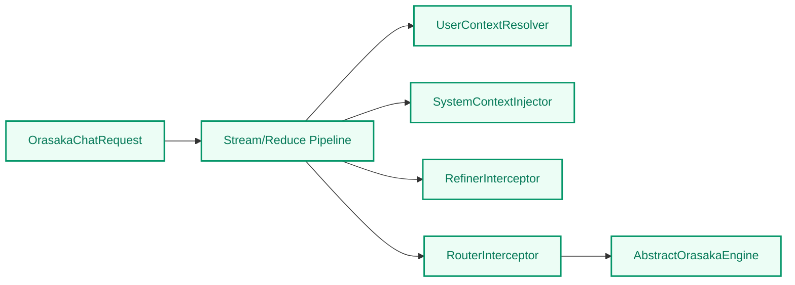

# ORASAKA - Native IA Orchestration Engine



> **Precision in Implementation. Intelligence through Decoupling.**

Orasaka is a professional-grade Java solution based on Spring, architected for **Multi-Session & Multi-Modal Context Memory**. It enforces strict domain isolation, stateless library design, and high-concurrency execution via Java 21 Virtual Threads.

---

## 📚 Documentation

| Document | Description |
| :--- | :--- |
| [Architecture Reference](docs/ARCHITECTURE.md) | Complete system architecture, BFF topology, and cognitive engine flows |
| [API Reference](docs/API_REFERENCE.md) | Full specification of public types, facades, and engine abstractions |
| [Glossary](docs/GLOSSARY.md) | Definitions of all ecosystem terms and design patterns |
| [Architectural Decisions (ADR)](docs/CONTEXT.md) | Architectural Decision Records governing the platform |

---

## 🗺️ Ecosystem Feature Matrix

- **Agentic Orchestration Framework (Satsui Engine)**: Multi-agent workflow scheduling, programmatic dynamic routing, and standard Model Context Protocol (MCP) server compliance mappings.
- **Sovereign LLM Core Processing**: 100% offline text-to-text inference backed by local Ollama clusters running Llama 3.1 8B parameter models.
- **Bare-Metal Multi-Modal Execution Layer**:
  - **Text-to-Image Engine**: Native C++ `stable-diffusion.cpp` compiler stack accelerating SD 1.5 tensors over Apple Silicon Metal (Port `8085`).
  - **Text-to-Video Engine**: Native C++ DiT runner running optimized LTX-Video layers over Apple Unified Memory architectures (Port `8086`).
- **Decoupled Architecture Stack**: High-efficiency Java Spring Boot 3.x backend infrastructure integrated with a type-safe Next.js / Tailwind CSS reactive workspace canvas (`orasaka-ui`).

---

## 🏛️ Multi-Module Blueprint

| Module | Role |
| :--- | :--- |
| **`orasaka-parent`** | Root BOM. Manages centralized dependency versions (Spring Boot 3.5, Spring AI 1.1.6, Java 21). |
| **`orasaka-core`** | Pure AI Orchestration Engine. Stateless library, Bridge Pattern 2.0. No Spring Boot starters allowed. |
| **`orasaka-identity`** | User management, RBAC, and cross-modality security contracts via Java 21 Sealed Interfaces. |
| **`orasaka-tools`** | Concrete implementations of MCP orchestrators and Function Tool registries. Depends on `orasaka-core`. |
| **`orasaka-gateway`** | GraphQL BFF (Spring Boot 3.5). Merges context from Identity and Core; streams results to UI and CLI. |
| **`orasaka-ui`** | Next.js frontend application (BFF pattern). Routes client chat streams and queries. |
| **`orasaka-cli`** | Node.js/TypeScript terminal client. Authenticates via JWT/UUID credentials and consumes SSE streams. |

> **Dependency Flow**:
>
> - `orasaka-core` → `orasaka-identity`
> - `orasaka-tools` → `orasaka-gateway`
>
> Strictly unidirectional. No circular dependencies.

## 📁 Repository Layout

```text
orasaka/
├── ops/                     # DevOps, infrastructure, scripts, and testing assets
│   ├── docker/              # Docker Compose and container orchestration configs
│   │   └── docker-compose.yml
│   ├── http/                # REST/GraphQL environment test files
│   │   └── orasaka.http
│   ├── postgres/            # Relational database migration and seeding scripts
│   │   └── init/
│   │       ├── 01-schema.sql
│   │       └── 02-data.sql
│   └── scripts/             # Operational automation scripts (e.g. bootstrap)
│       └── setup.sh
├── orasaka-core/            # Pure AI Orchestration Engine (Bridge Pattern 2.0)
├── orasaka-gateway/         # Spring Boot BFF Routing & Streaming orchestrator
├── orasaka-identity/        # User Authentication and Identity domain module
├── orasaka-tools/           # MCP Integration and Concrete Tool registry
├── orasaka-ui/              # Next.js Front-End Client App
└── orasaka-cli/             # TS Node Terminal Client
```

---

## 🏢 Building on Orasaka: The Business Layer

Orasaka is built to be an **enabler framework**. When implementing a new business venture or a unique domain use-case (e.g., cross-platform media recommendation engines, automated market research tools, or financial analysts), you do not alter the stateless `orasaka-core`.

Instead, you implement a dedicated vertical domain. The business recipe always follows a 3-step pipeline:

1. **Context & Profile Extraction**: Let `orasaka-identity` resolve who the customer is and what their explicit preferences are (e.g., favorite streaming services, language, content restrictions).
2. **Agentic Knowledge Retrieval**: Use `orasaka-tools` to connect custom **MCP (Model Context Protocol) Servers** capable of fetching real-time real-world data (e.g., pulling active trending charts from Netflix, Apple TV, or Amazon Prime APIs).
3. **Structured Orchestration**: The AI engine in `orasaka-core` processes the dynamic context, formats the outputs into strict, predictable schemas, and streams tailored, hyper-personalized value back to the `orasaka-ui` or `orasaka-cli`.

> To see a comprehensive blueprint of a real-world startup feature implemented on this framework, read the [Business Implementation Guide](docs/BUSINESS_IMPLEMENTATION.md).

---

## ⚙️ Architectural Mandates

### A. Chat Memory — Session-Based Elasticity

Users can instantiate unlimited independent conversation threads. `orasaka-core` resolves `ChatMemory` state dynamically per `conversationId`, ensuring full multi-tenant session isolation.

### B. Multi-Modal Context Profiles

For non-conversational AI (TTS, Image Generation), request records (e.g., `OrasakaSpeechRequest`) accept an immutable `OrasakaContext` profile carrying user-specific preferences: voice models, speed, and stylistic aspect ratios.

### C. The Decoupling Rule

`orasaka-core` is **stateless**. `orasaka-gateway` is responsible for fetching user profiles from `orasaka-identity`, merging them into an immutable `OrasakaContext`, and injecting that context into the Core Client on every single request.

---

## 🛡️ Technical Standards

| Standard | Enforcement |
| :--- | :--- |
| **Java 21** | Records, Sealed Interfaces, Pattern Matching, and Virtual Threads are mandatory. |
| **Spring AI 1.1.6** | Strictly locked. No version drift permitted via `orasaka-parent` BOM. |
| **No Starter Leaks** | `orasaka-core` must never import `spring-boot-starter` dependencies. |
| **Real-time Streaming** | Gateway stream endpoints use GraphQL Subscriptions or HTTP SSE. |
| **Virtual Threads** | All I/O-intensive and AI-inference tasks run on `Executors.newVirtualThreadPerTaskExecutor()`. |
| **Multi-Tier Cache** | Transparent, passive caching decorator (`CachingToolCallback`) utilizing local Caffeine in-memory store and a persistent PostgreSQL database cache tier. |
| **Asynchronous RAG** | Asynchronous pipeline invoking modular chunkers (`OrasakaChunkingStrategies`) to ingest document metadata into vector storage dynamically via context interceptor executions. |

---

## 🚀 Getting Started (DevX Experience)

### Prerequisites

- **Java 21+** (ensure `JAVA_HOME` points to JDK 21)
- **Maven 3.9+**
- **Node.js 20+** (required for `orasaka-ui` and `orasaka-cli`)
- **Docker Compose** (to spin up auxiliary services)

### 🔐 Pre-seeded Test Credentials

For local development and testing, the database is pre-seeded with the following roles and default credentials:

| Email | Plaintext Password | Authorities / Roles | Default Preferences |
| :--- | :--- | :--- | :--- |
| `admin@orasaka.com` | `admin` | `ROLE_ADMIN` | `{"language":"en", "tts-voice":"alloy", "chat-temperature":0.7}` |
| `user@orasaka.com` | `user` | `ROLE_USER` | `{"language":"en", "tts-voice":"nova", "chat-temperature":0.7}` |
| `guest@orasaka.com` | `guest` | `ROLE_GUEST` | `{"language":"en", "tts-voice":"shimmer", "chat-temperature":0.9}` |

### Local Environment Setup

Run the bundled setup script which validates the JDK, checks for a native Ollama instance, pulls required models, and starts auxiliary containers:

```bash
./ops/scripts/setup.sh
```

> The script will also launch the `pgvector` database and the MCP debug server defined in [docker-compose.yml](ops/docker/docker-compose.yml).
> [!TIP]
> To run Docker containers manually, specify the project name and the configuration file path:

```bash
docker compose -p orasaka -f ops/docker/docker-compose.yml up -d
```

### Local Sovereign AI Image Generation Setup (`stable-diffusion.cpp`)

Orasaka supports 100% sovereign, local image generation via a bare-metal `stable-diffusion.cpp` engine.

1. **Build the `sd-server` binary**:
   Compile `stable-diffusion.cpp` on your target hardware. For Apple Silicon with Metal GPU acceleration:
   ```bash
   git clone --recursive https://github.com/leejet/stable-diffusion.cpp
   cd stable-diffusion.cpp
   mkdir build && cd build
   cmake .. -DSD_METAL=ON
   cmake --build . --config Release --target sd-server
   ```

2. **Download a Model**:
   Download a compatible Stable Diffusion model (e.g., `v1-5-pruned-emaonly.safetensors` in safetensors format) and place it on your machine.

3. **Start the local server**:
   Run the compiled server on port `8085`:
   ```bash
   ./bin/sd-server --listen-port 8085 -m ~/models/stable-diffusion/v1-5-pruned-emaonly.safetensors
   ```

4. **Verify Gateway Integration**:
   The Orasaka gateway is pre-configured to bind the `localai` overrides context pointing directly to `http://localhost:8085`. Ensure connectivity responds:
   ```bash
   curl http://localhost:8085/
   # Returns "Stable Diffusion Server is running"
   ```

### Local Sovereign AI Video Generation Setup (LTX-Video)

Orasaka supports 100% sovereign, local video generation via a bare-metal `sd-server` (built above) loaded with quantized LTX-Video.

1. **Quantized Checkpoint Ingestion**:
   Download the optimized GGUF/Safetensors model checkpoint:
   ```bash
   mkdir -p ~/models/stable-diffusion
   curl -L -o ~/models/stable-diffusion/ltx-video-q4_k_m.safetensors https://huggingface.co/unsloth/LTX-Video-GGUF/resolve/main/ltx-video-v0.9-q4_k_m.safetensors
   ```

2. **Start the local server**:
   Run the compiled server on port `8086`:
   ```bash
   ./bin/sd-server --listen-port 8086 -m ~/models/stable-diffusion/ltx-video-q4_k_m.safetensors
   ```

3. **Verify Gateway Integration**:
   The Orasaka gateway is pre-configured to bind the `localai-video` overrides context pointing directly to `http://localhost:8086`. Ensure connectivity responds:
   ```bash
   curl http://localhost:8086/
   ```

### Quick Start (Local Infrastructure CLI)

To simplify the lifecycle management of our local AI workers (Ollama, Image worker, Video worker), we provide two execution scripts under `ops/scripts/`:

- **Start Infrastructure**: Spin up Ollama and the two `sd-server` instances in the background, verifying port allocation and recording Process IDs (PIDs):
  ```bash
  ./ops/scripts/start.sh
  ```
  This will check and bind:
  - **Ollama Core Client**: Port `11434`
  - **Text-to-Image (Stable Diffusion) Worker**: Port `8085` (logs to `sd-image.log`)
  - **Text-to-Video (LTX-Video) Worker**: Port `8086` (logs to `sd-video.log`)
  - **State Tracking**: Active PIDs are saved in `.orasaka.pid` at the root.

- **Stop Infrastructure**: Gracefully shut down background workers by reading the state file (or running socket inspection as a fallback):
  ```bash
  ./ops/scripts/stop.sh
  ```

### Build & Run All Modules

```bash
mvn clean install
```

### Build a Single Module

For fast iteration on a specific module, e.g. the core library:

```bash
mvn clean install -pl orasaka-core
```

### Run the Gateway locally

```bash
# Build and update dependencies in local repository
mvn clean install

# Launch Gateway
mvn spring-boot:run -pl orasaka-gateway
```

The GraphQL Playground will be available at `http://localhost:8080/graphiql`.

### Run the UI (Next.js BFF) locally

```bash
cd orasaka-ui
npm install
npm run dev
```

The application will run at `http://localhost:3000`. Next.js API Routes act as a BFF proxying GraphQL queries to `http://localhost:8080/graphql` and Server-Sent Events to `http://localhost:8080/api/v1/chat/stream/[conversationId]`.

### Run the CLI Client locally

```bash
cd orasaka-cli
npm install
# Run login command to save session configs in ~/.orasaka-cli.json
npx ts-node src/index.ts login user@orasaka.com user

# Execute streaming chat query
npx ts-node src/index.ts chat "Explain quantum computing in one sentence."
```

## 🎙️ Elite Developer Experience (DevX) & Extensibility Matrix

Orasaka is architected to provide an elite, modern development experience (DevX), leveraging cutting-edge Java 21 features and a decoupled component-driven extension model.

### A. Dynamic Context Interceptor Pipeline

Third-party developers can extend the orchestration engine without modifying the core cognitive code. By implementing the `OrasakaContextInterceptor` interface, custom components are automatically discovered via Spring dependency injection and woven into the functional execution pipeline:



### B. Decoupled Event-Driven Extensibility

Execution lifecycle events are emitted asynchronously and reactively, enabling non-blocking analytics, auditing, and observability integrations:

- **`OrasakaChatCompletedEvent`**: An immutable record published using Spring's `ApplicationEventPublisher` upon successful completion of synchronous chat executions or reactive token streams.

### C. Self-Validating Records & Compile-Time Defensiveness

We enforce compile-time verification and runtime safety by migrating defensive copies, default parameters, and structural validation from anemic services directly into the **Compact Constructors** of Java 21 records:

- **Zero-Allocation Payloads**: Rich domain methods like `compileMessages()` eliminate procedural loop structures from the service layer, keeping service classes clean and orchestration-focused.

### D. Server-Driven UX via the Orasaka Operation Graph

Orasaka implements a Server-Driven UI capability architecture via the polymorphic `OrasakaOperationGraph`. Rather than hardcoding feature toggles in the frontend, the UI constructs its contextual "+" actions menu dynamically by querying the `/api/v1/operations/graph` endpoint:

- **Polymorphic Capability States**: Capabilities can evaluate to `Active`, `Locked` (providing a contextual locking explanation and audit timestamp), or `Invisible` (which is skipped entirely in frontend rendering).
- **Frontier Ingress Security**: The gateway boundary enforces matching access control via the `OrasakaOperationGraphFilter`. Calls to locked or invisible capabilities are aborted immediately at the frontier, returning an HTTP `403 Forbidden` response.

---

## 🥷 AI Agent Governance & DevX Integration

To facilitate seamless collaboration between human developers and AI coding assistants, Orasaka enforces an autonomous governance layer.

### 🏛️ The Master Contract (`AGENTS.md`)

The [AGENTS.md](AGENTS.md) file serves as the system's ledger. It defines boundaries such as the statelessness of `orasaka-core`, thread safety, and Virtual Thread execution policies that AI models must respect.

### 📁 Agent Context Matrix (`.agent/`)

The `.agent/` directory contains reference guidelines:
**Rules (`.agent/rules/`)**: Code-level constraints, e.g., the [naming conventions and persistence policies](.agent/rules/naming_conventions.md) which forbid database query duplication.
**Workflows (`.agent/workflows/`)**: Step-by-step verification flows. The [review_architect workflow](.agent/workflows/review_architect.md) dictates how formatting, linting, and compilation cascade should be executed before any code validation loop is marked complete.

### 💻 Integrating with your Development Cycle (DevX)

1. **Instructing Agents**: When onboarding a new coding assistant or prompting an agent, begin with:
   > "Read AGENTS.md and conform to all instructions in .agent/rules/ and .agent/workflows/."
2. **Quality Verification Gate**: Run the compilation and verification workflow to ensure compatibility:

   ```bash
   # Run Java Code Quality and Spotless Apply
   mvn spotless:apply -pl orasaka-gateway

   # Run UI Code Formatting & Lint
   cd orasaka-ui && npm run format && npm run lint

   # Recompile entire integration mesh
   mvn clean compile -pl orasaka-gateway -am
   ```

---

For more details, see the [Architecture Reference](docs/ARCHITECTURE.md), [API Reference](docs/API_REFERENCE.md), and the [Architectural Decisions](docs/CONTEXT.md).

---

*Orasaka — Precision in Implementation, Intelligence through Decoupling.*
