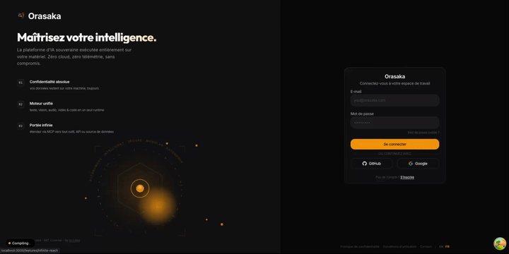
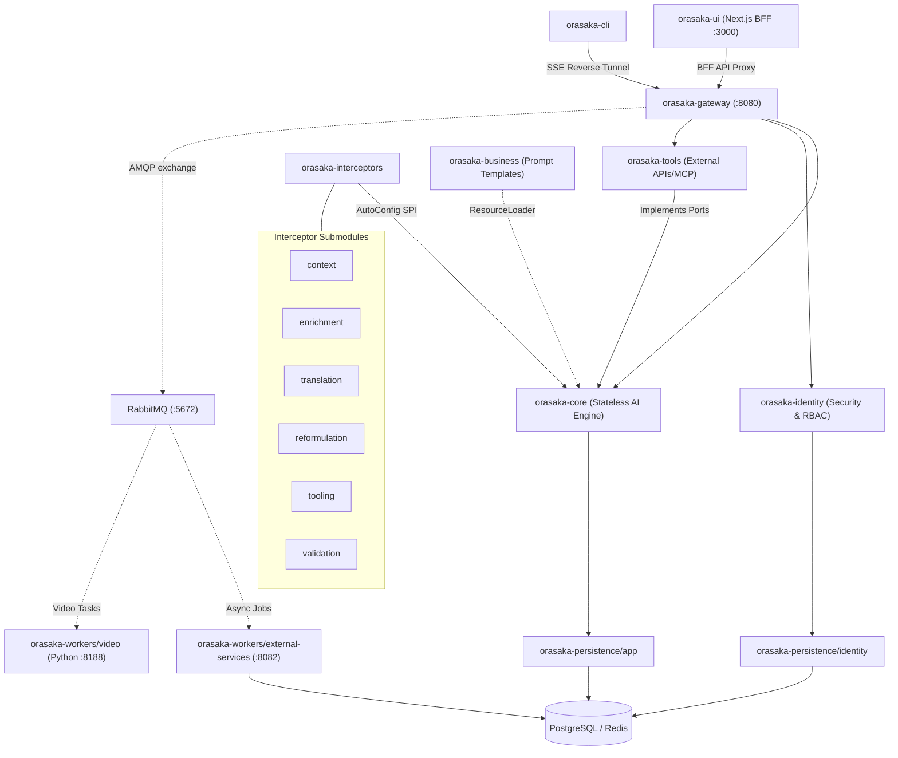

# ORASAKA — NATIVE AI ORCHESTRATION ENGINE

> **Note:** This project is under active development. Core features, API contracts, and modules may change.

<p align="center">
  
</p>

<p align="center">
  <strong>Production-grade, multi-modal AI orchestration engine for Java 21.</strong><br/>
  Chat · Image · Video · Speech · RAG · PromptOps · Tool Calling · MCP — running locally.
</p>

<p align="center">
  
  
  
  
  
  <a href="https://sonarcloud.io/project/overview?id=oussamaABID_orasaka"></a>
</p>

---

## What is Orasaka?

Orasaka is an enterprise-grade multi-agent orchestration engine designed for **total privacy** and **on-device execution**. Built on Java 21 and Spring AI, it provides chat, image generation, video synthesis, speech, RAG, and tool calling without cloud dependencies. Everything runs locally on Apple Silicon (MPS) or CUDA.

---

## See It in Action

Real outputs from our local infrastructure:

| Cinematic Video Pipeline | High-Fidelity Image Generation |
| :---: | :---: |
| AnimateDiff-Lightning (MPS)<br/><video src="https://github.com/user-attachments/assets/4a643384-358b-4b6d-b02f-1a4c037bbc0b" autoplay loop muted playsinline controls width="100%"></video> | Stable Diffusion 1.5 (MPS)<br/> |

<p align="center">
  <strong>Next.js Agentic HUD Interface</strong><br/>
  
</p>

<details>
<summary>Prompt Transparency (reproducibility configurations)</summary>

- **[Video config](docs/assets/orasaka/output/video/animatediff-lightning/diffusers-pytorch/prompt.md)** — Cinematic cyberpunk sequence parameters
- **[Image config](docs/assets/orasaka/output/image/sd-1.5/stable-diffusion-cpp/prompt.md)** — Photorealistic cityscape generation settings
</details>

---

## Quick Start

Initialize and run the stack:

```bash
# 1. Interactive setup (Target environment, Hardware topology, BYO-Infra)
npx orasaka install

# 2. Start local infrastructure
npx orasaka start

# 3. Test chat execution
npx orasaka chat --prompt "Generate a 4-second cinematic cyberpunk sequence."
```

---

## Key Features

- **Hexagonal Architecture**: Enforced separation of concerns via ArchUnit compile-time guards.
- **Dynamic Interceptor Chain**: 15 pipeline filters loaded via Spring autoconfiguration.
- **Quantum Validation**: Configurable 4-Tier Validation Matrix — JSON Schema → MCP Sandbox → Multi-Agent Debate → Test-Driven Response.
- **Hermetic E2E Pipeline**: 3-tier test pyramid (httpyac API → CLI Vitest → Playwright Java UI) via `orasaka-end2end` (ADR-040).
- **Git PromptOps**: Persona prompts saved as `.md` templates in Git.
- **Offline CLI**: Agent commands queued in a local SQLite database for offline resiliency.

---

## Documentation

The documentation is designed to be read in this order. Start from the top and follow the logical progression:

| # | Document | Purpose |
|:-:|:---|:---|
| 1 | **[Developer Onboarding (101)](docs/101.md)** | Start here — core concepts, architecture map, getting started |
| 2 | **[Architecture Reference](docs/ARCHITECTURE.md)** | System topology, BFF schemas, execution flows |
| 3 | **[Core Deep-Dive](docs/CORE.md)** | Engine pipeline, interceptor chain, configuration keys |
| 4 | **[API Reference](docs/API_REFERENCE.md)** | Endpoints, parameters, schemas, RBAC constraints |
| 5 | **[Auth & Security](docs/AUTH.md)** | Authentication flows (local, OAuth2, password recovery) |
| 6 | **[Model Catalog](docs/MODELS.md)** | Tested models: Speech, Image, Video, Vision, Audio, Code |
| 7 | **[Automation & Workers](docs/AUTOMATION.md)** | Background workers, Quartz, Local Agent Protocol |
| 8 | **[CLI Reference](docs/CLI.md)** | Command-line interface guide |
| 9 | **[Business Playbook](docs/BUSINESS_IMPLEMENTATION.md)** | Building a product on Orasaka (CinePulse case study) |
| 10 | **[E2E Testing](docs/END2END_TEST.md)** | Test pyramid, Testcontainers, Playwright, ArchUnit |
| 11 | **[Deployment (IaC)](docs/DEPLOY.md)** | Production deployment on AWS, RunPod, Modal |
| 12 | **[ADR Index](docs/CONTEXT.md)** | Architectural Decision Records log |
| 13 | **[Glossary](docs/GLOSSARY.md)** | Environment variables, terms, naming conventions |
| — | **[Governance Contract](AGENTS.md)** | Agent rules, module boundaries, ERR codes |

---

## System Architecture



---

## Module Reference

### Monorepo Tree

```
orasaka/
├── orasaka-framework/                  # Shared libraries (no runnable apps)
│   ├── orasaka-core/                   # Stateless AI orchestration engine
│   ├── orasaka-identity/               # User domain, RBAC, password hashing
│   ├── orasaka-business/               # Markdown persona prompt templates
│   ├── orasaka-tools/                  # Tool callbacks, MCP clients, caches
│   ├── orasaka-persistence/            # JPA persistence layer
│   │   ├── app/                        # Chat sessions, jobs, model catalog
│   │   └── identity/                   # User credentials, authorities
│   ├── orasaka-interceptors/           # Pipeline filter submodules
│   │   ├── orasaka-interceptor-context/
│   │   ├── orasaka-interceptor-enrichment/
│   │   ├── orasaka-interceptor-translation/
│   │   ├── orasaka-interceptor-reformulation/
│   │   ├── orasaka-interceptor-tooling/
│   │   └── orasaka-interceptor-validation/
│   └── orasaka-test-support/           # AbstractContainerIntegrationTest, GovernanceRules
│
├── orasaka-apps/                       # Runnable applications
│   ├── orasaka-gateway/                # REST, GraphQL, SSE BFF controllers
│   ├── orasaka-ui/                     # Next.js 16 web client
│   ├── orasaka-cli/                    # TypeScript developer CLI
│   └── orasaka-workers/                # Async background processors
│       ├── external-services/          # Java Quartz worker (port 8082)
│       └── video/                      # Python SVD XT GPU worker (port 8188)
│
├── orasaka-end2end/                    # Hermetic E2E integration tests (ADR-040)
├── infra/                              # Infrastructure-as-Code
│   ├── docker-compose.yml              # Local development infrastructure (canonical)
│   ├── docker-compose.override.yml     # Generated target topology override (gitignored)
│   ├── local-db/                       # Docker init SQL schemas
│   ├── brokers-infra/                  # PostgreSQL/RabbitMQ production tuning
│   ├── compute-nodes/                  # RunPod/Modal GPU worker Dockerfiles
│   ├── web-backend/ / web-frontend/    # ECS task wrappers
│   └── terraform/                      # AWS/RunPod/Modal Terraform modules
│
├── docs/                               # Project documentation
├── .github/workflows/ci.yml           # 5-phase CI pipeline
├── pom.xml                             # Maven reactor root
└── AGENTS.md                           # Governance contract
```

### Module Descriptions

| Module | Location | Purpose |
| :--- | :--- | :--- |
| `orasaka-core` | `orasaka-framework/orasaka-core/` | Core AI orchestration engine. Web-agnostic, stateless. Wraps Spring AI under `AiClient` facade. |
| `orasaka-identity` | `orasaka-framework/orasaka-identity/` | Pure Java user domain. RBAC, BCrypt passwords, OAuth2 reconciliation. No web dependencies. |
| `orasaka-business` | `orasaka-framework/orasaka-business/` | Markdown persona prompt templates loaded via `ResourceLoader`. |
| `orasaka-tools` | `orasaka-framework/orasaka-tools/` | Tool callbacks, MCP clients, Caffeine/Postgres multi-tier cache. |
| `orasaka-persistence/app` | `orasaka-framework/orasaka-persistence/app/` | Chat session state, async jobs, model catalog JPA repositories. |
| `orasaka-persistence/identity` | `orasaka-framework/orasaka-persistence/identity/` | PostgreSQL user authentication tables, authorities, reset tokens. |
| `orasaka-interceptors/*` | `orasaka-framework/orasaka-interceptors/` | 6 independent submodules implementing pipeline interceptor filters. |
| `orasaka-test-support` | `orasaka-framework/orasaka-test-support/` | Shared test infrastructure: `AbstractContainerIntegrationTest`, `GovernanceRules`. |
| `orasaka-gateway` | `orasaka-apps/orasaka-gateway/` | GraphQL, REST, SSE BFF controllers. Sole module referencing identity + core. |
| `orasaka-ui` | `orasaka-apps/orasaka-ui/` | Next.js 16 web client. Cinematic dark-mode, input-blocking, React 19. |
| `orasaka-cli` | `orasaka-apps/orasaka-cli/` | TypeScript developer CLI with offline SQLite job logging. |
| `orasaka-workers/external-services` | `orasaka-apps/orasaka-workers/external-services/` | Async Java worker running Quartz jobs via RabbitMQ. |
| `orasaka-workers/video` | `orasaka-apps/orasaka-workers/video/` | Python Stable Video Diffusion worker node (GPU inference). |
| `orasaka-end2end` | `orasaka-end2end/` | Hermetic E2E testing: httpyac API contracts, Playwright Java UI tests. |

---

## Build Your Own Interceptor

1. Create a Maven submodule under `orasaka-framework/orasaka-interceptors/`.
2. Implement `PromptContextInterceptor`.
3. Register via auto-configuration.
4. Declare in `META-INF/spring/org.springframework.boot.autoconfigure.AutoConfiguration.imports`.

For concrete instructions and configuration setup, see [Build Interceptors](docs/CORE.md#custom-interceptor-example).

---

## Contributing & Testing

All PRs must pass governance checks. Run these before submitting:

```bash
# Full compile + test + format verification
./mvnw clean verify
./mvnw spotless:check

# Run only governance constraints
./mvnw clean test -pl orasaka-framework/orasaka-core -Dtest=GovernanceTest

# Frontend lint + test
npm run validate --prefix orasaka-apps/orasaka-ui
npm run validate --prefix orasaka-apps/orasaka-cli
```

---

## License

This project is licensed under the terms of the [LICENSE.md](LICENSE.md) file.

---

Built with ❤️ by [Krizaka](https://www.krizaka.com/) — Java 21, Spring AI, and Virtual Threads.
