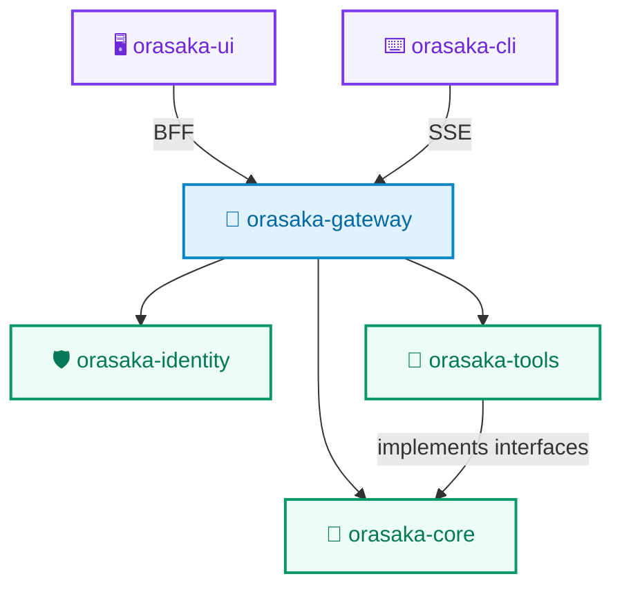

<p align="center">
  
</p>

<p align="center">
  <strong>Production-grade, multi-modal AI orchestration engine for Java 21.</strong><br/>
  Chat · Image · Video · Speech · RAG · Tool Calling · MCP — all running locally.
</p>

<p align="center">
  
  
  
  
  
  
</p>

---

## ✨ What is Orasaka?

Orasaka is a **self-hosted, privacy-first AI platform** that lets you run multi-modal AI workflows — text chat, image generation, video creation, speech synthesis, and intelligent document retrieval — entirely on your own hardware. No cloud API keys required.

Built on **Java 21 Virtual Threads** and **Spring AI**, it provides a modular monorepo architecture that's easy to extend, production-hardened, and ready for the open-source community.

> **🏠 100% Local-First** — Your data never leaves your machine. Run Ollama, Stable Diffusion, and LTX-Video natively on Apple Silicon or any GPU.

---

## 🚀 Features

### 🧠 Multi-Model Chat Orchestration
Talk to any LLM through a unified API. Orasaka routes your prompts through a **4-stage context enrichment pipeline** — injecting user preferences, system signals, conversation history, and RAG context — before dispatching to the optimal model.

> *Use it to:* Build personalized AI assistants, customer support bots, or internal knowledge agents.

### 🔧 Agentic Tool Calling & MCP
Register native Java methods as LLM-callable tools. Connect external data sources via the **Model Context Protocol (MCP)**. The AI decides when to call your tools and integrates the results automatically.

> *Use it to:* Let your AI fetch live stock prices, query databases, scrape websites, or call any API.

### 🎨 Text-to-Image Generation
Generate images locally using **stable-diffusion.cpp** with Apple Metal acceleration. No OpenAI API key needed — everything runs on your machine.

> *Use it to:* Create product mockups, marketing visuals, concept art, or AI-generated thumbnails.

### 🎬 Text-to-Video Generation
Create AI-generated videos using a quantized **LTX-Video** model running bare-metal on Apple Unified Memory. Fully offline, fully sovereign.

> *Use it to:* Generate short-form video content, animated explainers, or creative prototypes.

### 🎙️ Text-to-Speech Synthesis
Convert text to natural-sounding audio using the OpenAI TTS API bridge. Returns RFC 2397 Data URLs for instant browser playback.

> *Use it to:* Build voice assistants, podcast generators, or accessible content pipelines.

### 📚 RAG & Knowledge Ingestion
Automatically chunk, embed, and retrieve documents from a **pgvector** database. Three built-in chunking strategies: plain text, markdown headers, and JSON arrays.

> *Use it to:* Build searchable knowledge bases, documentation Q&A, or internal wiki assistants.

### 📺 Media Analysis Pipeline
Analyze images, audio, and video through port/adapter preprocessor contracts. Extract keyframes, transcribe audio with Whisper, and feed multi-modal data to vision models.

> *Use it to:* Build content moderation tools, video summarizers, or visual search engines.

### 🖥️ Server-Driven UI (Operation Graph)
Dynamically compile a capability graph with polymorphic states (`Active`, `Locked`, `Invisible`) driven by YAML configuration. The frontend renders exactly what the backend allows.

> *Use it to:* Build feature-flagged dashboards, tiered pricing UIs, or admin control panels.

### ⚡ Context-Matrix Pipeline
A 4-stage ordered interceptor chain processes every request:

| Stage | Interceptor | What it does |
|:---:|:---|:---|
| 1 | **UserContextResolver** | Injects user preferences, RBAC roles, rate-limit tiers |
| 2 | **SystemContextInjector** | Feeds real-time environment signals and system variables |
| 3 | **RefinerInterceptor** | Rewrites fuzzy queries into clear, explicit instructions |
| 4 | **RouterInterceptor** | Routes to the optimal model provider at `temperature: 0.0` |

---

## 📦 Architecture

Orasaka is structured as a **decoupled monorepo** with strict unidirectional dependencies:



| Module | Role |
|:---|:---|
| **`orasaka-core`** | Stateless AI engine — Bridge Pattern 2.0, zero web dependencies. Pure orchestration library. |
| **`orasaka-identity`** | User management, RBAC with sealed interfaces, email verification, interception engine. |
| **`orasaka-tools`** | MCP orchestrators, function tool registries, multi-tier caching (Caffeine → PostgreSQL). |
| **`orasaka-gateway`** | GraphQL + REST + SSE Backend-for-Frontend. Context assembly, streaming, virtual threads. |
| **`orasaka-ui`** | Next.js 16 frontend — workspace canvas, BFF proxy, chat interface. |
| **`orasaka-cli`** | TypeScript terminal client — JWT auth, GraphQL mutations, SSE streams, multi-modal output. |

> **🔒 Dependency flow is strictly unidirectional.** Core never imports from Gateway. Tools never import from Identity. Enforced by ArchUnit at compile time.

---

## ⚡ Quick Start

### Prerequisites

| Tool | Version |
|:---|:---|
| JDK | 21+ (`JAVA_HOME` must point here) |
| Maven | 3.9+ |
| Node.js | 20+ |
| Docker Compose | Latest |

### 1. Clone & Bootstrap

```bash
git clone https://github.com/your-org/orasaka.git
cd orasaka

# Bootstrap environment (validates JDK, pulls Ollama models, starts infrastructure)
./ops/scripts/start.sh
```

### 2. Build Everything

```bash
mvn clean install
```

### 3. Start the Gateway

```bash
mvn spring-boot:run -pl orasaka-gateway
# → GraphQL Playground: http://localhost:8080/graphiql
```

### 4. Start the Frontend

```bash
cd orasaka-ui && npm install && npm run dev
# → http://localhost:3000
```

### 5. Try the CLI

```bash
cd orasaka-cli && npm install && npm run build
node dist/index.js login admin@orasaka.com admin
node dist/index.js chat "What can you do?"
```

### Test Credentials

| Email | Password | Role |
|:---|:---|:---|
| `admin@orasaka.com` | `admin` | `ROLE_ADMIN` |
| `user@orasaka.com` | `user` | `ROLE_USER` |
| `guest@orasaka.com` | `guest` | `ROLE_GUEST` |

---

## 🦙 Local AI Infrastructure

Orasaka runs AI models locally for full data sovereignty. No cloud dependencies.

### Text Models (Ollama)

```bash
# Download a GGUF model from Hugging Face
huggingface-cli download TheBloke/Llama-3.1-8B-GGUF llama-3.1-8b.Q4_K_M.gguf \
  --local-dir ~/models/ollama

# Register with Ollama
ollama create llama3.1:8b -f ~/models/ollama/Modelfile
ollama run llama3.1:8b "Hello"
```

### Image Generation (stable-diffusion.cpp)

```bash
# Build with Apple Metal GPU acceleration
git clone --recursive https://github.com/leejet/stable-diffusion.cpp
cd stable-diffusion.cpp && mkdir build && cd build
cmake .. -DSD_METAL=ON
cmake --build . --config Release --target sd-server

# Start on port 8085
./bin/sd-server --listen-port 8085 -m ~/models/stable-diffusion/v1-5-pruned-emaonly.safetensors
```

### Video Generation (LTX-Video)

```bash
# Download quantized LTX-Video checkpoint
huggingface-cli download unsloth/LTX-Video-GGUF \
  ltx-video-v0.9-q4_k_m.safetensors \
  --local-dir ~/models/stable-diffusion

# Start on port 8086
./bin/sd-server --listen-port 8086 -m ~/models/stable-diffusion/ltx-video-v0.9-q4_k_m.safetensors
```

### Lifecycle Scripts

```bash
# Start all AI workers (Ollama:11434, Image:8085, Video:8086)
./ops/scripts/start.sh

# Stop all workers
./ops/scripts/stop.sh

# Start Docker containers (PostgreSQL + pgvector, MCP debug server)
docker compose -p orasaka -f ops/docker/docker-compose.yml up -d
```

---

## 🧪 Build & Test

### Java (ArchUnit + JaCoCo)

```bash
# Full verification with architectural tests and coverage check
mvn clean verify

# Fast iteration: rebuild gateway + all upstream deps
mvn clean compile -pl orasaka-gateway -am
```

| Gate | Tool | What it enforces |
|:---|:---|:---|
| Layer Boundary | ArchUnit | Core ↛ Gateway, Core ↛ Web, Core ↛ Servlet |
| One Class Per File | ArchUnit | Every `.java` file has exactly one top-level class |
| Zero-Prefix Policy | ArchUnit | No `Orasaka` prefix on internal class names |
| Prompt Externalization | ArchUnit | No hardcoded prompts in engine/pipeline |
| Encapsulation | ArchUnit | Private fields in concrete classes |
| Coverage Gate | JaCoCo | 80% minimum instruction coverage |

### TypeScript (Dependency Cruiser + Jest)

```bash
cd orasaka-ui && npm run validate && npm test
```

### Formatting

```bash
# Java — auto-format all modules
mvn spotless:apply

# TypeScript — format + lint
cd orasaka-ui && npm run format && npm run lint
```

---

## 📖 API Overview

### GraphQL (Primary)

```graphql
# Queries
me: User                                              # Get current user profile
operationGraph: OperationGraph                         # Get server-driven UI capabilities
interceptionSchema(schemaId: String!): String           # Get dynamic JSON schema

# Mutations
chat(prompt: String!, conversationId: String): ChatResponse
image(prompt: String!): ChatResponse                    # Text-to-image
speech(prompt: String!): ChatResponse                   # Text-to-speech
video(prompt: String!, durationSeconds: Int): VideoResponse  # Text-to-video
updatePreferences(preferences: Map!): User
register(username: String!, email: String!, password: String!): RegisterResult

# Subscriptions
chatStream(prompt: String!, conversationId: String): ChatResponse  # Real-time SSE streaming
```

### REST Endpoints

| Endpoint | Method | Description |
|:---|:---|:---|
| `/api/v1/auth/login` | `POST` | Authenticate and get session token |
| `/api/v1/auth/register` | `POST` | Self-service registration |
| `/api/v1/auth/verify` | `POST` | Email verification |
| `/api/v1/chat/stream/{id}` | `GET` | SSE text streaming |
| `/api/v1/ai/video` | `POST` | Text-to-video generation |

### CLI Commands

```bash
orasaka login <email> <password>       # Authenticate
orasaka chat "your prompt"             # Interactive chat
orasaka chat --gen-image "a sunset"    # Generate image
orasaka chat --speech "hello world"    # Text-to-speech
orasaka video "cyberpunk city"         # Generate video
orasaka profile                        # View user profile
orasaka settings set language fr       # Update preferences
orasaka graph                          # View Operation Graph
```

---

## ⚙️ Configuration

### Core Configuration (`application.yml`)

```yaml
orasaka:
  core:
    default-provider: ollama
    overrides: {}
    rag:
      enabled: true
      store: pgvector
      top-k: 3
    mcp:
      servers: []
    orchestration:
      pipeline:
        enabled: true
      user-context:
        enabled: true
      system-context:
        enabled: true
      refiner:
        enabled: false
        provider: openai
        model: gpt-4-turbo
        temperature: 0.2
      router:
        enabled: false
        provider: ollama
        model: llama3.1:8b
        temperature: 0.0
```

### Video Pipeline

```yaml
orasaka:
  engine:
    video:
      analysis:
        enabled: true
        max-keyframes: 8
        frame-interval-sec: 5
      generation:
        enabled: true
        provider: localai-video
```

---

## 🗂️ Repository Layout

```text
orasaka/
├── ops/                        # DevOps, Docker, scripts, DB migrations
│   ├── docker/docker-compose.yml
│   ├── http/orasaka.http       # REST/GraphQL test files
│   ├── postgres/init/          # Schema and seed SQL
│   └── scripts/                # start.sh, stop.sh
├── orasaka-core/               # Pure AI Engine (Bridge Pattern 2.0)
├── orasaka-gateway/            # Spring Boot BFF + GraphQL + Streaming
├── orasaka-identity/           # Authentication & Identity Domain
├── orasaka-tools/              # MCP + Tool Registry + Cache
├── orasaka-ui/                 # Next.js Front-End
├── orasaka-cli/                # TypeScript CLI Client
├── docs/                       # Architecture, API, Glossary, ADRs
└── AGENTS.md                   # AI Agent Governance Contract
```

---

## 📚 Documentation

| Document | Description |
|:---|:---|
| [Architecture Reference](docs/ARCHITECTURE.md) | System topology, cognitive engine flows, module boundaries |
| [Authentication Guide](docs/AUTH.md) | Local credentials, OAuth2 federation, provider extensibility |
| [API Reference](docs/API_REFERENCE.md) | Public types, facades, engine abstractions, endpoint specs |
| [Glossary](docs/GLOSSARY.md) | Ecosystem terms, patterns, and environment variables |
| [ADR Log](docs/CONTEXT.md) | 23 Architectural Decision Records with rationale |
| [Business Guide](docs/BUSINESS_IMPLEMENTATION.md) | Step-by-step vertical feature implementation blueprint |
| [Aggregate Javadoc](docs/apidocs/) | Auto-generated cross-module API documentation |

---

## 🤝 Contributing

We welcome contributions! Here's how to get started:

1. **Fork** the repository
2. **Create** a feature branch (`git checkout -b feature/amazing-feature`)
3. **Follow** the governance rules in [AGENTS.md](AGENTS.md) — they're non-negotiable
4. **Ensure** all quality gates pass:
   ```bash
   mvn clean verify              # Java: ArchUnit + JaCoCo + Spotless
   cd orasaka-ui && npm test     # TypeScript: Jest + Dependency Cruiser
   ```
5. **Submit** a Pull Request

### Key Rules for Contributors

- **One class per file** — every top-level Java class gets its own `.java` file
- **No `Orasaka` prefix** — use `Engine`, not `OrasakaEngine` (only `OrasakaCoreConfiguration` is whitelisted)
- **Records for data** — all data carriers must be immutable Java 21 `record` types
- **Virtual Threads** — all blocking I/O must run on virtual threads
- **Package-private by default** — only interfaces and facades should be `public`

---

## 🏛️ Design Principles

| Principle | Enforcement |
|:---|:---|
| **Stateless Core** | `orasaka-core` has zero web dependencies. No HTTP, no sessions, no security. |
| **Bridge Pattern 2.0** | Spring AI types are encapsulated inside core. Never leak outward. |
| **Ports & Adapters** | `orasaka-tools` implements interfaces defined in `orasaka-core`. |
| **Virtual Thread Mandate** | Every blocking operation runs on `Executors.newVirtualThreadPerTaskExecutor()`. |
| **Self-Validating Records** | Compact constructors handle all validation, defaults, and defensive copies. |
| **Unidirectional Dependencies** | Gateway → Core ✅ | Core → Gateway ❌ | Tools → Identity ❌ |

---

## 📄 License

This project is licensed under the **MIT License** — see the [LICENSE.md](LICENSE.md) file for details.

---

<p align="center">
  Built with ❤️ using Java 21, Spring AI, and a lot of Virtual Threads.
</p>