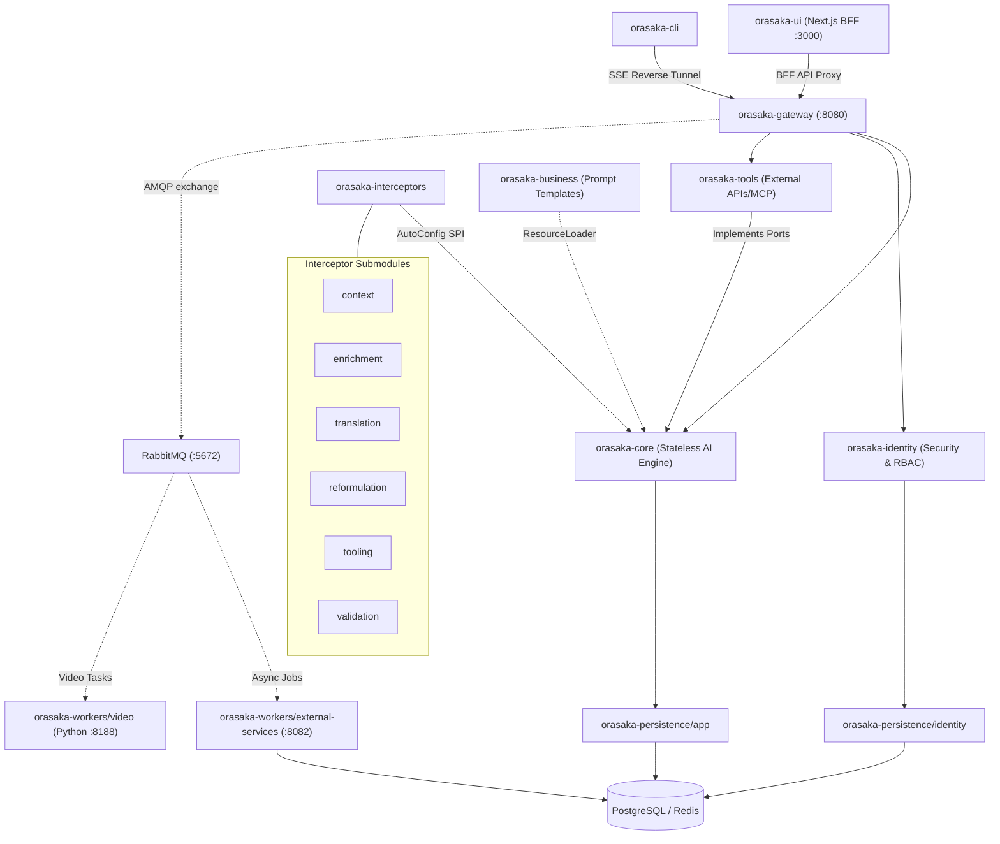

# ORASAKA — NATIVE IA ORCHESTRATION ENGINE

> **Note:** This project is under active development. Core features, API contracts, and modules may change.

<p align="center">
  
</p>

<p align="center">
  <strong>Production-grade, multi-modal AI orchestration engine for Java 21.</strong><br/>
  Chat · Image · Video · Speech · RAG · PromptOps · Tool Calling · MCP — running locally.
</p>

<p align="center">
  
  
  
  
  
  <a href="https://sonarcloud.io/project/overview?id=oussamaABID_orasaka"></a>
</p>

---

## What is Orasaka?

Orasaka is an enterprise-grade multi-agent orchestration engine designed for **total privacy** and **on-device execution**. Built on Java 21 and Spring AI, it provides chat, image generation, video synthesis, speech, RAG, and tool calling without cloud dependencies. Everything runs locally on Apple Silicon (MPS) or CUDA.

---

## See It in Action

Real outputs from our local infrastructure:

| Cinematic Video Pipeline | High-Fidelity Image Generation |
| :---: | :---: |
| AnimateDiff-Lightning (MPS)<br/><video src="https://github.com/user-attachments/assets/4a643384-358b-4b6d-b02f-1a4c037bbc0b" autoplay loop muted playsinline controls width="100%"></video> | Stable Diffusion 1.5 (MPS)<br/> |

<p align="center">
  <strong>Next.js Agentic HUD Interface</strong><br/>
  
</p>

<details>
<summary>Prompt Transparency (reproducibility configurations)</summary>

- **[Video config](docs/assets/orasaka/output/video/animatediff-lightning/diffusers-pytorch/prompt.md)** — Cinematic cyberpunk sequence parameters
- **[Image config](docs/assets/orasaka/output/image/sd-1.5/stable-diffusion-cpp/prompt.md)** — Photorealistic cityscape generation settings
</details>

---

## Quick Start

Initialize and run the stack:

```bash
# 1. Initialize environment
npx orasaka init

# 2. Start local infrastructure
npx orasaka start

# 3. Test chat execution
npx orasaka chat --prompt "Generate a 4-second cinematic cyberpunk sequence."
```

---

## Key Features

- **Hexagonal Architecture**: Enforced separation of concern via ArchUnit compile-time guards.
- **Dynamic Interceptor Chain**: 15 pipeline filters loaded via Spring autoconfiguration.
- **Quantum Validation**: Configurable 4-Tier Validation Matrix — JSON Schema -> MCP Sandbox -> Multi-Agent Debate -> Test-Driven Response.
- **Hermetic E2E Pipeline**: 3-tier test pyramid (httpyac API → CLI Vitest → Playwright Java UI) via `orasaka-apps/orasaka-end2end` (ADR-040).
- **Git PromptOps**: Persona prompts saved as `.md` templates in Git.
- **Offline CLI**: Agent commands queued in a local SQLite database for offline resiliency.

---

## Documentation

- [Architecture Reference](docs/ARCHITECTURE.md) & [Core Deep-Dive](docs/CORE.md)
- [Governance Contract](AGENTS.md)
- [Automation & Workers](docs/AUTOMATION.md)
- [Model Specs](docs/MODELS.md) & [Context/ADR Logs](docs/CONTEXT.md)
- [Deployment](docs/DEPLOY.md) & [E2E Testing](docs/END2END_TEST.md)
- [CLI Reference](docs/CLI.md)
- [Auth & Security](docs/AUTH.md) & [Glossary](docs/GLOSSARY.md)

---

## System Architecture



| Module | Purpose |
| :--- | :--- |
| `orasaka-core` | Core AI orchestration engine. Web-agnostic. |
| `orasaka-interceptors/*` | Submodules resolving pipeline filters (`context`, `enrichment`, `translation`, etc.). |
| `orasaka-gateway` | GraphQL, REST, and SSE BFF controllers. Enforces security filters. |
| `orasaka-identity` | RBAC user controls, hashing, and recovery. |
| `orasaka-business` | Markdown persona prompt templates. |
| `orasaka-tools` | Caffeine/Postgres caches and MCP clients. |
| `orasaka-persistence/app` | Chat session DB state and JPA repositories. |
| `orasaka-persistence/identity` | PostgreSQL user authentication tables. |
| `orasaka-workers/external-services` | Async Java worker running Quartz jobs. |
| `orasaka-workers/video` | Python Stable Video Diffusion worker node (runs GPU inference). |
| `orasaka-ui` | Next.js 16 Web client with input-blocking mechanisms. |
| `orasaka-cli` | Developer CLI running command logging on SQLite. |

---

## Build Your Own Interceptor

1. Create a Maven submodule under `orasaka-interceptors/`.
2. Implement `PromptContextInterceptor`.
3. Register via auto-configuration.
4. Declare in `META-INF/spring/org.springframework.boot.autoconfigure.AutoConfiguration.imports`.

For concrete instructions and configuration setup, see [Build Interceptors](docs/CORE.md#custom-interceptor-example).

---

## Contributing & Testing

All PRs must pass governance checks. Run these before submitting:

```bash
# Compile core modules
./mvnw clean compile -pl orasaka-core,orasaka-interceptors -am

# Test governance constraints
./mvnw clean test -pl orasaka-core -Dtest=GovernanceTest

# Verification & Spotless format check
./mvnw clean verify
./mvnw spotless:check
```

---

Built with ❤️ by [Krizaka](https://www.krizaka.com/) — Java 21, Spring AI, and Virtual Threads.
