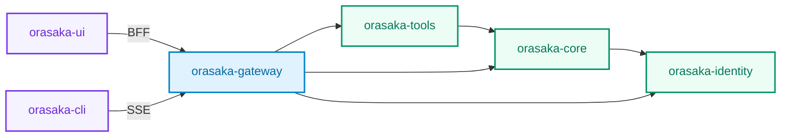

# ORASAKA - Native AI Orchestration Engine


Orasaka is a production-grade Java monorepo for multi-session, multi-modal AI orchestration. It enforces strict domain isolation, stateless engine design, and high-concurrency execution via Java 21 Virtual Threads.

---

## Feature Inventory

| Capability | Engine | Stack |
| :--- | :--- | :--- |
| **Multi-Model Chat Orchestration** | Satsui Engine (context interceptor pipeline) | Spring AI → Ollama / OpenAI |
| **Agentic Tool Calling** | MCP-compliant function registry | MCP Protocol Servers + `CachingToolCallback` |
| **Text-to-Image Generation** | Bare-metal `stable-diffusion.cpp` | Native C++ on Apple Metal (Port `8085`) |
| **Text-to-Video Generation** | Bare-metal LTX-Video runner | Native C++ DiT on Apple Unified Memory (Port `8086`) |
| **Video Analysis Pipeline** | `VideoPreProcessor` port/adapter | Keyframe extraction + Whisper stub (conditional) |
| **Text-to-Speech** | OpenAI TTS API bridge | Spring AI OpenAI TTS Model |
| **RAG / Knowledge Ingestion** | Async chunking pipeline | `OrasakaChunkingStrategies` → Vector Store |
| **Server-Driven UI** | `OrasakaOperationGraph` | Polymorphic capability states (Active/Locked/Invisible) |
| **Context-Matrix Pipeline** | 4-stage interceptor chain | UserContext → SystemContext → Refiner → Router |

---

## Multi-Module Blueprint

| Module | Role |
| :--- | :--- |
| **`orasaka-parent`** | Root BOM — centralized dependency versions |
| **`orasaka-core`** | Stateless AI Orchestration Engine — Bridge Pattern 2.0, no web starters |
| **`orasaka-identity`** | User management, RBAC, sealed security contracts |
| **`orasaka-tools`** | MCP orchestrators, function tool registries, caching decorators |
| **`orasaka-gateway`** | GraphQL BFF (Spring Boot 3.5) — context assembly, streaming |
| **`orasaka-ui`** | Next.js 16 frontend — BFF proxy, workspace canvas |
| **`orasaka-cli`** | TypeScript terminal client — JWT auth, SSE streams |



> **Dependency flow is strictly unidirectional.** No circular dependencies.

---

## Repository Layout

```text
orasaka/
├── ops/                        # DevOps, Docker, scripts, DB migrations
│   ├── docker/docker-compose.yml
│   ├── http/orasaka.http       # REST/GraphQL test files
│   ├── postgres/init/          # Schema and seed SQL
│   └── scripts/                # setup.sh, start.sh, stop.sh
├── orasaka-core/               # Pure AI Engine (Bridge Pattern 2.0)
├── orasaka-gateway/            # Spring Boot BFF + GraphQL + Streaming
├── orasaka-identity/           # Authentication & Identity Domain
├── orasaka-tools/              # MCP + Tool Registry + Cache
├── orasaka-ui/                 # Next.js Front-End
├── orasaka-cli/                # TS Node CLI Client
├── docs/                       # Architecture, API, Glossary, ADRs
└── AGENTS.md                   # AI Agent Governance Contract
```

---

## Getting Started

### Prerequisites

| Tool | Version |
| :--- | :--- |
| JDK | 21+ (`JAVA_HOME` must point here) |
| Maven | 3.9+ |
| Node.js | 20+ |
| Docker Compose | latest |

### Quick Start

```bash
# 1. Bootstrap environment (validates JDK, pulls Ollama models, starts containers)
./ops/scripts/setup.sh

# 2. Build all modules
mvn clean install

# 3. Launch the Gateway
mvn spring-boot:run -pl orasaka-gateway
# → GraphQL Playground: http://localhost:8080/graphiql

# 4. Launch the UI
cd orasaka-ui && npm install && npm run dev
# → http://localhost:3000
```

### Pre-Seeded Test Credentials

| Email | Password | Role |
| :--- | :--- | :--- |
| `admin@orasaka.com` | `admin` | `ROLE_ADMIN` |
| `user@orasaka.com` | `user` | `ROLE_USER` |
| `guest@orasaka.com` | `guest` | `ROLE_GUEST` |

---

## Hugging Face Model Ingestion

Orasaka consumes model weights from Hugging Face for both text inference (via Ollama) and image/video generation (via `stable-diffusion.cpp`).

### Text Models (Ollama)

```bash
# Install Hugging Face CLI
pip install huggingface-hub

# Download a GGUF model (e.g., Llama 3.1 8B)
huggingface-cli download TheBloke/Llama-3.1-8B-GGUF llama-3.1-8b.Q4_K_M.gguf \
  --local-dir ~/models/ollama

# Create an Ollama Modelfile
cat > ~/models/ollama/Modelfile <<EOF
FROM ~/models/ollama/llama-3.1-8b.Q4_K_M.gguf
PARAMETER temperature 0.7
PARAMETER num_ctx 8192
EOF

# Register with Ollama
ollama create llama3.1:8b -f ~/models/ollama/Modelfile
ollama run llama3.1:8b "Hello"
```

Configure in `orasaka-gateway/src/main/resources/application.yml`:

```yaml
orasaka:
  core:
    default-provider: ollama
    features:
      chat:
        provider: ollama
        model: llama3.1:8b
```

### Image Models (stable-diffusion.cpp)

```bash
# Download SD 1.5 weights in safetensors format
huggingface-cli download stable-diffusion-v1-5/stable-diffusion-v1-5 \
  v1-5-pruned-emaonly.safetensors \
  --local-dir ~/models/stable-diffusion

# Build sd-server (Apple Silicon with Metal)
git clone --recursive https://github.com/leejet/stable-diffusion.cpp
cd stable-diffusion.cpp && mkdir build && cd build
cmake .. -DSD_METAL=ON
cmake --build . --config Release --target sd-server

# Start on port 8085
./bin/sd-server --listen-port 8085 -m ~/models/stable-diffusion/v1-5-pruned-emaonly.safetensors
```

### Video Models (LTX-Video)

```bash
# Download quantized LTX-Video checkpoint
huggingface-cli download unsloth/LTX-Video-GGUF \
  ltx-video-v0.9-q4_k_m.safetensors \
  --local-dir ~/models/stable-diffusion

# Start on port 8086
./bin/sd-server --listen-port 8086 -m ~/models/stable-diffusion/ltx-video-v0.9-q4_k_m.safetensors
```

### Local Model Directory Layout

```text
~/models/
├── ollama/
│   ├── llama-3.1-8b.Q4_K_M.gguf
│   └── Modelfile
└── stable-diffusion/
    ├── v1-5-pruned-emaonly.safetensors    # Image (Port 8085)
    └── ltx-video-v0.9-q4_k_m.safetensors # Video (Port 8086)
```

---

## Local AI Infrastructure

Lifecycle scripts manage Ollama + the two `sd-server` workers:

```bash
# Start all workers (Ollama:11434, Image:8085, Video:8086)
./ops/scripts/start.sh

# Stop all workers
./ops/scripts/stop.sh
```

Docker containers (PostgreSQL + pgvector, MCP debug server):

```bash
docker compose -p orasaka -f ops/docker/docker-compose.yml up -d
```

---

## Build & Test Governance

### Java (ArchUnit + JaCoCo)

```bash
# Full verification with architectural tests and coverage check
mvn clean verify -pl orasaka-core -am

# Run gateway boundary tests
mvn clean test -pl orasaka-gateway -am
```

| Gate | Tool | Scope |
| :--- | :--- | :--- |
| Layer Boundary | ArchUnit | Core ↛ Gateway, Core ↛ Web, Core ↛ Servlet |
| Prompt Externalization | ArchUnit | No hardcoded prompts in engine/pipeline |
| Fail-Fast Compliance | ArchUnit | OrasakaException only in engine services |
| Encapsulation | ArchUnit | Private fields in concrete classes |
| Gateway Boundary | ArchUnit | No Spring AI leaks, pkg-private filters |
| Coverage Gate | JaCoCo | 60% min instruction coverage |

### TypeScript (Dependency Cruiser + Jest)

```bash
# Architectural boundary validation
cd orasaka-ui && npm run validate

# Component tests (next/jest SWC compiler)
npm test
```

| Gate | Tool | Scope |
| :--- | :--- | :--- |
| No Circular Deps | dependency-cruiser | All source files |
| Feature Isolation | dependency-cruiser | No cross-feature imports |
| Layer Direction | dependency-cruiser | Components ↛ Features |
| Component Tests | Jest + RTL | UI primitives |

### Formatting & Linting

```bash
# Java
mvn spotless:apply

# TypeScript
cd orasaka-ui && npm run format && npm run lint
```

---

## Architecture & Governance

The [AGENTS.md](AGENTS.md) file is the system governance ledger. It defines:

- **Decoupling boundaries** — `orasaka-core` is stateless, web-agnostic
- **Bridge Pattern 2.0** — Spring AI types encapsulated in core, never leak outward
- **Virtual Thread mandate** — all I/O on `Executors.newVirtualThreadPerTaskExecutor()`
- **Self-validating records** — compact constructors handle all validation (ADR-007)
- **Context-Matrix Pipeline** — ordered interceptor chain for prompt enrichment

The `.agent/rules/` and `.agent/workflows/` directories contain machine-readable constraints and verification flows.

---

## Documentation

| Document | Content |
| :--- | :--- |
| [Architecture Reference](docs/ARCHITECTURE.md) | System topology, cognitive engine flows |
| [API Reference](docs/API_REFERENCE.md) | Public types, facades, engine abstractions |
| [Glossary](docs/GLOSSARY.md) | Ecosystem terms and patterns |
| [ADR Log](docs/CONTEXT.md) | Architectural Decision Records |
| [Business Guide](docs/BUSINESS_IMPLEMENTATION.md) | Vertical domain implementation blueprint |
| [Aggregate Javadoc](docs/apidocs/) | Auto-generated API documentation |

---

## Video Pipeline Configuration

The video pipeline is partitioned into **analysis** (vision input) and **generation** (text-to-video output), each independently toggleable:

```yaml
orasaka:
  engine:
    video:
      analysis:
        enabled: true
        max-keyframes: 8
        frame-interval-sec: 5
      generation:
        enabled: true
        provider: localai-video
```

| Key | Default | Description |
| :--- | :--- | :--- |
| `analysis.enabled` | `false` | Activates the `LocalVideoProcessor` conditional bean |
| `analysis.max-keyframes` | `8` | Maximum keyframes extracted per video |
| `analysis.frame-interval-sec` | `5` | Seconds between keyframe samples |
| `generation.enabled` | `false` | Enables the `OrasakaVideoService` generation endpoint |
| `generation.provider` | `localai-video` | Provider key resolved via `CoreProperties.overrides` |

---

## Fast-Iteration Build Workflow

```bash
# 1. Update identity contracts
mvn clean install -pl orasaka-identity

# 2. Recompile entire integration mesh (auto-cascades upstream deps)
mvn clean compile -pl orasaka-gateway -am
```
---

## 📄 License

This project is licensed under the MIT License - see the [LICENSE.md](LICENSE.md) file for details.
