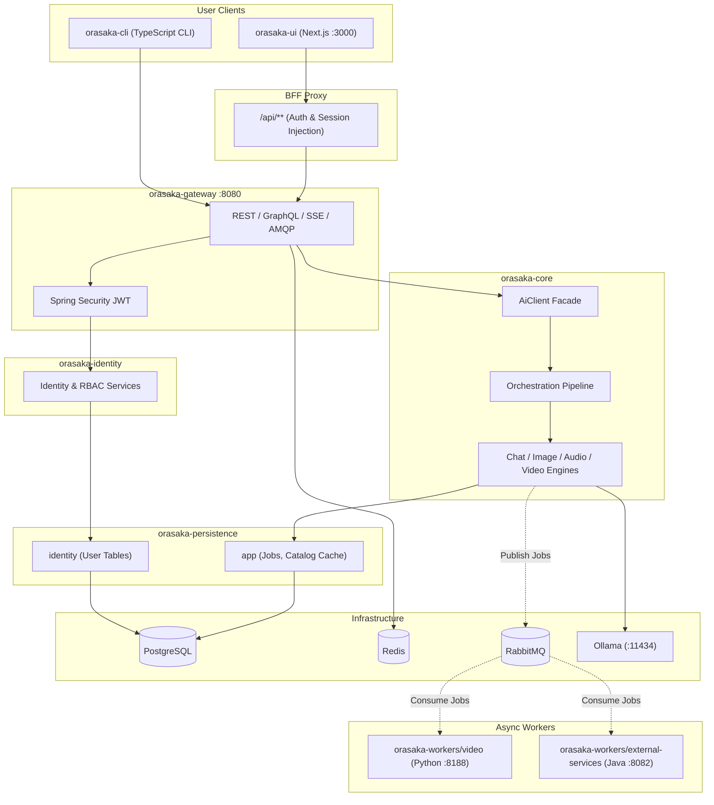

# Orasaka 101: Developer Onboarding Guide

> Introduction to the Orasaka ecosystem — a self-hosted, local-first AI orchestration platform built on Spring Boot, Next.js, and local inference.

---

## 1. Core Principles

- **Local-First**: All inference runs locally (Ollama, Apple Metal MPS, CUDA). No data leaves your machine.
- **Hexagonal Architecture**: Core AI logic is decoupled from frameworks, protocols, and database engines.
- **Multi-Modal**: Single interface for Chat, Image, Audio, and Video.
- **Zero-Trust BFF**: Client calls proxy through Next.js server-side API routes.

---

## 2. Architecture Map



---

## 3. Module Map

- `orasaka-core`: Core Stateless AI orchestration library. Holds ports/engines.
- `orasaka-identity`: Sealed user domain logic, passwords, and security helpers.
- `orasaka-gateway`: Ingress BFF. Houses REST/GraphQL/AMQP adapters.
- `orasaka-tools`: RAG, tool callbacks, and Caffeine/Postgres caches.
- `orasaka-persistence/app`: Core business tables, AMQP event listeners, and JPA repositories.
- `orasaka-persistence/identity`: PostgreSQL schemas for users, BCrypt credentials.
- `orasaka-workers/external-services`: Isolated Java worker running Quartz jobs.
- `orasaka-workers/video`: Python Stable Video Diffusion GPU worker node.
- `orasaka-ui`: Next.js 16 Web client with input-blocking safety.
- `orasaka-cli`: TS developer CLI with offline SQLite logging.

---

## 4. Core Concepts

### 4.1 AiClient Facade
All AI capabilities are accessed through `AiClient`:
```java
public interface AiClient {
    ChatResponse chat(ChatRequest request);
    Flux<ChatResponse> stream(ChatRequest request);
    AudioResponse audio(AudioRequest request);
    ImageResponse image(ImageRequest request);
    VideoResponse video(VideoRequest request);
}
```

### 4.2 Orchestration Pipeline
Before reaching the model, prompts go through an ordered chain:
`User Input → UserContext → SystemContext → Translation → Memory → RAG → MCP → Refiner → Router → Tool → CostShield → Validation → Engine`

### 4.3 Async Video & Job Lifecycle
For heavy tasks like video synthesis:
`PENDING_APPROVAL → APPROVED → RUNNING → COMPLETED | FAILED`
Job state is published via RabbitMQ and status updates stream via SSE.

### 4.4 CLI Reverse Tunneling
CLI opens an SSE connection (`GET /api/v1/agent/stream`). When a local job is spawned, Gateway pushes it to the CLI agent. No inbound ports required on the local machine.

---

## 5. Getting Started

### Prerequisites
- Java 21, Node.js 20+, Python 3.11+
- PostgreSQL, Redis, RabbitMQ
- Ollama (installed and running)

### Running CLI Commands
The platform lifecycle is managed via the CLI:
```bash
npx orasaka init      # Set up local environment files (.env)
npx orasaka doctor    # Check prerequisites
npx orasaka start     # Start database containers and workers
npx orasaka stop      # Stop the infrastructure
```

You can verify the backend installation by calling health check actuators:
- Actuator check: `GET http://localhost:8080/actuator/health`

---

## 6. Frontend & Security Model

- **Next.js App Router & React 19**: Powered by Tailwind CSS 4.
- **Cinematic dark-mode first**: Translucent glassmorphism with HSL variables.
- **Dual Ingress**: Web UI goes through the Next.js BFF proxy (injecting bearer cookies); CLI queries the Gateway API directly with JWTs.

---

## 7. Quality & SonarCloud Analysis

Run a manual scan using the root maven wrapper:
```bash
./mvnw sonar:sonar
```

### Metrics Gates
- Test Coverage: >= 80% on new code.
- Duplication: <= 3% density.
- Ratings: A rating on Security, Reliability, and Maintainability.

---

## Related Documentation
- [Architecture Reference](ARCHITECTURE.md)
- [Core Deep-Dive](CORE.md)
- [API Reference](API_REFERENCE.md)
- [ADR Index Log](CONTEXT.md)
- [Production Deployment](DEPLOY.md)
- [Automation & Workers](AUTOMATION.md)
