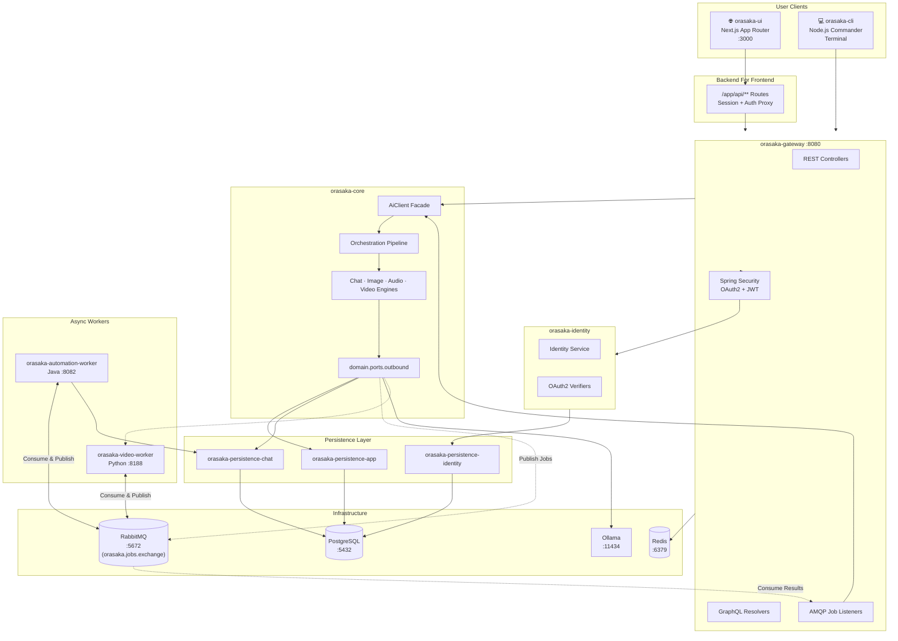

# Orasaka 101: Developer Onboarding Guide

> Your comprehensive introduction to the Orasaka ecosystem — a self-hosted, multi-modal AI orchestration platform built on Spring Boot, Next.js, and local-first inference.

---

## 1. What is Orasaka?

Orasaka is a **production-grade, self-hosted AI orchestration framework** that unifies text generation, image synthesis, speech synthesis, video generation, and code scaffolding under a single, decoupled architecture.

### Key Principles

| Principle | Description |
|-----------|-------------|
| **Local-First** | All AI inference runs on your hardware (Ollama, Apple Metal MPS). No data leaves your machine by default. |
| **Hexagonal Architecture** | Core business logic is completely decoupled from protocols, databases, and infrastructure. |
| **Multi-Modal** | 6 AI modalities under one unified facade: Chat, Image, Speech, Video, Vision Analysis, Audio Analysis. |
| **Zero-Trust BFF** | The browser never talks to backend services directly. All requests proxy through Next.js server-side routes. |

---

## 2. Architecture Overview



---

## 3. Module Map

| Module | Language | Purpose |
|--------|----------|---------|
| `orasaka-core` | Java 21 | Stateless AI orchestration library. Depends only on `spring-ai-core`. |
| `orasaka-identity` | Java 21 | User authentication, OAuth2 verification, RBAC management. |
| `orasaka-gateway` | Java 21 | BFF layer. REST, GraphQL, AMQP adapters. Security filter chain. |
| `orasaka-tools` | Java 21 | Utility functions implementing core port interfaces (RAG, vector search). |
| `orasaka-persistence-identity` | Java 21 | Flyway migrations for identity schema. |
| `orasaka-persistence-app` | Java 21 | Flyway migrations for core business schema (jobs, models, capabilities). |
| `orasaka-ui` | TypeScript | Next.js 16 App Router frontend. JARVIS 2026 design language. |
| `orasaka-cli` | TypeScript | Terminal-based Commander.js client for all AI operations. |
| `orasaka-video-worker` | Python | Stable Video Diffusion inference server on Apple Metal (MPS). |
| `orasaka-automation-worker` | Java 21 | Decoupled task execution engine — Quartz scheduling, AMQP consumption, connector dispatching. |

---

## 4. Core Concepts

### 4.1 The AiClient Facade

All AI operations flow through a single interface — `AiClient`:

```java
public interface AiClient {
    ChatResponse chat(ChatRequest request);
    Flux<ChatResponse> stream(ChatRequest request);
    AudioResponse audio(AudioRequest request);
    ImageResponse image(ImageRequest request);
    VideoResponse video(VideoRequest request);
}
```

### 4.2 Immutable Domain Records

Every request/response is a self-validating Java `record`:

```java
public record ChatRequest(
    String prompt,
    String conversationId,
    List<ChatMessage> messageHistory,
    Options options
) {
    public ChatRequest {
        Objects.requireNonNull(prompt, "prompt must not be null");
    }
}
```

### 4.3 The Orchestration Pipeline

Before reaching the AI model, every prompt passes through an ordered interceptor chain:

```
User Input → UserContextResolver → SystemContextInjector → LanguageAlignmentInterceptor → DynamicMemoryCondenser → HybridRagResolver → RefinerInterceptor → RouterInterceptor → SimDagRouterInterceptor → CostShieldInterceptor → Engine
```

Each interceptor implements `PromptContextInterceptor` with an `@Order` annotation to control execution sequence.

### 4.4 Automation & Approval State Engine

Orasaka supports enterprise automation through a multi-stage approval pipeline:

```
User Request → Core Plans Action → Job(PENDING_APPROVAL) → User Approves via UI
                                                            ↓
                                              APPROVED → RabbitMQ → automation-worker
                                                            ↓
                                              Connector Dispatch (Jira / WhatsApp / Slack / CLI Agent)
                                                            ↓
                                              Telemetry → Live Job Grid
```

**Job Lifecycle**: `PENDING_APPROVAL → APPROVED → RUNNING → COMPLETED | FAILED`

### 4.5 CLI Agent Reverse Tunneling

The `orasaka-cli agent listen` command creates a persistent SSE connection to the gateway, enabling the platform to execute tasks on the user's local machine:

1. CLI opens SSE tunnel: `GET /api/v1/agent/stream` with bearer token
2. Gateway authenticates via `orasaka-identity` and maps the connection
3. When the automation worker dispatches a local execution job, gateway proxies the payload down the SSE tunnel
4. CLI agent prompts user for authorization, executes locally, and reports results back

> Zero inbound ports on the user's machine — all communication is outbound-initiated.

### 4.6 Ports & Adapters

```
Inbound Ports:  AiClient (facade)
Outbound Ports: ChatGeneratorClient, ImageGeneratorClient, AudioGeneratorClient, VideoGeneratorClient
Adapters:       Spring AI wrapper clients, HTTP video worker client
```

---

## 5. Data Flow: Synchronous vs. Asynchronous

### Synchronous (Fast Track)

Used for: **Text chat, RAG search, speech synthesis, image generation**

```
Client → Gateway → Security → AiClient → Pipeline → Engine → Ollama → Response
```

### Asynchronous (Heavy Lifter)

Used for: **Video generation, bulk media processing**

```
Client → Gateway → Create PENDING Job → Publish to RabbitMQ → Return 202 + jobId
                                                    ↓
                                          JobListener → Video Worker :8188
                                                    ↓
                                          Progress updates via SSE
                                                    ↓
                                          Job → COMPLETED → SSE notification
```

---

## 6. Getting Started

### Prerequisites

- **Java 21** (GraalVM or Temurin)
- **Node.js 20+** (with npm)
- **Python 3.11+** (for video worker)
- **PostgreSQL 15+**
- **Redis 7+**
- **RabbitMQ 3.12+**
- **Ollama** (latest)
- **Maven 3.9+**

### Quick Start

### Quick Start

We provide automated scripts to manage the local environment seamlessly. They are located in the `ops/local/scripts/` directory.

```bash
# Start the full local infrastructure, pulling models, and initializing databases
bash ops/local/scripts/start.sh

# Stop all services and containers
bash ops/local/scripts/stop.sh

# Restart the environment
bash ops/local/scripts/restart.sh
```

These scripts handle the full backend bootstrap, including PostgreSQL, RabbitMQ, Redis, Ollama model pulling, and LocalAI worker initialization.

### Verify Installation

You can verify the backend installation by executing the `.http` files provided in the `http/` directory. These files are compatible with the VS Code REST Client or JetBrains HTTP Client.

```bash
# 1. Open the http/ directory in your IDE
# 2. Execute health checks:
http/core/1_actuator.http

# 3. Test chat endpoints and job queues:
http/core/2_chat.http
```

---

## 7. Frontend Architecture

### Technology Stack

| Layer | Technology | Version |
|-------|-----------|---------|
| Framework | Next.js (App Router) | 16.x |
| UI Library | React | 19.x |
| Styling | Tailwind CSS | 4.x |
| Auth | NextAuth.js | 4.x |
| Icons | Lucide React | 1.x |

### Design Language: JARVIS 2026

The UI follows a cinematic, translucent dark-mode-first aesthetic:
- **Glassmorphism panels** with `backdrop-filter: blur(16px)` and frosted-glass overlays
- **Cyan accent palette** (`#06b6d4`) with luminous gradients
- **Micro-animations** on all interactive elements
- **Dark-first palette**: `hsl(220, 20%, 4%)` base background

### Frontend Hexagonal Pattern

```
Pages (app/**)
  → Custom Hooks (features/*/hooks)
    → ApiService Modules (services/*.api.ts)
      → graphql-client.ts
        → Next.js BFF Routes (app/api/**)
          → orasaka-gateway :8080
```

> [!IMPORTANT]
> Components must **never** call `fetch()` directly. They consume custom hooks only. The `services/` directory is the sole exit point for network I/O.

---

## 8. Feature Module Structure

Each feature follows a consistent vertical slice:

```
features/<feature-name>/
├── components/     # React presentational components
├── hooks/          # TanStack Query wrappers & local state managers
└── types/          # TypeScript interfaces and type definitions
```

---

## 9. CLI vs. Web: Dual Ingress

Both the web app and CLI are symmetric hexagonal inbound adapters:

| Client | Protocol | Target |
|--------|----------|--------|
| `orasaka-ui` | REST → BFF → Gateway | Port 3000 → 8080 |
| `orasaka-cli` | GraphQL / REST → Gateway | Direct → 8080 |

---

## 10. Security Model

### Authentication Providers

| Provider | Mechanism | Configuration |
|----------|-----------|---------------|
| Local | Email + Password → PostgreSQL | Default, always available |
| Google | OAuth2 Code Flow → NextAuth | `GOOGLE_CLIENT_ID` env var |
| GitHub | OAuth2 Code Flow → NextAuth | `GITHUB_CLIENT_ID` env var |

### Token Flow

1. **Frontend (NextAuth)** performs OAuth2 negotiation
2. **Backend** acts as identity verifier and reconciler
3. **BFF routes** inject `Authorization: Bearer <userId>` headers
4. **Gateway** validates via Spring Security `BearerTokenAuthenticationFilter`

---

## 11. Extending Orasaka

### Add a New AI Provider

1. Implement the outbound port interface (e.g., `ChatGeneratorClient`)
2. Create the adapter under `com.orasaka.core.infrastructure.adapter.ai`
3. Register as a Spring bean with `@ConditionalOnProperty`

### Add a Custom Interceptor

```java
@Component
public class MyInterceptor implements PromptContextInterceptor {
    @Override
    public PromptContext intercept(PromptContext ctx) {
        ctx.getMetadata().put("custom_key", "value");
        return ctx;
    }

    @Override
    public int getOrder() { return 10; }
}
```

### Add a New Media Worker

1. Write a worker in any language (Rust, Go, Python)
2. Subscribe to `orasaka.jobs.exchange` via AMQP
3. Process job messages and publish progress updates
4. Register the worker endpoint in gateway configuration

---

## 10. SonarCloud Quality Analysis

Orasaka uses [SonarCloud](https://sonarcloud.io) for continuous code quality inspection across all 4 projects. Each project publishes its own analysis report with dedicated project keys under the `orasaka` organization.

### 10.1 Project Keys

| Project | Language | SonarCloud Key | Dashboard |
|---------|----------|----------------|-----------|
| **orasaka-parent** | Java / XML | `orasaka_orasaka` | [View →](https://sonarcloud.io/dashboard?id=orasaka_orasaka&branch=feature%2Finit-project) |
| **orasaka-ui** | TypeScript / CSS | `orasaka_orasaka-ui` | [View →](https://sonarcloud.io/dashboard?id=orasaka_orasaka-ui&branch=feature%2Finit-project) |
| **orasaka-cli** | TypeScript | `orasaka_orasaka-cli` | [View →](https://sonarcloud.io/dashboard?id=orasaka_orasaka-cli&branch=feature%2Finit-project) |
| **orasaka-video-worker** | Python | `orasaka_orasaka-video-worker` | [View →](https://sonarcloud.io/dashboard?id=orasaka_orasaka-video-worker&branch=feature%2Finit-project) |

### 10.2 Prerequisites

```bash
# 1. Set the SONAR_TOKEN environment variable (from .env or CI secrets)
source .env   # Contains SONAR_TOKEN=...

# 2. For JS/TS/Python projects, install the scanner
npm install -g @sonar/scan

# 3. For Java, the Maven Sonar plugin is already configured in pom.xml
```

> ⚠️ **Never hardcode the token.** It is injected via `${env.SONAR_TOKEN}` in `pom.xml` and `$SONAR_TOKEN` in CLI commands.

### 10.3 Running Analysis

#### Backend (Java — Maven)

```bash
cd /path/to/orasaka

# Full build + Sonar analysis + publish
mvn clean verify sonar:sonar \
  -Dsonar.token="$SONAR_TOKEN" \
  -Dsonar.host.url=https://sonarcloud.io \
  -Dsonar.organization=orasaka \
  -Dsonar.projectKey=orasaka_orasaka \
  -Dsonar.branch.name=$(git branch --show-current) \
  -DskipTests=true
```

#### Frontend UI (Next.js — TypeScript)

```bash
cd orasaka-ui

npx -y @sonar/scan \
  -Dsonar.token="$SONAR_TOKEN" \
  -Dsonar.branch.name=$(git branch --show-current)
```

> Configuration is in `orasaka-ui/sonar-project.properties`.

#### CLI (TypeScript)

```bash
cd orasaka-cli

npx -y @sonar/scan \
  -Dsonar.token="$SONAR_TOKEN" \
  -Dsonar.branch.name=$(git branch --show-current)
```

> Configuration is in `orasaka-cli/sonar-project.properties`.

#### Video Worker (Python)

```bash
cd orasaka-video-worker

npx -y @sonar/scan \
  -Dsonar.token="$SONAR_TOKEN" \
  -Dsonar.branch.name=$(git branch --show-current)
```

> Configuration is in `orasaka-video-worker/sonar-project.properties`.

### 10.4 Configuration Files

| File | Location | Purpose |
|------|----------|---------|
| `pom.xml` (root) | `<sonar.token>${env.SONAR_TOKEN}</sonar.token>` | Maven Sonar plugin configuration |
| `sonar-project.properties` | `orasaka-ui/` | UI source/test/exclusion settings |
| `sonar-project.properties` | `orasaka-cli/` | CLI source/test/exclusion settings |
| `sonar-project.properties` | `orasaka-video-worker/` | Python source/test settings |

### 10.5 CI/CD Integration

The `review_architect` workflow triggers Sonar analysis automatically. To manually trigger from the review workflow:

```bash
# Run the architectural review workflow (includes Sonar)
# This is automated via .agent/workflows/review_architect.md
```

### 10.6 Quality Metrics Tracked

| Metric | Description |
|--------|-------------|
| **Security Rating** | Vulnerability assessment (A–E) |
| **Reliability Rating** | Bug density and severity (A–E) |
| **Maintainability Rating** | Code smell density and tech debt (A–E) |
| **Coverage** | Unit test code coverage percentage |
| **Duplications** | Code duplication density percentage |
| **Hotspots Reviewed** | Security hotspot review completeness |

### 10.7 Addressing Sonar Issues

Sonar issues are categorized by severity:

| Severity | Action Required |
|----------|-----------------|
| **BLOCKER** | Fix immediately — blocks release |
| **CRITICAL** | Fix in current sprint |
| **MAJOR** | Fix before next milestone |
| **MINOR** | Fix when convenient |
| **INFO** | Informational, no action needed |

Common fix patterns:
- **S1192** (String literals): Extract to `private static final String` constants
- **S3776** (Cognitive complexity): Extract methods to reduce branching depth
- **S1068** (Unused fields): Remove or `@SuppressWarnings("java:S1068")` if reserved
- **S1186** (Empty methods): Add a clarifying comment inside the method body
- **S6206** (Class → Record): Convert immutable data classes to Java `record`
- **S6218** (Array in record): Override `equals`/`hashCode`/`toString` for `byte[]` fields

---

## Related Documentation

| Document | Description |
|----------|-------------|
| [Architecture Reference](ARCHITECTURE.md) | System topology & module boundaries |
| [Core Engine Deep-Dive](CORE.md) | Pipeline, engines & outbound ports |
| [Business Implementation](BUSINESS_IMPLEMENTATION.md) | CLI commands & playbook |
| [Authentication Guide](AUTH.md) | Local credentials & OAuth2 federation |
| [API Reference](API_REFERENCE.md) | Public types, facades & endpoint specs |
| [Model Catalog](MODELS.md) | Seeded & tested model registry |
| [Glossary](GLOSSARY.md) | Ecosystem terms & environment variables |
| [ADR Log](CONTEXT.md) | Architectural Decision Records |
| [Production Deployment](DEPLOY.md) | Terraform, Docker & cloud provisioning |
| [Automation & Agents](AUTOMATION.md) | Decoupled Java worker, Quartz scheduling, connector routes & Local Agent Protocol |
| [E2E Testing Guide](END2END_TEST.md) | Local Playwright E2E framework |
| [SonarCloud Dashboard](https://sonarcloud.io/organizations/orasaka/projects) | Live quality gates & issue tracking |

