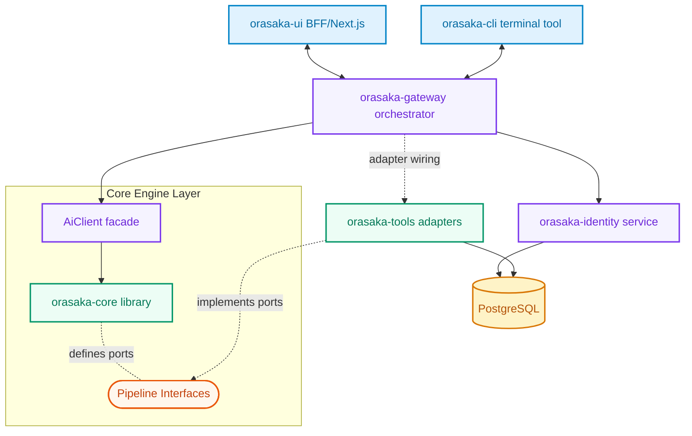
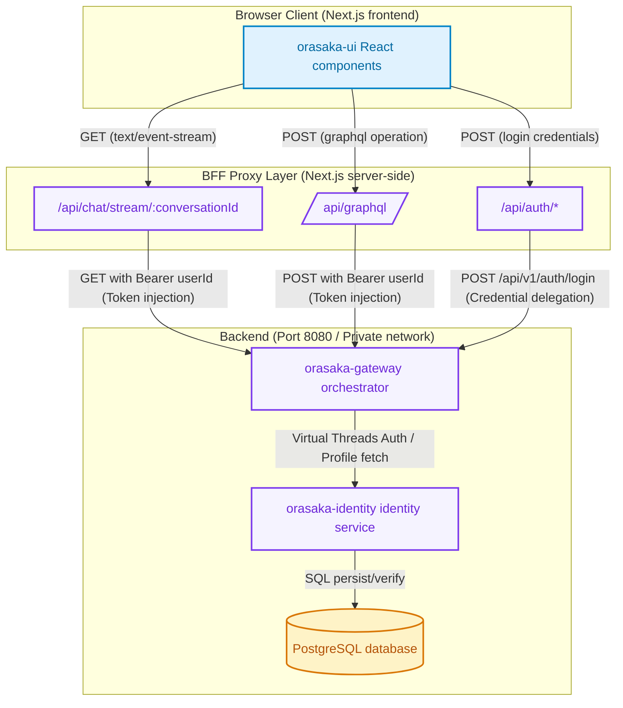
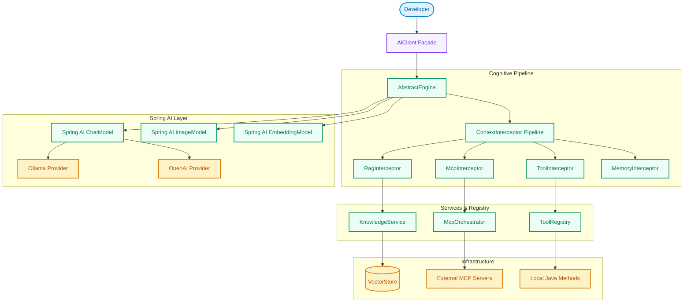
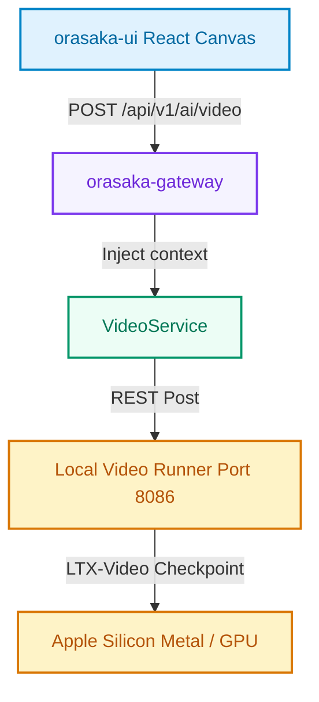

# Architecture Reference

> A visual guide to Orasaka's system topology, module boundaries, and runtime execution flows.

---

## Overview

Orasaka follows a **Ports & Adapters** (Hexagonal) architecture, enforced by ArchUnit at compile time. The system is structured as a decoupled monorepo where every module has a clear, isolated responsibility and dependencies flow strictly top-down.

**Key invariants:**
- `orasaka-core` is 100% web-agnostic — no HTTP, no sessions, no Spring Boot auto-configuration
- Spring AI types never leak outside `orasaka-core` boundaries (Bridge Pattern 2.0)
- `orasaka-gateway` is the only module allowed to cross-reference identity and core
- All blocking I/O runs on Java 21 Virtual Threads

---

## 🏛️ Module Topology



### Module Responsibilities

| Module | What it does | Key packages |
|:---|:---|:---|
| **orasaka-core** | Stateless AI engine library. Holds pure abstractions and strictly locks Spring AI to `1.1.6`. Zero web dependencies. | `client/` — `AiClient` facade · `engine/` — `AbstractEngine`, `CoreProperties`, `GraphEngine` · `pipeline/` — interceptors, tool/knowledge/MCP abstractions · `ingest/` — media pre-processor ports · `support/` — public data records |
| **orasaka-tools** | Concrete tool execution, multi-tier cache (Caffeine → PostgreSQL), and MCP integrations. Implements interfaces defined in core. | `functions/` — `DefaultToolRegistry`, `CachingToolCallback` · `mcp/` — `DefaultMcpOrchestrator` · `config/` — `ToolsProperties` |
| **orasaka-identity** | User authentication, BCrypt hashing, sealed-interface RBAC, email verification, and the interception/feedback engine. | `domain/` — `User`, `Role` sealed interface · `service/` — `IdentityService` · `repository/` — JPA repositories |
| **orasaka-gateway** | Backend-for-Frontend orchestrator. Handles GraphQL, REST, SSE streaming, virtual threads, and security context assembly. | `endpoint/` — `AiController`, `AuthController`, `ChatStreamController` · `config/` — security filters, CORS |
| **orasaka-ui** | Next.js 16 web frontend. Chat canvas, operation graph renderer, BFF proxy layer. | `app/` — pages · `api/` — BFF proxy routes · `components/` — React UI |
| **orasaka-cli** | TypeScript terminal client. JWT auth, GraphQL mutations, SSE streams, multi-modal output. | `src/` — command handlers, SSE client |

---

## 🌐 BFF (Backend-for-Frontend) Topology

The browser **never** connects directly to `orasaka-gateway` (port `8080`) or local AI services (Ollama `11434`, SD `8085`/`8086`). All traffic flows through Next.js server-side API routes.

> [!NOTE]
> Environment parameters like `GATEWAY_URL` are read exclusively on the Next.js server side. The browser is unaware of the actual backend network topology.



**Why BFF?**
- **Security** — User tokens are injected server-side, never exposed to the browser
- **CORS** — No cross-origin issues since the browser only talks to its own Next.js server
- **Topology isolation** — Backend ports and URLs can change without touching client code

---

## 🧠 Cognitive Engine Flow

When a developer calls `AiClient.chat()`, the request flows through a sequential pipeline of context interceptors before reaching the LLM:



### Context-Matrix Pipeline (4 Stages)

Every request passes through an ordered chain of `PromptInterceptor` beans:

| Order | Interceptor | Responsibility |
|:---:|:---|:---|
| 1 | **UserContextResolver** | Extracts user profile, RBAC roles, and rate-limit tier from session context |
| 2 | **SystemContextInjector** | Feeds real-time environment signals, active tools, and system variables |
| 3 | **RefinerInterceptor** | Rewrites fuzzy queries against conversation history into clear instructions |
| 4 | **RouterInterceptor** | Evaluates intent at `temperature: 0.0` and routes to the optimal model provider |

> [!TIP]
> The pipeline can be disabled entirely via `orasaka.core.orchestration.pipeline.enabled=false` for zero-allocation bypass.

---

## 🔏 Interception & Feedback Engine

The `orasaka-identity` module implements an "Intercept & Resume" session engine. Downstream business features can dynamically prompt users to complete surveys, feedback loops, or onboarding flows using abstract JSON configurations.

**How it works:**
1. **Zero-Polling** — Interceptions are checked during initial Gateway token verification and cached in JWT payloads
2. **Database Tracking** — Stored in `orasaka_user_interceptions` (maps `user_id` → `interception_type` + `schema_id`)
3. **Opt-in Activation** — Controlled by feature flags in `application.yml`

---

## 📹 Video Generation Pipeline

The text-to-video pipeline runs on a dedicated port to isolate heavy GPU workloads:

| Service | Port | Technology |
|:---|:---:|:---|
| Gateway | `8080` | Spring Boot + GraphQL |
| Text-to-Image | `8085` | stable-diffusion.cpp (Apple Metal) |
| Text-to-Video | `8086` | LTX-Video GGUF (Apple Metal) |



The client-side canvas renders video via standard HTML5 `<video>` tags with RFC 2397 Data URLs:

```tsx
<video 
  src={payload.url} 
  controls 
  autoPlay 
  loop
  className="max-h-[512px] w-full max-w-[512px] rounded-md bg-black shadow-md"
/>
```

---

## 🌊 Pipeline Orchestration Patterns

### Pattern A: Declarative Configuration

New pipelines can be declared purely in `application.yml` — no code changes required:

```yaml
orasaka:
  pipelines:
    fast-chat:                         # Lightweight — no RAG, no heavy validation
      interceptors:
        - routerInterceptor
        - promptInterceptor
    secure-enterprise-rag:             # Full enterprise context enrichment
      interceptors:
        - securityContextInterceptor
        - ragInterceptor
        - memoryInterceptor
        - promptInterceptor
```

### Pattern B: Fluent Builder (Runtime)

For testing or runtime isolation, use the type-safe builder:

```java
OrchestrationPipeline customPipeline = PipelineBuilder.create()
    .addInterceptor(routerInterceptor)
    .addInterceptor(codeSandboxInterceptor)
    .addInterceptor(promptInterceptor)
    .build();
```

### Encapsulation Rules

- All concrete interceptors are **package-private** within `com.orasaka.core.pipeline`
- Only `OrchestrationPipeline` and `PipelineBuilder` are public API
- Pipeline execution uses `Stream.reduce` — zero race conditions, zero thread-local leaks

---

## 📝 Externalized Prompt Templates

All prompt text is externalized from Java source code into `.st` (StringTemplate) files:

| Template | Purpose |
|:---|:---|
| `prompts/system-refinement.st` | User query refinement and context enrichment |
| `prompts/context-envelope.st` | Structured container for user and system metadata |
| `prompts/system-router.st` | Intent classification and model routing decisions |

Templates are loaded via Spring's `ResourceLoader` and resolved at runtime during cognitive execution loops.

---

## 📎 Related Documentation

| Document | Description |
|:---|:---|
| [API Reference](API_REFERENCE.md) | Public types, facades, endpoints, and data models |
| [Glossary](GLOSSARY.md) | Ecosystem terms, patterns, and environment variables |
| [ADR Log](CONTEXT.md) | 22 Architectural Decision Records |
| [Business Guide](BUSINESS_IMPLEMENTATION.md) | Step-by-step feature implementation blueprint |
