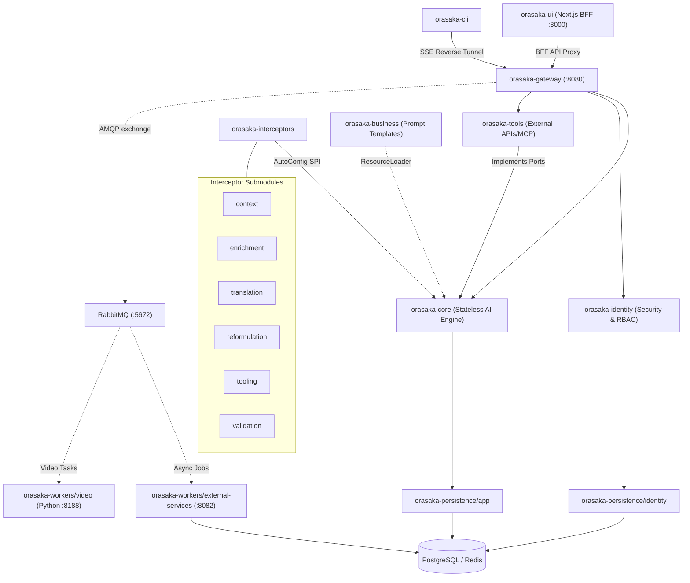
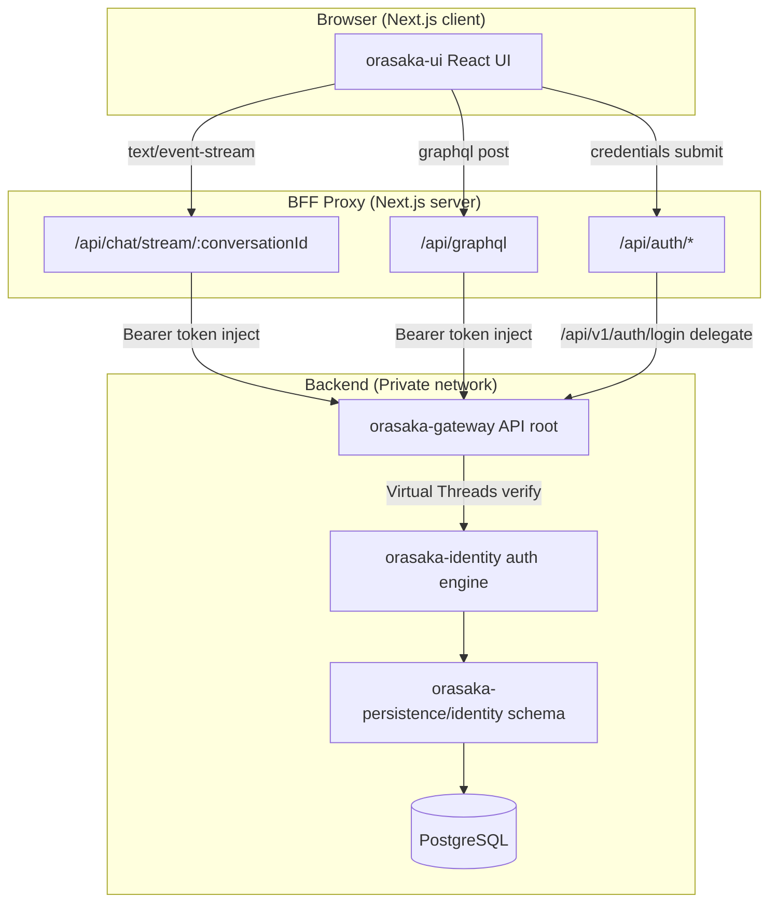
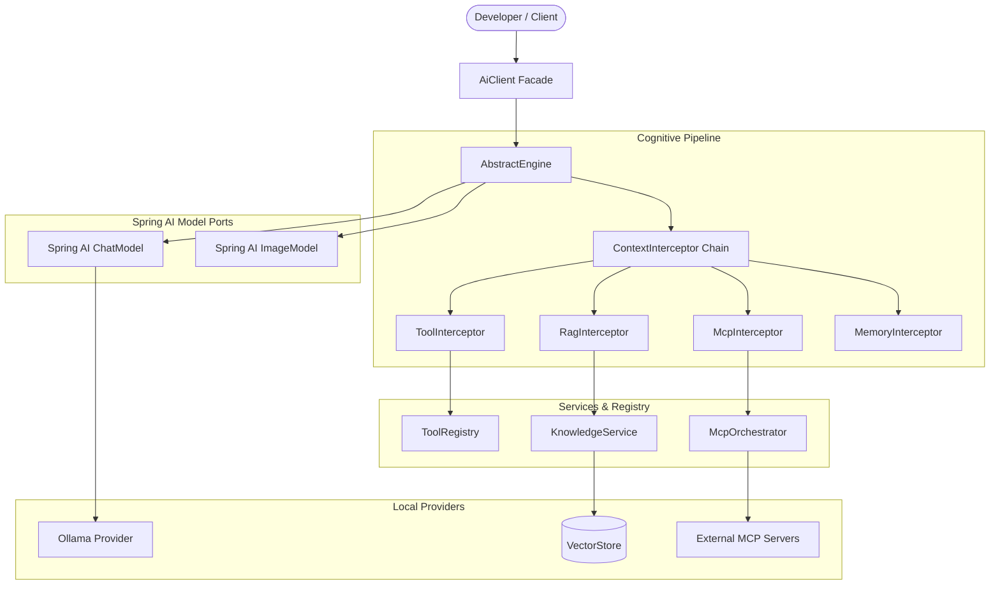
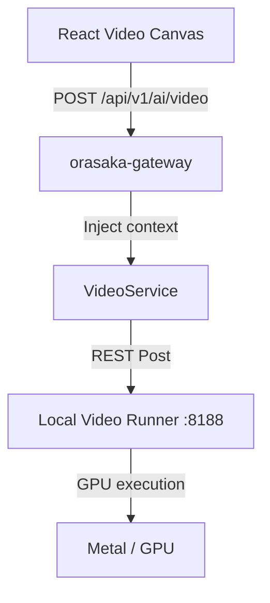

# Architecture Reference

> Visual guide to Orasaka's system topology, module boundaries, and execution flows.

---

## 1. Overview & Module Topology

Orasaka follows a **Ports & Adapters (Hexagonal)** architecture, enforced by ArchUnit at compile time.

> [!IMPORTANT]
> **Outbound Port Event Patterns**: Domain events are published from `orasaka-identity` via pure Java interfaces (`UserEventPublisher` outbound ports). Concrete messaging adapters (`RabbitUserEventAdapter`) reside in `orasaka-persistence/app` and delegate them to RabbitMQ. This maintains core purity.

---

## 2. BFF (Backend-for-Frontend) Topology

The browser **never** connects directly to `orasaka-gateway` (port `8080`) or local AI engines. All traffic proxies through Next.js server-side API routes.

---

## 3. Cognitive Engine Flow

When `AiClient.chat()` is invoked, requests pass through the ordered context interceptor pipeline:

### Context-Matrix Pipeline (Blueprints)
1. **UserContextResolver**: User profiles & RBAC roles.
2. **UserContextInterceptor**: Tenant-level context enrichment.
3. **SystemContextInjector**: Environment signals & active capabilities.
4. **LanguageAlignmentInterceptor**: English reasoning alignment.
5. **MemoryInterceptor**: FIFO conversation history prepend.
6. **DynamicMemoryCondenser**: Sliding window memory compaction.
7. **RagInterceptor**: Tenant-isolated vector store RAG context.
8. **HybridRagResolver**: Dense (PGVector) + Sparse (BM25) fused RAG queries.
9. **McpInterceptor**: Resolve external MCP server tools/data.
10. **RefinerInterceptor**: Resolves contextual refinement (AI-dependent).
11. **RouterInterceptor**: Routes to the optimal model based on intent (AI-dependent).
12. **SimDagRouterInterceptor**: DAG-based multi-step routing simulation.
13. **ToolInterceptor**: Dynamic tool registration & callbacks.
14. **CostShieldInterceptor**: Switches to cloud fallback if memory usage exceeds 85%.
15. **QuantumValidationAdvisor**: 4-tier closed-loop validation (A/B/C/D).

---

## 4. Video Generation Pipeline

Heavy rendering runs on an isolated video worker:

| Service | Port | Engine / Stack |
| :--- | :---: | :--- |
| Gateway | `8080` | Spring Boot GraphQL / REST |
| LocalAI (Speech & Audio) | `8085` | Piper TTS & Whisper (CPU) |
| Text-to-Image | `8086` | stable-diffusion.cpp (MPS) |
| Text-to-Video | `8188` | Stable Video Diffusion XT (Python) |

---

## 5. Pipeline Orchestration Patterns

- **Declarative DB Config**: Declare chains in `pipeline_interceptor_config` (no rebuilds required).

---

## Related Documentation
- [Developer Onboarding Guide](101.md)
- [Core Pipeline specifications](CORE.md)
- [Public API details](API_REFERENCE.md)
- [ADR Indexes](CONTEXT.md)
