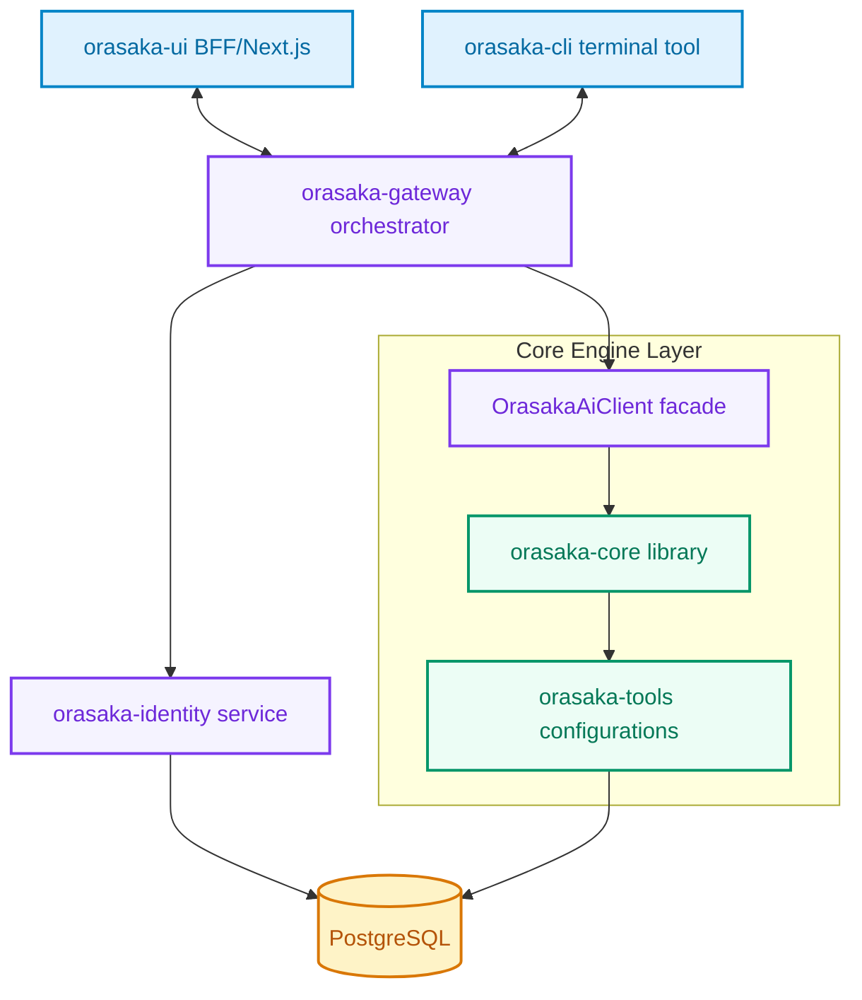
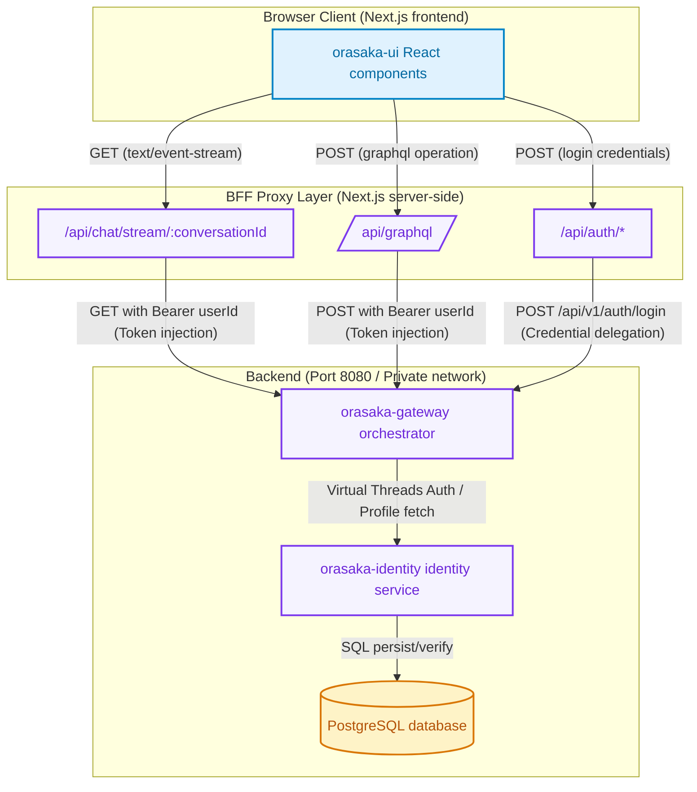
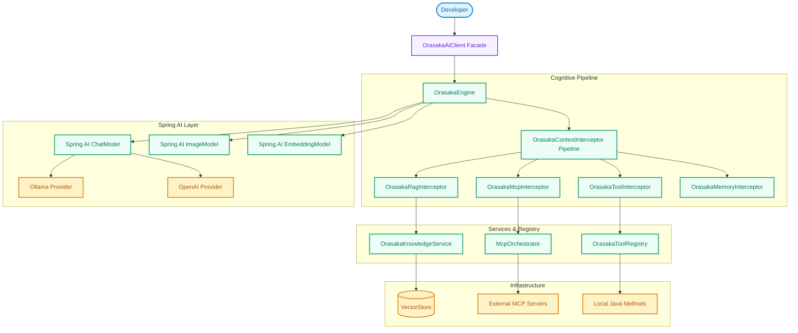
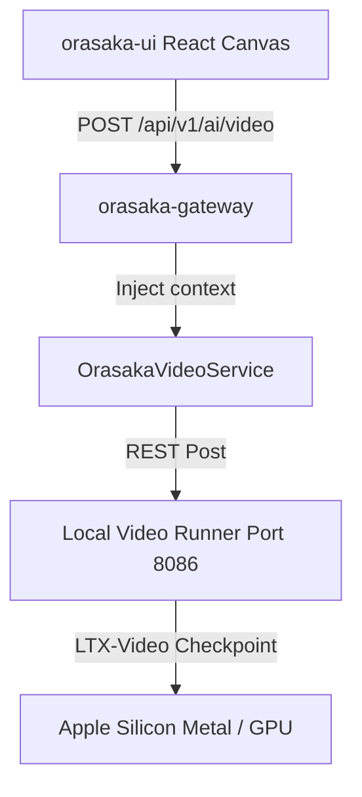

# Orasaka Architecture Overview

This document provides the technical overview of the Orasaka monorepo architecture, describing its component modules, security boundaries, and runtime execution models.

---

## 🏛️ Component Hierarchy

Orasaka is structured as a decoupled monorepo, keeping business features, infrastructure layers, and AI engines completely isolated.



### Module Breakdown

- **[orasaka-core](./orasaka-core)**: The stateless, agnostic core library. It holds pure abstractions (RAG interfaces, Model Context Protocol declarations, engine interfaces) and strictly locks down Spring AI to version `1.1.6`. It is completely decoupled from Spring Boot auto-configuration.
- **[orasaka-tools](./orasaka-tools)**: The concrete tool execution and multi-tier cache module. Contains memory/persistent caffeine-to-postgres decorators and concrete MCP integrations.
- **[orasaka-identity](./orasaka-identity)**: Manages authentication credentials, user profiles, BCrypt hashing, and the data-driven Interception & Feedback engine.
- **[orasaka-gateway](./orasaka-gateway)**: The backend entry orchestrator. Handles secure stateless sessions, virtual threads executing parallel requests, and exposes GraphQL & Server-Sent Events stream interfaces.
- **[orasaka-ui](./orasaka-ui)**: Next.js 14 Web UI. Houses standard pages and features (e.g. Chat, Dynamic Remote UI Renderer), and acts as a BFF (Backend-For-Frontend) proxy layer.
- **[orasaka-cli](./orasaka-cli)**: Node-based terminal client allowing chat automation, profile queries, and streaming chat completions.

---

## 🌐 BFF (Backend-for-Frontend) Topology

To prevent security context leakage, browser-side CORS failures, and open-port exposures on the client, the UI follows a strict BFF topology pattern.

**Key Rule**: The browser client NEVER connects directly to `orasaka-gateway` (port `8080`) or local AI execution environments (e.g., Ollama port `11434`). All asynchronous interactions must go through server-side API Routes in Next.js (`/api/graphql` or `/api/chat/stream/[conversationId]`).

### BFF Topology Flow

Below is the request flow from the browser to the backend database, mediated by Next.js API Routes.

> [!NOTE]
> Environment parameters (like `GATEWAY_URL`) are read exclusively on the Next.js server side. The client code is unaware of the actual backend network topology.



---

## 🧠 Cognitive Engine Execution Flow

The `OrasakaEngine` orchestrates the lifecycle of AI requests, RAG context enrichment, tool matching, and streaming token delivery. It executes on the Gateway tier via Virtual Threads.

### Engine Flow Diagram

Below is the internal flow of client calls through the engine abstractions:



---

## 🔏 Generic Interception & Feedback Engine

The `orasaka-identity` module implements an "Intercept & Resume" Session Engine. Downstream business verticals can dynamically prompt users to perform feedback loops or complete surveys using abstract JSON configurations.

### Key Characteristics

1. **Zero-Polling Profile Injection**: Checked during initial Gateway token verification and cached in JWT payloads, preventing unnecessary runtime API queries.
2. **Generic Database Tracking**: Registered in `orasaka_user_interceptions` (mapping a `user_id` to an active `interception_type` and `schema_id`).
3. **Opt-in Passive Activation**: Controlled dynamically by feature flags inside backend configurations.

---

## 📹 Video Generation Architecture & Rendering

### 🏛️ Pipeline Topology

The Text-to-Video pipeline relies on a local GGUF/Safetensors quantized model loader running on a dedicated port. This decouples video generation traffic from other media execution services:

- **Core Gateway**: Runs on port `8080`.
- **Text-to-Image (Stable Diffusion) Service**: Runs on port `8085`.
- **Text-to-Video (LTX-Video) Service**: Runs on port `8086`.



### 🎨 Frontend Rendering

The client-side canvas checks for `payload.format === 'mp4'` or `payload.url.startsWith('data:video/')`. It then mounts a standard HTML5 video tag with autoplays, controls, and loops:

```tsx
<video 
  src={payload.url} 
  controls 
  autoPlay 
  loop
  className="max-h-[512px] w-full max-w-[512px] rounded-md bg-black shadow-md"
/>
```

---


## 🌊 5. High-Density Pipeline Orchestration & Interceptor Lego Pattern

### 5.1 The Architecture Principle

Orasaka pipelines are stateless, sequential orchestration layers executing safely over Java 21 Virtual Threads. Instead of mutating or fragmenting core logic into different hardcoded service layers, the framework treats the pipeline as an anemic processing sequence driven by a chain of package-private interceptors (`List<OrasakaContextInterceptor>`).

### ⚙️ 5.2 Pattern A: Dynamic Declarative Routing via Configuration

New, isolated execution pipelines can be instantiated purely through metadata declaration within application configuration boundaries (`application.yml`). This prevents code duplication and keeps internal interceptor strategies strictly sealed.

```yaml
orasaka:
  pipelines:
    fast-chat: # Lightweight profile (No RAG, No heavy security validation)
      interceptors:
        - routerInterceptor
        - promptInterceptor
    secure-enterprise-rag: # Fully enriched contextual enterprise profile
      interceptors:
        - securityContextInterceptor
        - orasakaRagInterceptor
        - orasakaMemoryInterceptor
        - promptInterceptor
```

### 🛠️ 5.3 Pattern B: Programmable Fluent Construction (The Pipeline Builder)

For contextual testing or runtime isolation, the framework exposes a strict, type-safe Builder pattern to assemble internal implementation blocks:

```java
// Instantiating a specialized high-density pipeline at runtime
OrasakaOrchestrationPipeline customCodingPipeline = OrasakaPipelineBuilder.create()
    .addInterceptor(routerInterceptor)
    .addInterceptor(codeSandboxInterceptor)
    .addInterceptor(promptInterceptor)
    .build();
```

### 🔒 5.4 Encapsulation & Concurrency Invariance

- **Absolute Package Privacy**: All individual concrete interceptor definitions must remain package-private within `com.orasaka.core.pipeline`. Only the Orchestrator and the Builder are allowed to be public.
- **Virtual Thread Purity**: Because interceptors rely entirely on linear functional reduction (`Stream.reduce`), adding or removing nodes into a pipeline layout introduces zero race conditions or thread-local storage leaks.
