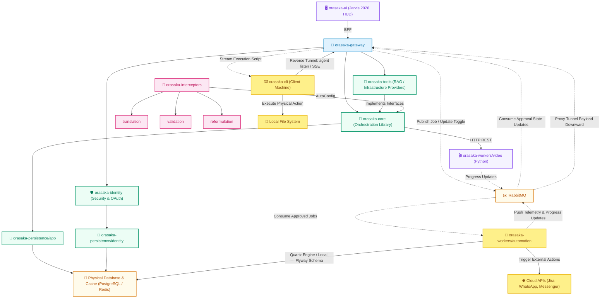
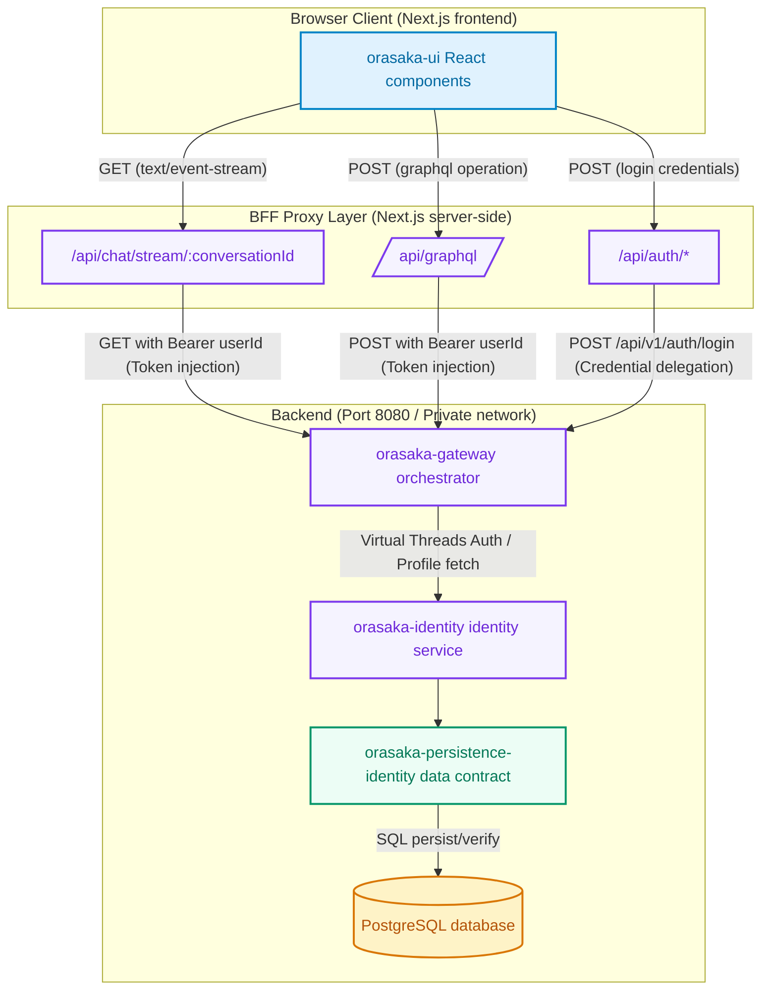
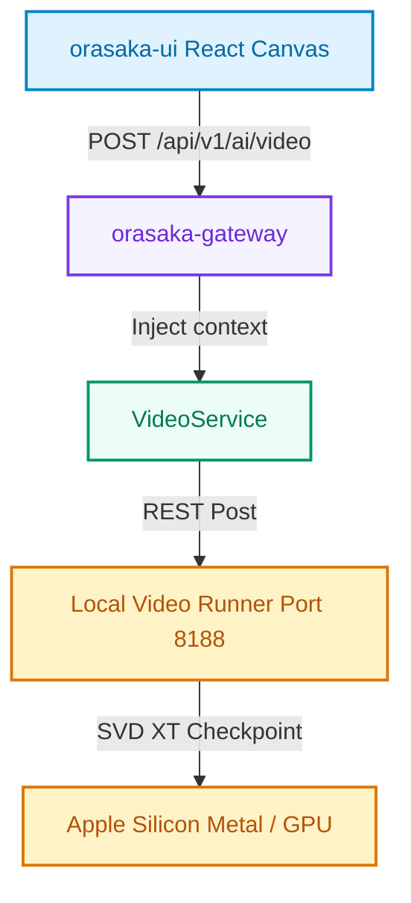

# Architecture Reference

> A visual guide to Orasaka's system topology, module boundaries, and runtime execution flows.

---

## Overview

Orasaka follows a **Ports & Adapters** (Hexagonal) architecture, enforced by ArchUnit at compile time. The system is structured as a decoupled monorepo where every module has a clear, isolated responsibility and dependencies flow strictly top-down.

**Key invariants:**

- `orasaka-core` is 100% web-agnostic — no HTTP, no sessions, no Spring Boot auto-configuration
- Spring AI types never leak outside `orasaka-core` boundaries (Bridge Pattern 2.0)
- `orasaka-gateway` is the only module allowed to cross-reference identity and core
- All blocking I/O runs on Java 21 Virtual Threads

---

## 🏛️ Module Topology



> [!IMPORTANT]
> **Gateway Infrastructure Dependency Exception**
> 
> While `orasaka-gateway` acts strictly as an API border guard and orchestrator and is forbidden from directly invoking or bypassing to the primary business persistence module (`orasaka-persistence-app`), the gateway retains direct database/cache connections solely for framework-level utilities (such as Redis/PostgreSQL infrastructure for session tokens, technical rate-limiting, and OAuth routing context). This is a technical infrastructure-level integration and does not constitute a domain persistence leak.

### Module Responsibilities

| Module                  | What it does                                                                                                                              | Key packages                                                                                                                                                                                                                                                                                                                                                                                                                                                               |
| :---------------------- | :---------------------------------------------------------------------------------------------------------------------------------------- | :------------------------------------------------------------------------------------------------------------------------------------------------------------------------------------------------------------------------------------------------------------------------------------------------------------------------------------------------------------------------------------------------------------------------------------------------------------------------- |
| **orasaka-core**        | Stateless AI engine library. Holds pure abstractions, `DynamicPipelineOrchestrator`, and strictly locks Spring AI to `1.1.6`. Zero web dependencies. | `domain.ports.inbound` / `domain.ports.outbound` — ports · `domain.model` — requests, responses, execution states · `application.engine` — engine runners · `application.pipeline` — `DynamicPipelineOrchestrator`, `OrchestrationPipeline` · `application.interceptor` — `PromptContextInterceptor` port · `infrastructure.config` — CoreProperties, SecurityProperties · `infrastructure.adapter.ai` — Ollama, local generators |
| **orasaka-interceptors** | Aggregator module for plug-and-play interceptor submodules. Loaded via Spring Boot `AutoConfiguration.imports`. | `orasaka-interceptor-translation` — language alignment · `orasaka-interceptor-validation` — cost shield, hardware telemetry · `orasaka-interceptor-reformulation` — query refinement, intent routing, SIM-DAG |
| **orasaka-tools**       | Concrete tool execution, multi-tier cache (Caffeine → PostgreSQL), and MCP integrations. Implements interfaces defined in core.           | `domain.ports` — tool registry port · `application.service` — cache, callback services · `functions.[feature]` — CLI-based tools callback definitions · `infrastructure.config` — ToolsProperties · `infrastructure.persistence.[entity|repository|converter]` — entities and converters |
| **orasaka-persistence/app** | Decoupled persistence and infrastructure state management. Manages database tables and queues for jobs, rate limits, and feature toggles. | `domain` — job/rate limit ports · `application.service` — persistence services · `infrastructure.config` — RabbitMQ config, DB configs · `infrastructure.persistence.[entity|repository|converter]` — entities, repositories, and JSON converters |
| **orasaka-identity**    | User authentication, BCrypt hashing, sealed-interface RBAC, email verification, password recovery (token-based), and the interception/feedback engine.                     | `domain` — User, Role, profiles · `application.service` — identity services, password recovery · `infrastructure.config` — Security config, token filters · `infrastructure.persistence.[entity|repository|converter]` — entities, repositories, and converters |
| **orasaka-gateway**     | Backend-for-Frontend orchestrator. Handles GraphQL, REST, SSE streaming, virtual threads, and security context assembly.                  | `domain.model` — DTOs, request payloads · `application.service` — SSE services, async runners · `infrastructure.config` — CORS, GraphQL config · `infrastructure.adapter.[rest|graphql|amqp]` — endpoint handlers · `infrastructure.support` — Security context utils, token decoders |
| **orasaka-ui**          | Next.js 16 web frontend. Chat canvas, operation graph renderer, BFF proxy layer.                                                          | `app/` — pages · `api/` — BFF proxy routes · `components/` — React UI · `features/` — domain hooks, components, and types · `services/` — ApiService modules |
| **orasaka-cli**         | TypeScript terminal client. JWT auth, GraphQL mutations, SSE streams, reverse tunnel agent listener, multi-modal output.                   | `src/commands/` — commander actions (incl. `agent listen`) · `src/services/` — API clients · `src/types/` — types · `src/ui/` — box, prompt templates |
| **orasaka-workers/automation** | Isolated Spring Boot worker consuming approved jobs from RabbitMQ. Executes cloud API actions via Apache Camel connectors and dispatches CLI agent payloads. Maintains independent Quartz/Flyway persistence. | `domain` — job payloads, connector types · `application.service` — Camel routes, Quartz scheduler · `infrastructure.persistence` — Flyway migrations, credential vault |
| **orasaka-workers/video** | Standalone Python module executing Stable Video Diffusion video generation optimized for Apple Silicon (MPS). Excluded from Maven reactor. | `app/main.py` — worker server · `requirements.txt` — dependencies |

---

## 🌐 BFF (Backend-for-Frontend) Topology

The browser **never** connects directly to `orasaka-gateway` (port `8080`) or local AI services (Ollama `11434`, SD `8085`/`8086`). All traffic flows through Next.js server-side API routes.

> [!NOTE]
> Environment parameters like `GATEWAY_URL` are read exclusively on the Next.js server side. The browser is unaware of the actual backend network topology.



**Why BFF?**

- **Security** — User tokens are injected server-side, never exposed to the browser
- **CORS** — No cross-origin issues since the browser only talks to its own Next.js server
- **Topology isolation** — Backend ports and URLs can change without touching client code

---

## 🧠 Cognitive Engine Flow

When a developer calls `AiClient.chat()`, the request flows through a sequential pipeline of context interceptors before reaching the LLM:


### Context-Matrix Orchestration Pipeline

Every request passes through the `DynamicPipelineOrchestrator`, which resolves an ordered chain of `PromptContextInterceptor` beans via two routing modes:

| Mode | Strategy |
|:---|:---|
| **DETERMINISTIC** (default) | Database-driven ordering via `PipelineConfigProvider` — admin-controlled execution sequence |
| **AGENTIC** | LLM-driven runtime sequence generation based on payload intent analysis |

**Security Kill-Switch**: When `orasaka.security.disable-ai=true`, the orchestrator blocks all AI-dependent interceptors with a `SecurityException`.

| Order | Interceptor                    | Module | AI-Dep | Responsibility |
| :---: | :----------------------------- | :--- | :---: | :------------------------------------------------------------------------------ |
|   1   | **UserContextResolver**        | core | ❌ | Extracts user profile, RBAC roles, and rate-limit tier from session context |
|   2   | **SystemContextInjector**      | core | ❌ | Feeds real-time environment signals, active tools, and system variables |
|   3   | **LanguageAlignmentInterceptor** | translation | ❌ | Detects user language; forces LLM reasoning in English, output in user's native tongue |
|   4   | **DynamicMemoryCondenser**     | reformulation | ❌ | Retains last 3 raw turns, compresses older history into dense semantic facts |
|   5   | **HybridRagResolver**          | reformulation | ❌ | Reciprocal Rank Fusion: BM25 (PostgreSQL) + dense embedding (PGVector) with tenant isolation |
|   6   | **RefinerInterceptor**         | reformulation | ✅ | Rewrites fuzzy queries against compiled context into clear instructions |
|   7   | **RouterInterceptor**          | reformulation | ✅ | Evaluates intent at `temperature: 0.0` and routes to the optimal model provider |
|   9   | **CostShieldInterceptor**      | validation | ❌ | Monitors M1 unified memory; shifts heavy tasks to cloud API when usage > 85% |

> [!TIP]
> The pipeline can be disabled entirely via `orasaka.core.orchestration.pipeline.enabled=false` for zero-allocation bypass.

---

## 🔏 Interception & Feedback Engine

The `orasaka-identity` module implements an "Intercept & Resume" session engine. Downstream business features can dynamically prompt users to complete surveys, feedback loops, or onboarding flows using abstract JSON configurations.

**How it works:**

1. **Zero-Polling** — Interceptions are checked during initial Gateway token verification and cached in JWT payloads
2. **Database Tracking** — Stored in `orasaka_user_interceptions` (maps `user_id` → `interception_type` + `schema_id`)
3. **Opt-in Activation** — Controlled by feature flags in `application.yml`

---

## 📹 Video Generation Pipeline

The text-to-video pipeline runs on a dedicated port to isolate heavy GPU workloads:

| Service       |  Port  | Technology                         |
| :------------ | :----: | :--------------------------------- |
| Gateway       | `8080` | Spring Boot + GraphQL              |
| Text-to-Image | `8085` | stable-diffusion.cpp (Apple Metal) |
| Text-to-Speech| `8085` | LocalAI Speech Synthesis           |
| Text-to-Video | `8188` | Stable Video Diffusion XT (Python) |



The client-side canvas renders video via standard HTML5 `<video>` tags with RFC 2397 Data URLs:

```tsx
<video
  src={payload.url}
  controls
  autoPlay
  loop
  className="max-h-[512px] w-full max-w-[512px] rounded-md bg-black shadow-md"
/>
```

---

## 🌊 Pipeline Orchestration Patterns

### Pattern A: Declarative Configuration

New pipelines can be declared purely in the `pipeline_configurations` database table via the Admin API — no code changes required:

```json
{
  "pipelineKey": "fast-chat",
  "description": "Lightweight — no RAG, no heavy validation",
  "interceptorChain": [
    "routerInterceptor",
    "promptInterceptor"
  ]
}
```

### Pattern B: Fluent Builder (Runtime)

For testing or runtime isolation, use the type-safe builder:

```java
OrchestrationPipeline customPipeline = PipelineBuilder.create()
    .addInterceptor(routerInterceptor)
    .addInterceptor(codeSandboxInterceptor)
    .addInterceptor(promptInterceptor)
    .build();
```

### Encapsulation Rules

- Interceptor implementations are **standalone Maven submodules** under `orasaka-interceptors/`, loaded via `AutoConfiguration.imports`
- `orasaka-core` contains only the `PromptContextInterceptor` port interface and `DynamicPipelineOrchestrator`
- `DynamicPipelineOrchestrator` and `PipelineOptionsRegistry` are public API
- Pipeline execution uses `Stream.reduce` — zero race conditions, zero thread-local leaks
- Security governance: `isAiDependent()` flag on each interceptor enables fine-grained kill-switch control

---

## 📝 Externalized Prompt Templates

All prompt text is externalized from Java source code into `.st` (StringTemplate) files:

| Template                       | Purpose                                           |
| :----------------------------- | :------------------------------------------------ |
| `prompts/system-refinement.st` | User query refinement and context enrichment      |
| `prompts/context-envelope.st`  | Structured container for user and system metadata |
| `prompts/system-router.st`     | Intent classification and model routing decisions |

Templates are loaded via Spring's `ResourceLoader` and resolved at runtime during cognitive execution loops.

---

## 📎 Related Documentation

| Document                                     | Description                                          |
| :------------------------------------------- | :--------------------------------------------------- |
| [API Reference](API_REFERENCE.md)            | Public types, facades, endpoints, and data models    |
| [Glossary](GLOSSARY.md)                      | Ecosystem terms, patterns, and environment variables |
| [ADR Log](CONTEXT.md)                        | 31 Architectural Decision Records                    |
| [Business Guide](BUSINESS_IMPLEMENTATION.md) | Step-by-step feature implementation blueprint        |
| [Automation & Agents](AUTOMATION.md)         | Decoupled Java worker, Quartz/Flyway, Camel routes & Local Agent Protocol |
