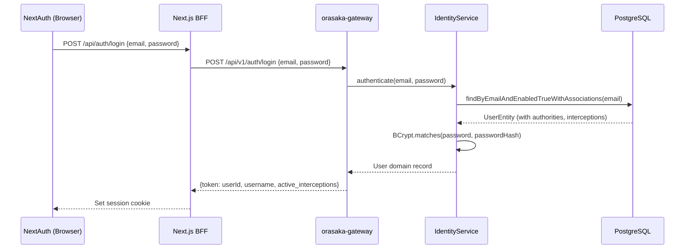
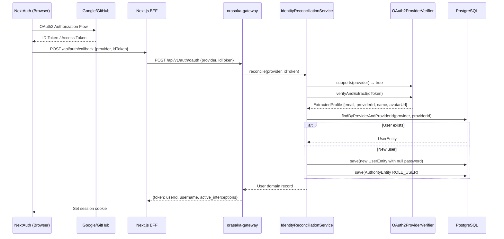

# Authentication Reference

> Complete guide to Orasaka's authentication architecture, covering local credentials, OAuth2 federation, and provider extensibility.

---

## Overview

Orasaka supports two authentication strategies, governed by configuration flags:

| Strategy | Module | Config Prefix | Description |
|:---|:---|:---|:---|
| **Local Credentials** | `orasaka-identity` | `orasaka.identity.auth.local` | Email + password → BCrypt → JWT |
| **OAuth2 Token-Exchange** | `orasaka-identity` | `orasaka.identity.auth.oauth2.*` | NextAuth → provider token → backend verification → reconciliation |

Both strategies produce the same output: a domain `User` record with authorities, preferences, and interception state.

> [!IMPORTANT]
> The backend **never** performs OAuth2 protocol negotiation (authorization code flows, redirects, etc.). That responsibility belongs entirely to the frontend layer (NextAuth). The backend acts purely as an **Identity Verifier & Reconciler** (ADR-023).

---

## 🔑 Local Credential Flow



### Endpoint

```
POST /api/v1/auth/login
Content-Type: application/json

{
  "email": "user@example.com",
  "password": "secret"
}
```

### Response (200 OK)

```json
{
  "token": "550e8400-e29b-41d4-a716-446655440000",
  "username": "johndoe",
  "active_interceptions": ["onboarding"]
}
```

---

## 🌐 OAuth2 Token-Exchange Flow



### Endpoint

```
POST /api/v1/auth/oauth
Content-Type: application/json

{
  "provider": "google",
  "idToken": "eyJhbGciOiJSUzI1NiIs...",
  "email": "user@gmail.com",
  "username": "John Doe"
}
```

| Field | Required | Description |
|:---|:---:|:---|
| `provider` | ✅ | Provider identifier: `"google"`, `"github"`, etc. |
| `idToken` | ✅ | Raw identity/access token from the external provider |
| `email` | ❌ | Optional email hint for logging |
| `username` | ❌ | Optional username hint (falls back to provider profile name) |

### Response (200 OK)

```json
{
  "token": "550e8400-e29b-41d4-a716-446655440000",
  "username": "John Doe",
  "active_interceptions": []
}
```

### Response (401 Unauthorized)

```json
{
  "error": "No active verifier found for provider: apple. Ensure the provider is enabled in configuration."
}
```

---

## ⚙️ Configuration Flags

All authentication strategies are governed by feature flags in `application.yml`:

```yaml
orasaka:
  infrastructure:
    identity:
      auth:
        local:
          enabled: true                                    # Email/password login
        oauth2:
          google:
            enabled: ${ORASAKA_OAUTH2_GOOGLE_ENABLED:false}
            client-id: ${GOOGLE_CLIENT_ID:}
          github:
            enabled: ${ORASAKA_OAUTH2_GITHUB_ENABLED:false}
            client-id: ${GITHUB_CLIENT_ID:}
```

### Environment Variables

| Variable | Default | Description |
|:---|:---|:---|
| `ORASAKA_OAUTH2_GOOGLE_ENABLED` | `false` | Enable/disable Google OAuth2 provider |
| `GOOGLE_CLIENT_ID` | *(empty)* | Google OAuth2 client ID |
| `ORASAKA_OAUTH2_GITHUB_ENABLED` | `false` | Enable/disable GitHub OAuth2 provider |
| `GITHUB_CLIENT_ID` | *(empty)* | GitHub OAuth2 client ID |

> [!NOTE]
> When a provider is disabled (`enabled: false`), its `OAuth2ProviderVerifier` bean is **never instantiated**. This means zero startup overhead and zero memory allocation for unused providers.

---

## 🔌 Adding a New Provider

Adding a new OAuth2 provider follows the **Open-Closed Principle** — no existing code needs modification.

### Step 1: Create the Verifier

```java
package com.orasaka.identity.federation;

@Component
@ConditionalOnProperty(
    prefix = "orasaka.identity.auth.oauth2.apple",
    name = "enabled",
    havingValue = "true")
class AppleProviderVerifier implements OAuth2ProviderVerifier {

    @Override
    public boolean supports(String providerId) {
        return "apple".equalsIgnoreCase(providerId);
    }

    @Override
    public ExtractedProfile verifyAndExtract(String idToken) {
        // Implement Apple ID token verification
        // Return ExtractedProfile with email, providerId, name, avatarUrl
    }
}
```

### Step 2: Add Configuration

```yaml
orasaka:
  infrastructure:
    identity:
      auth:
        oauth2:
          apple:
            enabled: ${ORASAKA_OAUTH2_APPLE_ENABLED:false}
            client-id: ${APPLE_CLIENT_ID:}
```

### Step 3: Update `FederationProperties.java`

Add the new provider config record to `FederationProperties.OAuth2Auth`.

That's it. The `IdentityReconciliationService` automatically discovers the new verifier via Spring's `List<OAuth2ProviderVerifier>` injection.

---

## 🏛️ Architecture Invariants

| Rule | Enforcement |
|:---|:---|
| **Token-Exchange Only** | Backend never performs OAuth2 authorization code flows (ERR-105) |
| **Stateless Verification** | No provider sessions maintained in Spring Security filters |
| **Conditional Loading** | `@ConditionalOnProperty` gates each provider bean |
| **Null Password Hash** | Federated users have `password_hash = NULL` in the database |
| **Race Condition Safety** | `unique_provider_user` constraint handles concurrent JIT provisioning |
| **Web Agnosticism** | `orasaka-identity` has zero web dependencies (no `spring-boot-starter-web`) |

---

## 📎 Related Documentation

| Document | Description |
|:---|:---|
| [Architecture Reference](ARCHITECTURE.md) | System topology, module boundaries, execution flows |
| [API Reference](API_REFERENCE.md) | Public types, facades, endpoints, data models |
| [ADR-023](CONTEXT.md) | Agnostic OAuth2 Token-Exchange Federation decision record |
| [AGENTS.md](../AGENTS.md) | ERR-105: Identity Federation Invariant |
