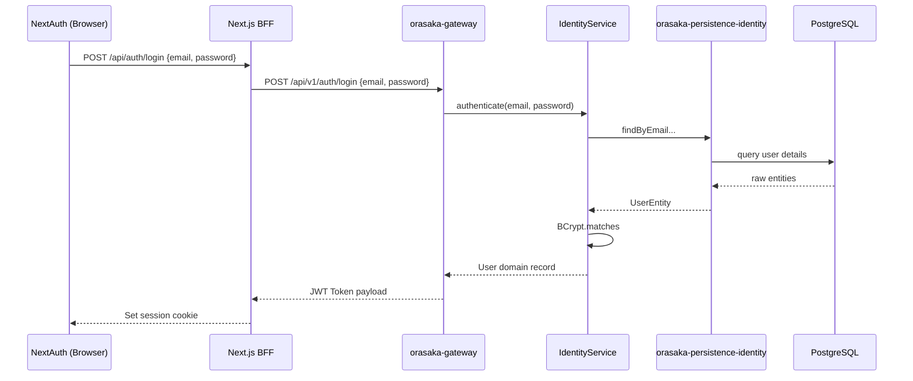
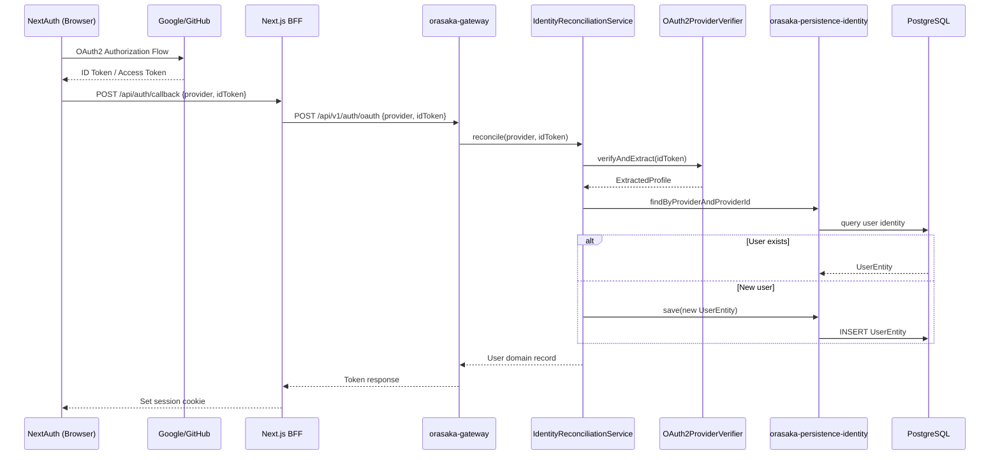
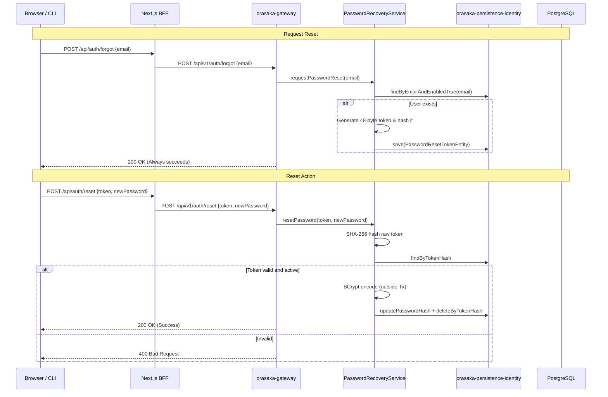

# Authentication Reference

> Complete guide to Orasaka's authentication architecture (local credentials, OAuth2, password recovery).

---

## 1. Overview

| Strategy | Module | Configuration | Description |
|:---|:---|:---|:---|
| **Local Credentials** | `orasaka-identity` | `orasaka.identity.auth.local` | Email + password hashed with BCrypt |
| **OAuth2 Exchange** | `orasaka-identity` | `orasaka.identity.auth.oauth2.*` | NextAuth verifies -> Gateway reconciles |
| **Password Reset** | `orasaka-identity` | — | Token-based reset with zero-enumeration |

> [!IMPORTANT]
> The backend **never** performs OAuth2 redirects or protocol negotiations. This is handled by NextAuth (BFF). The backend only validates tokens.

---

## 2. Local Credential Flow

- Endpoint: `POST /api/v1/auth/login`
- Payload: `{"email": "...", "password": "..."}`

---

## 3. OAuth2 Token-Exchange Flow

- Endpoint: `POST /api/v1/auth/oauth`
- Payload: `{"provider": "google", "idToken": "..."}`

---

## 4. Password Recovery Flow

- **Forgot Password**: `POST /api/v1/auth/forgot`. Enforces **Zero-Enumeration Invariant**: returns `200 OK` regardless of whether the email exists.
- **Reset Password**: `POST /api/v1/auth/reset` with payload `{"token": "...", "newPassword": "..."}`. Returns `400` on invalid/expired token.

---

## 5. Security & Invariants

- **Token Cryptography**: 48-byte `SecureRandom` token saved as SHA-256 hash (never plaintext). Expire in 15 minutes. Single-use.
- **Password Hashing**: BCrypt is always executed outside `@Transactional` blocks to prevent pool starvation.
- **Provider Extensibility**: Implement `OAuth2ProviderVerifier` and annotate with `@ConditionalOnProperty` to support new sign-in options.
- **Database Schemas**: Password reset tokens and user password-change tracking are defined in `infra/local-db/01-schema.sql`. Flyway is disabled (`spring.flyway.enabled=false`); schemas load via Docker init scripts.
- **Concurrency**: Global security context propagation utilizes a `DelegatingSecurityContextExecutorService` wrapper bean.

---

## Related Documentation
- [Developer Onboarding Guide](101.md)
- [Architecture Reference](ARCHITECTURE.md)
- [API Reference](API_REFERENCE.md)
- [Glossary](GLOSSARY.md)

