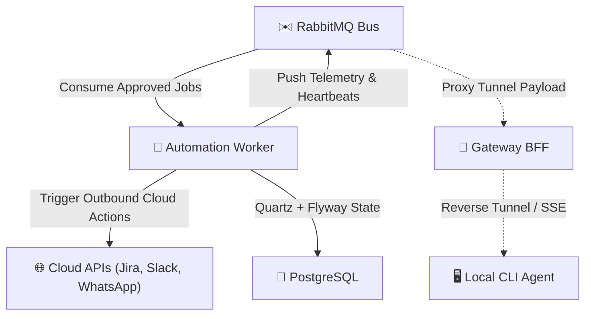
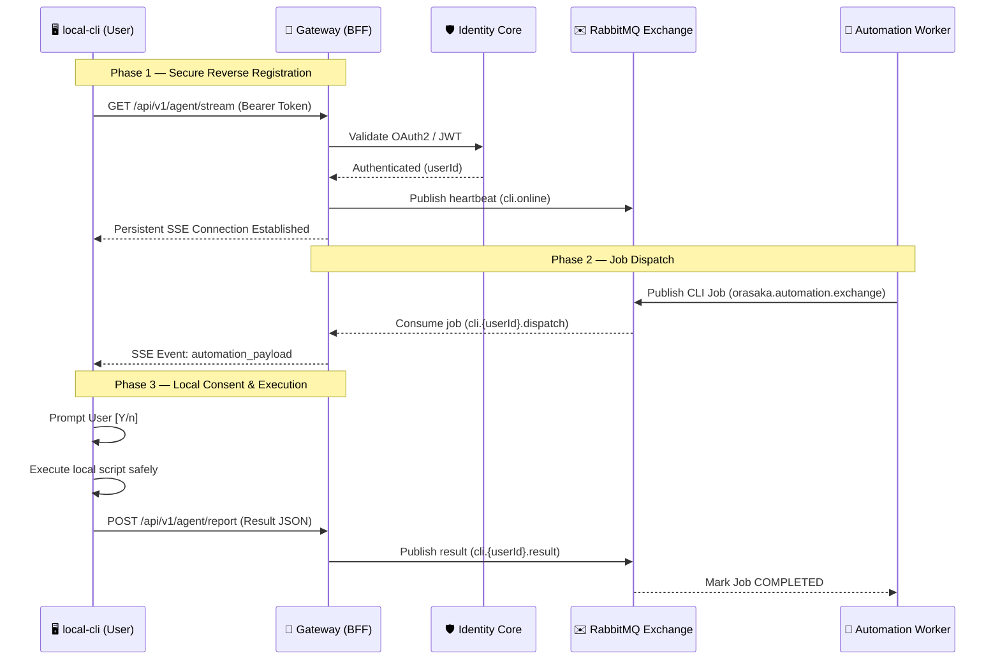

# Automation Engine & Local Agent Protocol Specification

> System specification for the decoupled background job executor (`orasaka-automation-worker`) and the secure reverse-tunneling agent protocol.

---

## 1. Architectural Architecture & Principles

Orasaka enforces a strict separation of heavy async task execution from the core request-response gateway threadpool. This is achieved via two main components:
1. **`orasaka-automation-worker`**: An isolated background processor.
2. **`orasaka-cli` agent mode**: A local-execution runner that communicates with the gateway via a secure reverse-tunnel.



### 1.1 Hexagonal Isolation
To prevent compilation or classpath leaks, the automation worker maintains strict isolation:
- **No Classpath Sharing**: It does not depend on `orasaka-persistence-app` or `orasaka-gateway`.
- **Independent Schema Management**: It uses its own JPA entities and Flyway migrations table (`flyway_schema_history_automation`).
- **Communication Invariant**: It interacts with other system modules exclusively via the RabbitMQ message exchange.

### 1.2 Zero Inbound Ports
To maintain a zero-trust network posture:
- The background worker exposes no public network ports (runs inside the isolated cluster mesh).
- The local CLI agent runs behind a user's NAT and initiates all connections **outbound** to the gateway.

---

## 2. Quartz & Schema Persistence

Scheduled and long-running automation tasks are stored in a persistent JDBC Job Store using Quartz:

| Configuration Property | Target Value |
|:---|:---|
| `spring.quartz.job-store-type` | `jdbc` |
| `spring.quartz.jdbc.initialize-schema` | `never` (Flyway-managed) |
| `spring.quartz.properties.org.quartz.jobStore.driverDelegateClass` | `org.quartz.impl.jdbcjobstore.PostgreSQLDelegate` |
| `spring.quartz.properties.org.quartz.jobStore.tablePrefix` | `QRTZ_` |

### 2.1 Flyway Separation
The worker runs migrations against the shared physical database but isolates its metadata schema:
- **Table name**: `flyway_schema_history_automation`
- **Location**: `classpath:db/migration` containing standard Quartz JDBC tables, connector credential vaults, and job execution logs.

---

## 3. Apache Camel Integration & Connectors

The worker utilizes Apache Camel routes to integrate with external collaboration tools dynamically:

### 3.1 Supported Connectors
*   **Jira Cloud** (`camel-jira`): Ticket ingestion, comment indexing, status mutation.
*   **Slack** (`camel-http`): Channel alerts, real-time message routing.
*   **WhatsApp / Messenger** (`camel-http`): Dynamic messaging via Graph APIs.

### 3.2 Dynamic Route Pattern
```java
from("rabbitmq:orasaka.automation.exchange?queue=orasaka.automation.jobs&routingKey=job.approved")
    .routeId("automation-job-consumer")
    .unmarshal().json(JsonLibrary.Jackson, AutomationJobPayload.class)
    .choice()
        .when(header("connectorType").isEqualTo("JIRA"))
            .to("direct:jira-execute")
        .when(header("connectorType").isEqualTo("WHATSAPP"))
            .to("direct:whatsapp-execute")
        .when(header("connectorType").isEqualTo("CLI_AGENT"))
            .to("direct:cli-proxy-dispatch")
    .end();
```

### 3.3 Multi-Tenant Credential Vault
- Credentials are encrypted at rest in PostgreSQL (`connector_credentials` table).
- They are decrypted on-demand at runtime using a per-tenant AES key derived from the master deployment secret.

---

## 4. Local Agent Protocol (Reverse AMQP Tunneling)

When the automation engine requires execution on a user's local machine (e.g., sorting local files, executing local test suites), it utilizes the **Local Agent Protocol**.

### 4.1 Architecture Flow



### 4.2 Protocol Phase Details

#### Phase 1: CLI Agent Registration
The CLI client initiates an outbound HTTP request to `GET /api/v1/agent/stream` using Server-Sent Events (SSE). The Gateway validates the authorization header and registers the channel. The Gateway broadcasts a heartbeat:
```json
{
  "userId": "user-uuid",
  "status": "ONLINE",
  "timestamp": "2026-06-01T22:30:00Z",
  "platform": "darwin-arm64",
  "version": "1.2.0"
}
```

#### Phase 2: Job Execution Dispatch
When a job is picked up by the automation worker that targets the user's CLI, the worker publishes a JSON payload to RabbitMQ:
```json
{
  "jobId": "job-uuid",
  "userId": "user-uuid",
  "connectorType": "CLI_AGENT",
  "action": "SORT_FILES",
  "payload": {
    "script": "find ~/Downloads -name '*.pdf' -exec mv {} ~/Documents/PDFs/ \\;",
    "workingDirectory": "~/Downloads",
    "timeout": 300
  }
}
```
The Gateway consumes the message and pushes it down the persistent SSE connection.

#### Phase 3: Local Consent & Execution
The CLI agent intercepts the command and prompts the user in the terminal for explicit permission:
```bash
⚠️  ORASAKA AUTOMATION REQUEST
Action: SORT_FILES
Script: find ~/Downloads -name '*.pdf' -exec mv {} ~/Documents/PDFs/ \;

Execute this action? [Y/n]
```
Upon user consent, the command runs locally, and execution results are returned to the gateway via a `POST /api/v1/agent/report` call.

---

## 5. Security & Isolation Matrix

| Safety Dimension | Enforcement Method |
|:---|:---|
| **Zero Inbound Ports** | CLI pulls commands via persistent outbound SSE; no inbound network rules required. |
| **Interactive Consent** | The CLI agent prompts the user with `[Y/n]` for all script execution actions. |
| **Scope Sandboxing** | Execution paths are bound to directories specified in local configurations. |
| **Transport Security** | TLS (HTTPS/WSS) is enforced on all gateway traffic. |
| **Execution Timeouts** | Hard timeouts (default 300s) prevent orphaned script hangs. |

---

## 6. RabbitMQ Topology

| Exchange | Type | Routing Key | Queue | Consumer |
|:---|:---|:---|:---|:---|
| `orasaka.automation.exchange` | Topic | `job.approved` | `orasaka.automation.jobs` | Worker |
| `orasaka.automation.exchange` | Topic | `cli.{userId}.dispatch` | Per-User Dispatch | Gateway |
| `orasaka.automation.exchange` | Topic | `cli.{userId}.result` | Per-User Result | Worker |
| `orasaka.cli.exchange` | Fanout | `cli.online` | `orasaka.cli.heartbeat` | Gateway |
