# Orasaka: Business Implementation & CLI Playbook

> A production-ready developer playbook for building, deploying, and operating the Orasaka multi-modal AI orchestration platform. This document covers the full lifecycle: from monorepo compilation to CLI execution, media ingestion, video generation, and dynamic capability management.

---

## 🎬 CinePulse — A Product Built on Orasaka

### The Problem

Every evening, millions of users face the same question: **"What should we watch tonight?"**

Current solutions (Netflix browse, Google search, friend recommendations) all fail at the same friction point — they require you to *already know what you're looking for*. But the real-world discovery journey is different:

- You hear a **soundtrack** playing in a café and want to know the movie
- You see a **poster** on the street and wonder what it is and where to stream it
- You catch a **scene** on someone's screen and want to identify it instantly
- You simply want a **mood-based recommendation** for a cozy evening with your partner

### The Solution: CinePulse by Orasaka

CinePulse is a multi-modal AI-powered entertainment discovery platform that answers three core questions:

| Question | Modality | Orasaka Capability |
|:---|:---|:---|
| **"What should I watch tonight?"** | Text prompt (mood/context) | Cognitive recommendation engine |
| **"What movie is this?"** (audio) | Audio clip / soundtrack | Audio fingerprinting + LLM enrichment |
| **"What movie is this?"** (visual) | Screenshot / poster / video clip | Vision analysis + semantic matching |

### UI Screens

CinePulse features 6 production screens, each powered by a distinct Orasaka pipeline:

| Screen | Core Purpose | Orasaka Backend Pipeline / Capability |
|:---|:---|:---|
| **Dashboard** | Cognitive Trends — AI-compiled recommendations based on mood queries, preferences, and scan history | `UserContextResolver` + `HybridRagResolver` |
| **Media Recognition** | Dual-panel Visual Scan + Audio Sound Match with real-time analysis | `Vision` + `Audio` ingestion pipelines |
| **Watchlist** | User's saved movies with streaming availability and progress tracking | `JPA persistence` + external availability adapters |
| **Video Studio** | AI trailer generation — create cinematic previews from text descriptions | `VideoEngine` (AnimateDiff-Lightning) |
| **Settings** | User preferences — streaming services, affinities, content filters | `orasaka-identity` preference profile |
| **CLI Output** | Terminal-based recognition — power users scanning via `orasaka-cli` | `orasaka-cli` Commander interface |

---

## 🧠 CinePulse × Orasaka: Architecture Mapping

### How Each Use Case Maps to Orasaka Modules

```mermaid
graph TD
    subgraph "User Inputs"
        text["🗣️ 'A cozy movie for tonight?'"]
        audio["🎵 Audio clip (soundtrack)"]
        visual["📸 Screenshot / poster"]
        video["🎬 Video clip (scene)"]
    end

    subgraph "orasaka-gateway"
        rest["REST /api/v1/media/analyze"]
        graphql["GraphQL mutation"]
        sse["SSE /api/v1/chat/stream"]
    end

    subgraph "orasaka-core"
        orchestrator["DynamicPipelineOrchestrator"]
        db["Admin Pipeline Config (DB)"]
        fallback["Hybrid Routing: DETERMINISTIC / AGENTIC"]
    end

    subgraph "orasaka-interceptors (resolved at runtime)"
        lang["LanguageAlignmentInterceptor"]
        memory["DynamicMemoryCondenser"]
        rag["HybridRagResolver"]
        refiner["RefinerInterceptor"]
        router["RouterInterceptor"]
        cost["CostShieldInterceptor"]
    end

    subgraph "orasaka-tools"
        tmdb["TMDb API Tool"]
        spotify["Spotify/AcoustID Tool"]
        svod["SVOD Availability Tool"]
    end

    subgraph "AI Models"
        llava["LLaVA (Vision)"]
        whisper["Whisper (Audio)"]
        llama["Llama 3 (Text)"]
    end

    text --> sse --> orchestrator
    audio --> rest --> orchestrator
    visual --> rest --> orchestrator
    video --> rest --> orchestrator

    orchestrator --> db
    db -->|Admin-defined chain| lang
    orchestrator -->|No admin config| fallback
    fallback -->|DETERMINISTIC| lang
    fallback -->|AGENTIC: AI selects chain| lang

    lang --> memory --> rag --> refiner --> router --> cost

    router --> llava
    router --> whisper
    router --> llama

    cost --> tmdb
    cost --> spotify
    cost --> svod

    classDef input fill:#fef3c7,stroke:#d97706,stroke-width:2px;
    classDef gateway fill:#e0f2fe,stroke:#0284c7,stroke-width:2px;
    classDef core fill:#f0f9ff,stroke:#0369a1,stroke-width:2px;
    classDef pipeline fill:#f5f3ff,stroke:#7c3aed,stroke-width:2px;
    classDef tools fill:#ecfdf5,stroke:#059669,stroke-width:2px;
    classDef models fill:#fce7f3,stroke:#db2777,stroke-width:2px;

    class text,audio,visual,video input;
    class rest,graphql,sse gateway;
    class orchestrator,db,fallback core;
    class lang,memory,rag,refiner,router,cost pipeline;
    class tmdb,spotify,svod tools;
    class llava,whisper,llama models;
```



### Pipeline Execution per Use Case

#### Use Case 1: "What should I watch tonight?" (Text Query)

| Stage | Interceptor | Action |
|:---:|:---|:---|
| 1 | `UserContextResolver` | Load user profile: genre affinities (Sci-Fi, Drama), subscriptions (Netflix, Prime), language (EN) |
| 2 | `SystemContextInjector` | Inject active tools: TMDb lookup, SVOD availability checker |
| 3 | `LanguageAlignmentInterceptor` | Detect language → enforce English reasoning, output in user's language |
| 4 | `DynamicMemoryCondenser` | Prepend last 3 conversations + compressed watch history |
| 5 | `HybridRagResolver` | BM25 + dense embedding search against movie knowledge base (PGVector) |
| 6 | `RefinerInterceptor` | Rewrite "cozy movie for tonight with my girlfriend" → structured query with temporal context, mood tags, genre constraints |
| 7 | `RouterInterceptor` | Route to `llama3` (text-only, no vision needed). Attach TMDb + SVOD tools |
| 8 | `CostShieldInterceptor` | Check M1 memory — if > 85%, fallback to cloud API |
| → | **LLM Execution** | Llama 3 generates ranked recommendations with streaming availability |

#### Use Case 2: "What movie is this?" (Audio Recognition)

| Stage | Interceptor | Action |
|:---:|:---|:---|
| 1 | `UserContextResolver` | Load user profile + audio capture permissions |
| 2 | `SystemContextInjector` | Inject tools: Spotify API, AcoustID fingerprinting |
| 3 | `MediaInterceptor` | Extract Base64 audio payload → decode → compute audio fingerprint |
| 4 | `RouterInterceptor` | Route to Whisper model for transcription + AcoustID tool for fingerprint match |
| → | **Tool Execution** | AcoustID returns track: "Cornfield Chase" → artist: "Hans Zimmer" |
| → | **LLM Enrichment** | Llama 3 correlates soundtrack → "Interstellar (2014)" → fetches TMDb metadata + SVOD availability |

#### Use Case 3: "What movie is this?" (Visual Recognition)

| Stage | Interceptor | Action |
|:---:|:---|:---|
| 1 | `UserContextResolver` | Load user profile |
| 2 | `MediaInterceptor` | Extract Base64 image/video payload → validate size (< 10 MB) |
| 3 | `RouterInterceptor` | Route to LLaVA (vision model) with TMDb tool attached |
| → | **LLM Execution** | LLaVA analyzes visual elements: black hole accretion disk, space setting → "Interstellar" |
| → | **Tool Execution** | TMDb confirms: "Interstellar (2014), Paramount" → SVOD: "Available on Prime Video (US)" |

---

## 🏗️ Step-by-Step Implementation Guide

### Step 1: Data Model — Movie Knowledge Base

Create the domain model in `orasaka-persistence/app`:

```java
// orasaka-persistence/app/src/main/java/.../entity/MovieEntity.java
@Entity
@Table(name = "cinepulse_movies")
public class MovieEntity {
    @Id
    private Long tmdbId;
    private String title;
    private String originalTitle;
    private String overview;
    private String genres;           // JSON array: ["Sci-Fi", "Action"]
    private String posterPath;
    private Double imdbRating;
    private LocalDate releaseDate;

    @Convert(converter = JsonMapConverter.class)
    private Map<String, Boolean> streamingAvailability;
    // { "netflix": true, "prime": true, "mubi": false }

    @Column(columnDefinition = "vector(1536)")
    private float[] embedding;       // PGVector semantic embedding
}
```

**Flyway migration** (`V12__cinepulse_movies.sql`):

```sql
CREATE TABLE IF NOT EXISTS cinepulse_movies (
    tmdb_id       BIGINT PRIMARY KEY,
    title         VARCHAR(500) NOT NULL,
    original_title VARCHAR(500),
    overview      TEXT,
    genres        JSONB NOT NULL DEFAULT '[]',
    poster_path   VARCHAR(255),
    imdb_rating   DECIMAL(3,1),
    release_date  DATE,
    streaming_availability JSONB NOT NULL DEFAULT '{}',
    embedding     vector(1536),
    created_at    TIMESTAMPTZ DEFAULT NOW()
);

CREATE INDEX CONCURRENTLY IF NOT EXISTS idx_movies_genres ON cinepulse_movies USING GIN (genres);
CREATE INDEX CONCURRENTLY IF NOT EXISTS idx_movies_embedding ON cinepulse_movies USING ivfflat (embedding vector_cosine_ops);
```

---

### Step 2: Tool Callbacks — External API Integration

Register CinePulse-specific tools in `orasaka-tools`:

```java
// orasaka-tools/src/main/java/.../functions/cinepulse/TmdbLookupTool.java
@Component
public class TmdbLookupTool {

    @Tool(description = "Search TMDb for movie metadata by title or ID")
    public MovieResult searchMovie(
        @ToolParam("Movie title to search") String query
    ) {
        // RestClient call to TMDb API v3
        // Returns: title, overview, genres, IMDb rating, poster
    }

    @Tool(description = "Check streaming availability for a movie across SVOD platforms")
    public StreamingResult checkAvailability(
        @ToolParam("TMDb movie ID") Long tmdbId,
        @ToolParam("User country code") String countryCode
    ) {
        // RestClient call to JustWatch/TMDB providers API
        // Returns: { netflix: true, prime: false, mubi: true }
    }
}
```

```java
// orasaka-tools/src/main/java/.../functions/cinepulse/AudioFingerprintTool.java
@Component
public class AudioFingerprintTool {

    @Tool(description = "Identify a song or soundtrack from an audio fingerprint")
    public AudioMatchResult identifyAudio(
        @ToolParam("Base64-encoded audio clip") String audioBase64
    ) {
        // 1. Decode Base64 → PCM
        // 2. Compute Chromaprint fingerprint
        // 3. Query AcoustID API
        // Returns: track name, artist, album, associated movie
    }
}
```

---

### Step 3: RAG Knowledge Base — Movie Embeddings

Populate the PGVector store with movie embeddings for semantic search:

```java
// orasaka-tools/src/main/java/.../service/MovieEmbeddingService.java
@Service
public class MovieEmbeddingService {

    private final EmbeddingModel embeddingModel;
    private final MovieRepository movieRepository;

    /**
     * Generate and store embeddings for all movies.
     * Called during initial data seeding or nightly batch refresh.
     */
    @Transactional
    public void embedMovieCatalog(List<MovieEntity> movies) {
        movies.forEach(movie -> {
            String content = String.format(
                "%s (%s). %s. Genres: %s. Rating: %.1f",
                movie.getTitle(),
                movie.getReleaseDate().getYear(),
                movie.getOverview(),
                movie.getGenres(),
                movie.getImdbRating()
            );
            float[] embedding = embeddingModel.embed(content);
            movie.setEmbedding(embedding);
        });
        movieRepository.saveAll(movies);
    }
}
```

The `HybridRagResolver` interceptor will automatically query this vector store during pipeline execution using Reciprocal Rank Fusion (BM25 + dense embedding).

---

### Step 4: Gateway Endpoints

Add CinePulse-specific REST endpoints in `orasaka-gateway`:

```java
// orasaka-gateway/src/main/java/.../adapter/rest/CinePulseController.java
@RestController
@RequestMapping("/api/v1/cinepulse")
public class CinePulseController {

    private final AiClient aiClient;

    /**
     * POST /api/v1/cinepulse/recommend
     * Text-based mood recommendation.
     */
    @PostMapping("/recommend")
    public Flux<ChatResponse> recommend(
        @RequestBody RecommendRequest request,
        @RequestHeader("Authorization") String token
    ) {
        // The DynamicPipelineOrchestrator resolves the interceptor chain:
        //   1. Checks admin-configured pipeline for this intent in the DB
        //   2. If no admin config → uses hybrid routing:
        //      - DETERMINISTIC: well-known intent → predefined chain
        //      - AGENTIC: unknown intent → AI selects optimal chain
        return aiClient.stream(AiRequest.builder()
            .prompt(request.query())         // "cozy movie for tonight"
            .context(Context.fromToken(token))
            .tools("tmdb-lookup", "svod-availability")
            .build());
    }

    /**
     * POST /api/v1/cinepulse/recognize
     * Multi-modal recognition (image, audio, or video).
     * Pipeline chain is resolved by DynamicPipelineOrchestrator at runtime.
     */
    @PostMapping("/recognize")
    public Flux<ChatResponse> recognize(
        @RequestBody RecognizeRequest request,
        @RequestHeader("Authorization") String token
    ) {
        return aiClient.stream(AiRequest.builder()
            .prompt("Identify this movie and tell me where I can stream it")
            .media(request.mediaPayload())   // Base64 image/audio/video
            .context(Context.fromToken(token))
            .tools("tmdb-lookup", "audio-fingerprint", "svod-availability")
            .build());
    }
}
```

---

### Step 5: Pipeline Resolution — Admin DB + Hybrid Routing

> [!IMPORTANT]
> Interceptor chains are **NOT** configured in `application.yml`. They are resolved at runtime by the `DynamicPipelineOrchestrator` using a two-tier strategy:

#### Tier 1: Admin-Configured (Database)

The system admin configures default pipeline chains via the Admin API, stored in the `pipeline_configurations` table:

```bash
# Admin creates a CinePulse recommendation pipeline
curl -X POST \
  -H "Authorization: Bearer <ADMIN_JWT_TOKEN>" \
  -H "Content-Type: application/json" \
  -d '{
    "pipelineKey": "cinepulse-recommend",
    "description": "Mood-based movie recommendation with RAG enrichment",
    "interceptorChain": [
      "userContextResolver",
      "systemContextInjector",
      "languageAlignmentInterceptor",
      "dynamicMemoryCondenser",
      "hybridRagResolver",
      "refinerInterceptor",
      "routerInterceptor",
      "costShieldInterceptor"
    ],
    "isDefault": true
  }' \
  http://localhost:8080/api/v1/admin/pipelines

# Admin creates a CinePulse recognition pipeline
curl -X POST \
  -H "Authorization: Bearer <ADMIN_JWT_TOKEN>" \
  -H "Content-Type: application/json" \
  -d '{
    "pipelineKey": "cinepulse-recognize",
    "description": "Multi-modal movie recognition from audio/visual input",
    "interceptorChain": [
      "userContextResolver",
      "systemContextInjector",
      "languageAlignmentInterceptor",
      "mediaInterceptor",
      "routerInterceptor",
      "costShieldInterceptor"
    ],
    "isDefault": true
  }' \
  http://localhost:8080/api/v1/admin/pipelines
```

#### Tier 2: Hybrid Routing Fallback (No Admin Config)

If no admin-configured pipeline exists for the current request, the `DynamicPipelineOrchestrator` uses **hybrid routing**:

| Mode | When | How |
|:---|:---|:---|
| **DETERMINISTIC** | Well-known intent patterns (e.g., text-chat, image-gen) | Predefined interceptor chain selected by pattern matching |
| **AGENTIC** | Unknown/ambiguous intent | The AI model itself selects the optimal interceptor chain at runtime |

```
Request → DynamicPipelineOrchestrator
  ├─ DB lookup: admin pipeline for this intent?
  │   ├─ YES → execute admin-defined chain
  │   └─ NO  → hybrid routing:
  │       ├─ DETERMINISTIC match? → predefined chain
  │       └─ No match → AGENTIC (AI selects chain)
  └─ Security kill-switch: AI-dependent interceptors
     blocked if isAiDependent() = true and security policy denies
```

> [!NOTE]
> The `isAiDependent()` governance flag on each interceptor enables a **security kill-switch**: the orchestrator can block AI-dependent interceptors (e.g., `refinerInterceptor`, `routerInterceptor`) from executing if the security policy denies them, while still allowing deterministic interceptors (e.g., `userContextResolver`, `mediaInterceptor`) to run.

---

### Step 6: Frontend Integration (orasaka-ui)

Create the CinePulse feature module following the existing Next.js patterns:

```
orasaka-ui/src/features/cinepulse/
├── components/
│   ├── RecommendationCard.tsx    # Movie card with SVOD badges, ratings
│   ├── MoodSearchBar.tsx         # Natural language input with send button
│   ├── VisualScanner.tsx         # Camera capture + scan overlay
│   ├── AudioMatcher.tsx          # Microphone capture + equalizer viz
│   ├── WatchlistPanel.tsx        # Saved movies with progress tracking
│   └── CognitivePipelinePanel.tsx # Real-time interceptor analysis
├── hooks/
│   ├── useRecommendation.ts      # @tanstack/react-query for /recommend
│   ├── useRecognition.ts         # @tanstack/react-query for /recognize
│   └── useWatchlist.ts           # CRUD operations on watchlist
├── types/
│   └── cinepulse.ts              # MovieResult, StreamingResult, etc.
└── pages/
    ├── DashboardPage.tsx          # Cognitive Trends (dashboard.svg)
    ├── RecognitionPage.tsx        # Media Match (recognition.svg)
    ├── WatchlistPage.tsx          # Watchlist (watchlist.svg)
    ├── VideoStudioPage.tsx        # AI trailer generation (video-studio.svg)
    └── SettingsPage.tsx           # User preferences (settings.svg)
```

Key component pattern (using `@tanstack/react-query` per §3.1):

```tsx
// features/cinepulse/hooks/useRecommendation.ts
export function useRecommendation(query: string) {
  return useQuery({
    queryKey: ["cinepulse", "recommend", query],
    queryFn: () => ApiService.cinepulse.recommend(query),
    enabled: query.length > 0,
    staleTime: 5 * 60 * 1000,
  });
}
```

---

### Step 7: CLI Integration

The `orasaka-cli` supports CinePulse via existing multi-modal commands:

```bash
# Text recommendation
node orasaka-cli/dist/index.js chat \
  "I want a movie for tonight with my girlfriend, something romantic and cozy"

# Audio recognition (record 10s clip from microphone)
node orasaka-cli/dist/index.js chat \
  --audio "path/to/soundtrack_clip.mp3" \
  "What movie is this soundtrack from?"

# Visual recognition (screenshot or poster photo)
node orasaka-cli/dist/index.js chat \
  --image "path/to/movie_screenshot.png" \
  "What movie is this? Where can I stream it?"

# Video clip recognition
node orasaka-cli/dist/index.js chat \
  --video "path/to/scene_clip.mp4" \
  "Identify this movie scene"
```

---

### Step 8: Automation Worker — Nightly Catalog Refresh

Configure a scheduled job in `orasaka-workers/automation` to refresh the movie catalog:

```java
// orasaka-workers/automation/src/main/java/.../job/CatalogRefreshJob.java
@DisallowConcurrentExecution
public class CatalogRefreshJob implements Job {

    @Override
    public void execute(JobExecutionContext context) {
        // 1. Fetch trending movies from TMDb API (daily)
        // 2. Check streaming availability per country
        // 3. Generate embeddings via EmbeddingModel
        // 4. Upsert into cinepulse_movies table
        // 5. Publish completion event to RabbitMQ
    }
}
```

Quartz schedule (every night at 3 AM):

```yaml
# orasaka-workers/automation application.yml
orasaka:
  automation:
    jobs:
      catalog-refresh:
        cron: "0 0 3 * * ?"
        connector: TMDB
        action: sync-catalog
```

---

### Step 9: Video Studio — Trailer Generation

The Video Studio feature (powered by `orasaka-workers/video`) enables AI-generated trailer previews:

```bash
# Generate a cinematic preview from a movie description
node orasaka-cli/dist/index.js video \
  "Cinematic neon city at night, a lone figure walks through rain-soaked streets, 
   cyberpunk atmosphere, purple and blue lighting" \
  --duration 4 \
  --output "scratch/cinepulse_trailer.mp4"
```

This dispatches to the Python video worker via RabbitMQ → SVD XT inference on Apple Metal → returns Base64 Data URL via SSE.

---

## 📊 CinePulse Revenue Model

| Tier | Price | Features |
|:---|:---|:---|
| **Free** | $0/month | 5 scans/day, text recommendations, basic watchlist |
| **Premium** | $4.99/month | Unlimited scans, priority AI, video studio, multi-profile |
| **Family** | $9.99/month | 5 profiles, shared watchlists, parental controls |

Rate limiting enforced via `UserContextResolver` interceptor → `orasaka-persistence/app` rate limit tables.

---

---

## 1. Monorepo Build Cascade

The strict multi-module Maven build sequence must be followed to prevent dependency staleness:

```bash
# Step 1 — Install the identity module (includes persistence-identity transitively)
mvn clean install -pl orasaka-identity

# Step 2 — Compile the gateway with all upstream dependencies (-am flag)
mvn clean compile -pl orasaka-gateway -am

# Step 3 — Build the CLI package
npm run build --prefix orasaka-cli

# Step 4 — Install frontend dependencies
npm install --prefix orasaka-ui
```

> [!IMPORTANT]
> The `-am` (also-make) flag in Step 2 forces Maven to automatically rebuild all modified dependencies (`orasaka-core`, `orasaka-tools`, `orasaka-persistence/*`) that the gateway relies on.

---

## 2. Infrastructure Prerequisites

### Local Development Stack

| Service       | Port  | Purpose                              |
|---------------|-------|--------------------------------------|
| PostgreSQL    | 5432  | Primary data store (Flyway-managed)  |
| Redis         | 6379  | Session cache & rate limiting        |
| RabbitMQ      | 5672  | Async job dispatch (AMQP)            |
| RabbitMQ Mgmt | 15672 | Queue management dashboard           |
| Ollama        | 11434 | Local LLM inference server           |
| Video Worker  | 8188  | Python SVD video generation          |
| Gateway       | 8080  | Spring Boot BFF API                  |
| Frontend      | 3000  | Next.js App Router UI                |

### Start Infrastructure

```bash
# Start PostgreSQL, Redis, RabbitMQ via Docker Compose
docker compose -f ops/local/docker-compose.yml up -d

# Start Ollama (macOS)
ollama serve &

# Pull required models
ollama pull llama3.2:latest
ollama pull llava:latest
ollama pull qwen2.5-coder:7b
```

---

## 3. Authentication & Session Management

Every client query to the Gateway must carry a valid JWT token. The CLI caches credentials locally inside `~/.orasaka/config.json`.

### CLI Login

```bash
# Authenticate with email/password
node orasaka-cli/dist/index.js login user@orasaka.com password123
```

Expected output:
```
✓ Login successful! Token cached for user: user@orasaka.com
✓ Session initialized: conv-a1b2c3d4
```

### Web UI Login

Navigate to `http://localhost:3000/login` and authenticate via:
- **Local credentials** — Email + password against PostgreSQL identity store
- **OAuth2 federation** — Google or GitHub SSO (requires `GOOGLE_CLIENT_ID` / `GITHUB_CLIENT_ID` env vars)

---

## 4. Capability Graph Inspection

The Gateway exposes its active processing nodes via the Server-Driven UI (SDUI) Operation Graph:

```bash
# Print all capability nodes and their states
node orasaka-cli/dist/index.js graph
```

Example output:
```
┌──────────────────┬──────────┬─────────────────────────────────┐
│ ID               │ State    │ Execution URI                   │
├──────────────────┼──────────┼─────────────────────────────────┤
│ chat-text        │ ACTIVE   │ POST /v1/chat/completions       │
│ speech-tts       │ ACTIVE   │ POST /v1/audio/speech           │
│ image-gen        │ ACTIVE   │ POST /v1/images/generations     │
│ video-gen        │ ACTIVE   │ POST /v1/videos/generations     │
│ vision-analysis  │ ACTIVE   │ POST /v1/media/analyze          │
│ audio-analysis   │ ACTIVE   │ POST /v1/media/analyze-audio    │
│ cinepulse-reco   │ ACTIVE   │ POST /v1/cinepulse/recommend    │
│ cinepulse-scan   │ ACTIVE   │ POST /v1/cinepulse/recognize    │
│ feature-to-code  │ LOCKED   │ POST /v1/chat/code              │
│ rag-search       │ ACTIVE   │ GET  /v1/media/search-rag       │
└──────────────────┴──────────┴─────────────────────────────────┘
```

Node states: `ACTIVE` (available), `LOCKED` (tier-restricted), `INVISIBLE` (disabled by admin).

---

## 5. Feature-to-Code Pipeline

The Feature-to-Code pipeline translates natural language specifications into production-ready directory scaffolds using code-optimized models on Ollama.

### Execution

```bash
node orasaka-cli/dist/index.js generate \
  --feature "Create a Next.js landing page with glassmorphism theme toggle" \
  --output "./scratch/my-landing-page" \
  --model "qwen2.5-coder:7b"
```

### Generated Output Structure

```
my-landing-page/
├── package.json          # Next.js 14 + React 18 configuration
├── tsconfig.json         # Strict TypeScript compiler options
└── src/
    └── app/
        ├── layout.tsx    # Root layout with metadata
        └── page.tsx      # Core component from model stream
```

---

## 6. Multi-Modal Ingestion Playbook

### 6.1 Text Chat (Synchronous)

```bash
# Send a chat message
node orasaka-cli/dist/index.js chat "Explain virtual thread concurrency in Java 21"
```

### 6.2 Image Generation (Synchronous → Async Job)

```bash
# Generate an image using local SDXL model
node orasaka-cli/dist/index.js image \
  "A cyberpunk cityscape at sunset, neon reflections on wet streets" \
  --model "sdxl-turbo-gguf"
```

### 6.3 Speech Synthesis (Synchronous)

```bash
# Generate speech audio
node orasaka-cli/dist/index.js speech \
  "Hello, this is a local speech synthesis test on macOS bare-metal" \
  --voice "en_US-ryan-medium"
```

### 6.4 Poster/Image Vision Analysis

```bash
# Analyze a poster image with LLaVA
node orasaka-cli/dist/index.js chat \
  --image "var/data/images/test_input_image.png" \
  "Describe all branding elements and layout of this design poster"
```

### 6.5 Audio Transcription

```bash
# Transcribe an audio file via Whisper
node orasaka-cli/dist/index.js chat \
  --audio "var/data/audio/test_input_speech.mp3"
```

---

## 7. Video Studio Generation

Video generation dispatches heavy GPU workloads asynchronously via RabbitMQ to the `orasaka-workers/video` Python process.

### CLI Execution

```bash
node orasaka-cli/dist/index.js video \
  "Cinematic neon lights sweeping across a rotating metallic shield" \
  --duration 4 \
  --output "scratch/generated_output_video.mp4"
```

### Execution Flow

1. Gateway receives request → creates `PENDING` job → publishes `JobMessage` to RabbitMQ
2. Gateway returns `202 Accepted` with `jobId` immediately
3. `JobListener` consumes the AMQP message → delegates to `orasaka-workers/video:8188`
4. Worker executes SVD inference on Apple Metal (MPS) → writes output to `var/` storage
5. Worker publishes progress updates back to RabbitMQ → Gateway broadcasts via SSE
6. Upon completion, job status → `COMPLETED`, client receives asset path via SSE

### Resource Guard

The video worker enforces memory safety thresholds:
- **Process RSS cap**: 6 GB — exceeding forces fallback to CPU-only frames
- **System available minimum**: 1.5 GB — below threshold triggers fallback mode
- **Frame clamping**: 7–28 frames (1–4 seconds at 7 fps)

---

## 8. Admin: Dynamic Capability Registry

System administrators can toggle features on/off instantly via REST API:

### Disable a Capability

```bash
curl -X PUT \
  -H "Authorization: Bearer <ADMIN_JWT_TOKEN>" \
  -H "Content-Type: application/json" \
  -d '{"featureKey": "orasaka.core.chat.code", "isEnabled": false}' \
  http://localhost:8080/api/v1/admin/features/orasaka.core.chat.code
```

### Model Catalog Management

```bash
# List all registered models
curl -H "Authorization: Bearer <TOKEN>" http://localhost:8080/api/v1/admin/models

# Register a new model
curl -X POST \
  -H "Authorization: Bearer <TOKEN>" \
  -H "Content-Type: application/json" \
  -d '{"modelName": "gemma2:9b", "label": "Gemma 2 9B", "category": "chat", "isDefault": false}' \
  http://localhost:8080/api/v1/admin/models
```

---

## 9. Async Job Monitoring

### SSE Stream (Real-Time)

```bash
# Subscribe to live job updates via Server-Sent Events
curl -N -H "Authorization: Bearer <TOKEN>" \
  http://localhost:8080/api/v1/jobs/stream
```

### REST Polling (Paginated)

```bash
# Fetch job history page
curl -H "Authorization: Bearer <TOKEN>" \
  "http://localhost:8080/api/v1/jobs?page=0&size=20"
```

---

## 10. Environment Variables Reference

| Variable                     | Default                                          | Description                        |
|------------------------------|--------------------------------------------------|------------------------------------|
| `PORT`                       | `8080`                                           | Gateway HTTP port                  |
| `SPRING_DATASOURCE_URL`     | `jdbc:postgresql://localhost:5432/orasaka_db`    | PostgreSQL connection string       |
| `SPRING_DATASOURCE_USERNAME` | `orasaka_admin`                                  | Database user                      |
| `SPRING_DATASOURCE_PASSWORD` | _(set in .env)_                                  | Database password                  |
| `SPRING_DATA_REDIS_URL`     | `redis://localhost:6379`                         | Redis connection URL               |
| `SPRING_RABBITMQ_HOST`      | `localhost`                                      | RabbitMQ broker host               |
| `SPRING_RABBITMQ_PORT`      | `5672`                                           | RabbitMQ broker port               |
| `GOOGLE_CLIENT_ID`          | *(empty)*                                        | Google OAuth2 client ID            |
| `GITHUB_CLIENT_ID`          | *(empty)*                                        | GitHub OAuth2 client ID            |
| `ORASAKA_VIDEO_WORKER_URL`  | `http://localhost:8188`                          | Video worker endpoint              |
| `ORASAKA_MEDIA_UPLOAD_DIR`  | `var/orasaka-uploads`                            | Media upload storage path          |
| `NEXTAUTH_SECRET`           | *(required)*                                     | NextAuth.js session encryption key |
| `NEXTAUTH_URL`              | `http://localhost:3000`                          | NextAuth.js callback URL           |
| `TMDB_API_KEY`              | *(required for CinePulse)*                       | TMDb v3 API key                    |
| `ACOUSTID_API_KEY`          | *(required for CinePulse)*                       | AcoustID audio fingerprint key     |

---

## Related Documentation

| Document | Description |
|----------|-------------|
| [Developer Guide 101](101.md) | Developer onboarding & core concepts |
| [Architecture Reference](ARCHITECTURE.md) | System topology & module boundaries |
| [API Reference](API_REFERENCE.md) | Public types, facades & endpoint specs |
| [Production Deployment](DEPLOY.md) | Terraform, Docker, cloud provisioning |
| [Model Catalog](MODELS.md) | Seeded & tested model registry |
| [Automation & Agents](AUTOMATION.md) | Decoupled Java worker, Quartz/Flyway, Camel routes & Local Agent Protocol |

