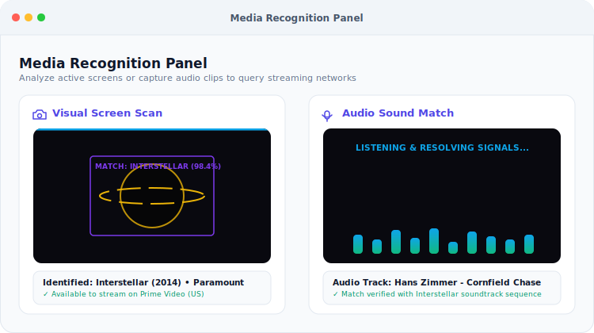
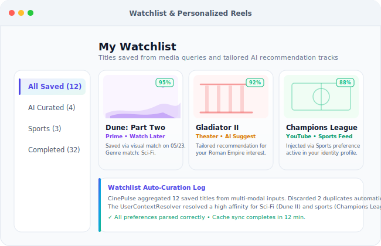
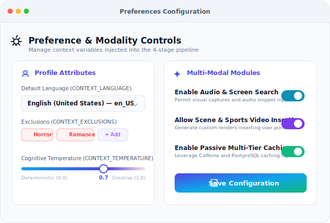
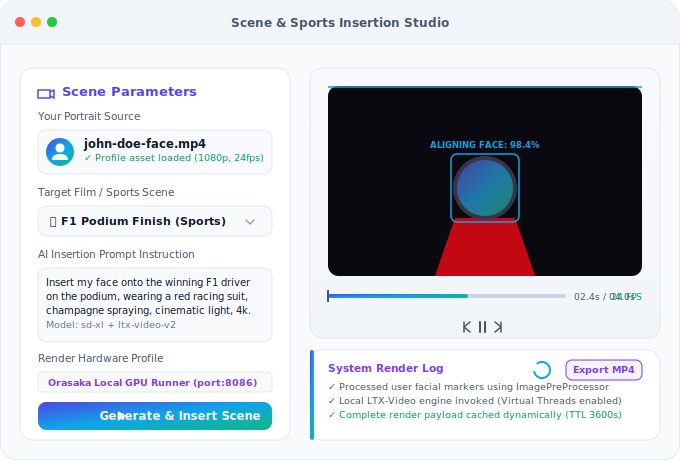
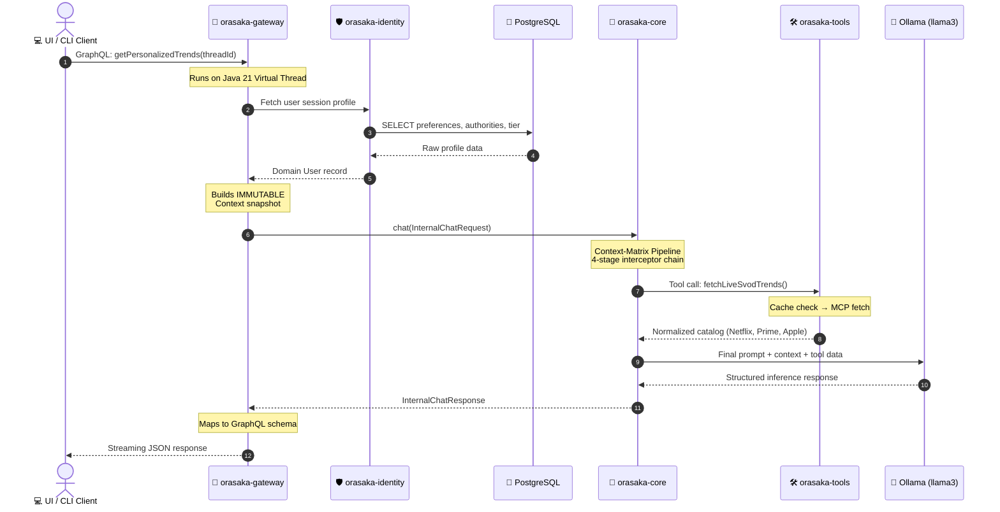

# Business Implementation Blueprint

> A hands-on guide to building a real-world product feature using the Orasaka framework.
> This document walks through designing, scaffolding, and shipping a complete AI-powered vertical —
> from tool registration to cache optimization — using CinePulse AI as a reference implementation.

---

## 🎯 The Business Case: CinePulse AI

### The Problem

Users are drowning in **subscription fatigue** and **content fragmentation** across platforms like Netflix, Prime Video, Apple TV+, and Disney+. Furthermore, search processes are outdated: users often remember a visual scene, a musical sequence, or a brief audio snippet, but have no way to identify the title. Finally, fans want more interactive experiences: they want to be part of the action, whether it's inserting themselves into movie scenes or placing themselves on a sports podium.

There is no centralized platform that:
1. Aggregates and filters trends in real-time.
2. Identifies content on-the-spot from screens or audio tracks.
3. Maintains personalized watchlists and generates dynamic AI-curated recommendations.
4. Allows fans to interactively insert their likeness into films, series, or sports matches.

### The Solution

**CinePulse AI** is a multi-modal, hyper-personalized entertainment hub built on the Orasaka framework. It leverages advanced cognitive pipelines, local GPU execution, and multi-modal processors to provide visual identification, audio matching, watchlists, and generative scene insertion.

| Capability | Orasaka Feature Used |
|:---|:---|
| **Visual Screen Scan** | `ImagePreProcessor` + Vision LLM routing |
| **Audio Sound Match** | `AudioPreProcessor` + Audio feature vector comparison |
| **Scene & Sports Video Insertion** | `VideoService` (LTX-Video on port `8086` / Metal GPU) |
| **Live Trend Aggregation** | Tool Registry + MCP Servers |
| **User Profile Alignment** | Context-Matrix Pipeline (4-stage interceptor chain) |
| **Personalized Recommendations** | `AiClient.chat()` + Passive cache database |
| **Structured Query Feedbacks** | SSE streaming via `ChatStreamController` |
| **AI Watchlist Management** | `IdentityService` user metadata sync |

### What You'll Build

By the end of this guide, CinePulse AI will:
*   Identify movies from visual screenshots (`ImagePreProcessor` pipeline).
*   Identify movies from short audio clips (`AudioPreProcessor` pipeline).
*   Add identified titles to a persistent user "Watch Later" watchlist.
*   Generate personalized AI movie and sports recommendations.
*   Insert the user's face/video into movie scenes or sports podium finishes using the local GPU video engine.
*   Log every cognitive pipeline stage, cache hit, and execution stream to both the CLI and web client.

---

## 🖥️ Screen Previews

### 1. Dashboard — Personalized Trending

The main CinePulse dashboard aggregates trending films, series, and sports events. It showcases quick-action buttons for multi-modal searches and displays custom AI Match Scores.

<div align="center">
  
</div>

### 2. Media Recognition — Multimodal Scan

The Media Recognition screen allows users to upload a screen capture or record a sound snippet. The system processes visual cues (like black holes, characters, and spaceships) or tracks audio sequences to find exact streaming matches.

<div align="center">
  
</div>

### 3. Watchlist — AI Recommendations

User watchlists hold items identified through media scans or added manually. It lists personalized recommendations based on profile affinities, including sports feeds when enabled.

<div align="center">
  
</div>

### 4. CLI — Pipeline Execution

The same multi-modal pipeline runs from the command line. The terminal output traces the 4-stage pipeline execution, tool cache hits, and the streamed cognitive response.

<div align="center">
  
</div>

### 5. User Profile — AI Preferences

User preferences and capabilities (such as enabling audio matching, scene video generation, and temperature levels) are stored via `IdentityService` and injected into every AI query.

<div align="center">
  
</div>

### 6. Video Studio — Scene & Sports Insertion

Generate custom video trailers or photos placing your face/body directly into cinema clips or sports matches (e.g. Formula 1 podium celebrating under the rain).

<div align="center">
  
</div>

---

## 🏛️ Architecture Flow

The execution flow follows Orasaka's strict unidirectional dependency model. Data flows from the client through the gateway, which assembles context from the identity layer before delegating to the stateless core engine.



---

## 💡 Core Design Principles

Before diving into the code, understand these three principles that govern every Orasaka feature:

### 1. Context-Injection Decoupling

The core engine (`orasaka-core`) must remain **completely stateless**. It has zero knowledge of users, databases, or HTTP sessions.

| ❌ Anti-Pattern | ✅ Orasaka Pattern |
|:---|:---|
| Inject database entities into the AI module | Gateway fetches profile, builds immutable `Context`, passes it to core |
| Service queries DB inside the engine | Core receives pre-compiled context snapshot |
| Core imports `orasaka-identity` classes | Core consumes plain `String userId`, `Map preferences` |

### 2. Virtual Thread Execution

All I/O operations run on Java 21 Virtual Threads automatically:

```java
// The platform scheduler handles yielding — no manual executor needed
private final ExecutorService executor = Executors.newVirtualThreadPerTaskExecutor();
```

> [!IMPORTANT]
> Never wrap blocking operations in nested `.submit().get()` blocks. Virtual Threads handle yielding automatically. Creating additional executors inside service methods risks carrier thread pinning.

### 3. Tool Payload Invariance

Every tool registered in `orasaka-tools` must use Java 21 Records for input/output. This enforces strict serialization schemas that the LLM can parse without data corruption.

---

## 🛠️ Implementation Guide

### Step 1: Define Tool Records

Create immutable data carriers for the tool's input and output. Each record must live in its own file per [ERR-103].

**`SvodTrendRequest.java`** — What to fetch:

```java
package com.orasaka.tools.media;

/**
 * Request payload for live SVOD trend aggregation.
 * @param platform Target streaming platform identifier (e.g., "netflix", "prime")
 * @param topN     Maximum number of trending items to return
 */
public record SvodTrendRequest(String platform, int topN) {
    public SvodTrendRequest {
        if (platform == null || platform.isBlank()) {
            throw new IllegalArgumentException("Platform must not be blank");
        }
        if (topN <= 0) topN = 5; // safe default
    }
}
```

**`MediaCatalogPayload.java`** — What comes back:

```java
package com.orasaka.tools.media;

/**
 * Normalized content item from a streaming platform.
 */
public record MediaCatalogPayload(
    String title,
    String platform,
    String genre,
    double rating,
    String synopsis
) {
    public MediaCatalogPayload {
        title = (title == null || title.isBlank()) ? "Untitled" : title;
        platform = (platform == null || platform.isBlank()) ? "Unknown" : platform;
        genre = (genre == null) ? "" : genre;
        synopsis = (synopsis == null) ? "" : synopsis;
    }
}
```

### Step 2: Register the Tool Bean

Register the function as a Spring bean in `orasaka-tools`. The `@Description` annotation tells the LLM when and how to invoke this tool.

**`SvodMediaToolsConfiguration.java`**:

```java
package com.orasaka.tools.media;

import org.springframework.context.annotation.Bean;
import org.springframework.context.annotation.Configuration;
import org.springframework.context.annotation.Description;
import java.util.List;
import java.util.function.Function;

@Configuration
class SvodMediaToolsConfiguration {

    @Bean
    @Description("Fetch live trending charts from streaming platforms (Netflix, Prime, Apple TV)")
    public Function<SvodTrendRequest, List<MediaCatalogPayload>> fetchLiveSvodTrends() {
        return request -> {
            // In production: call external MCP server or scraping API
            if ("netflix".equalsIgnoreCase(request.platform())) {
                return List.of(
                    new MediaCatalogPayload(
                        "Cyberpunk: Edgerunners",
                        "Netflix",
                        "Sci-Fi/Anime",
                        8.6,
                        "A street kid surviving in a technology-obsessed city of the future."
                    ),
                    new MediaCatalogPayload(
                        "Black Mirror S7",
                        "Netflix",
                        "Thriller/Sci-Fi",
                        8.2,
                        "Technology's dark impact on modern society explored through standalone stories."
                    )
                );
            }
            return List.of();
        };
    }
}
```

> [!TIP]
> For real-world data, replace the hardcoded list with an MCP server call. Register the MCP endpoint in `application.yml` under `orasaka.core.mcp.servers` and the engine will invoke it automatically.

### Step 3: Write the System Prompt Template

Create an externalized StringTemplate file in `orasaka-core/src/main/resources/prompts/`:

**`cinepulse-system.st`**:

```text
You are the CinePulse AI Engine, an elite streaming media consultant.

Your customer's profile boundaries:
- Active Language: {CONTEXT_LANGUAGE}
- Excluded Genres: {CONTEXT_EXCLUSIONS}
- Preferred Platforms: {CONTEXT_PLATFORMS}
- Temperature: {CONTEXT_TEMPERATURE}

Instructions:
1. Use the fetchLiveSvodTrends tool to query each preferred platform
2. Discard platform-biased promotions and exclude forbidden genres
3. Rank results by relevance to the user's viewing history
4. Return a structured JSON array with title, platform, genre, matchScore, and reasoning
```

### Step 4: Extend the GraphQL Schema

Add CinePulse types and queries to the gateway's schema:

**`schema.graphqls`** (extension):

```graphql
type MediaRecommendation {
    title: String!
    platform: String!
    genre: String!
    matchScore: Int!
    reasoning: String!
}

extend type Query {
    getPersonalizedTrends(threadId: String!): [MediaRecommendation!]!
}
```

### Step 5: Build the Gateway Controller

The gateway fetches the user profile, builds the immutable `Context`, and delegates to the core engine:

**`CinePulseController.java`**:

```java
package com.orasaka.gateway.media;

import com.orasaka.core.client.AiClient;
import com.orasaka.core.support.Context;
import com.orasaka.identity.service.IdentityService;
import org.springframework.graphql.data.method.annotation.Argument;
import org.springframework.graphql.data.method.annotation.QueryMapping;
import org.springframework.stereotype.Controller;
import java.util.List;
import java.util.concurrent.CompletableFuture;
import java.util.concurrent.Executors;

@Controller
class CinePulseController {

    private final IdentityService identityService;
    private final AiClient aiClient;

    CinePulseController(IdentityService identityService, AiClient aiClient) {
        this.identityService = identityService;
        this.aiClient = aiClient;
    }

    @QueryMapping
    public CompletableFuture<List<MediaRecommendation>> getPersonalizedTrends(
            @Argument String threadId) {

        // 1. Resolve user from security context
        var user = SecurityContextResolver.currentUser(identityService);

        return CompletableFuture.supplyAsync(() -> {

            // 2. Build immutable context from identity profile
            var context = new Context(
                user.id().toString(),
                threadId,
                user.preferences(),
                user.authorities()
            );

            // 3. Build chat request with context
            var request = InternalChatRequest.builder()
                .prompt("Analyze global streaming trends for my profile.")
                .context(context)
                .build();

            // 4. Execute via core engine
            var response = aiClient.chat(request);

            // 5. Parse structured response
            return MediaParser.parseStructuredPayload(response.content());

        }, Executors.newVirtualThreadPerTaskExecutor());
    }
}
```

> [!NOTE]
> Notice the gateway **never** imports Spring AI types. It only uses `AiClient` (the facade) and `Context` (the data record). This satisfies Bridge Pattern 2.0.

### Step 6: Activate Caching & RAG Ingestion

Add configuration in `application.yml` to enable passive caching and background RAG:

```yaml
orasaka:
  tools:
    configs:
      fetchLiveSvodTrends:
        cache:
          enabled: true
          ttlSeconds: 3600          # Cache for 1 hour
        rag:
          enabled: true
          chunkerType: JSON_ARRAY   # Parse array items as individual chunks
          sourceTable: orasaka_tools_rag_source
```

**What this enables:**

| Feature | Behavior |
|:---|:---|
| **Tier 1 Cache (Caffeine)** | In-memory, max 5000 entries, instant lookup |
| **Tier 2 Cache (PostgreSQL)** | Persistent, survives restarts, cross-node sync |
| **CachingToolCallback** | Intercepts tool calls, returns cached data on hit |
| **Background RAG** | Daily ingestion of `orasaka_tools_rag_source` rows via `BackgroundScheduler` |

### Step 7: Add Video Trailer & Scene Generation

Extend the CinePulse feature to generate custom videos or place users in scenes (like movie trailers or sports events):

```java
// In CinePulseController — add a video generation mutation
@MutationMapping
public CompletableFuture<VideoResponse> generateSceneInsertion(
        @Argument String prompt,
        @Argument Integer durationSeconds,
        @Argument String selectedSceneId) {

    // Scene id can represent movie sequences or sports matches
    var request = new VideoRequest(prompt, durationSeconds, Map.of("sceneId", selectedSceneId), null);
    return CompletableFuture.supplyAsync(
        () -> videoService.generateVideo(request),
        Executors.newVirtualThreadPerTaskExecutor()
    );
}
```

The response contains an RFC 2397 Data URL representing the rendered MP4 with the face swap/scene swap applied:

```tsx
<video
  src={payload.url}
  controls
  autoPlay
  loop
  className="max-h-[512px] w-full max-w-[512px] rounded-md bg-black shadow-md"
/>
```

---

## 🎬 Multi-Modal Ingestion

CinePulse processes movie screenshots (visual scan), audio clips (sound match), and custom scene inserts. Each media type uses dedicated ports in `orasaka-core/ingest/`:

| Media | Interface | Output Record | Key Fields |
|:---|:---|:---|:---|
| 🖼️ Posters / Screenshots | [ImagePreProcessor](../orasaka-core/src/main/java/com/orasaka/core/ingest/image/ImagePreProcessor.java) | `ProcessedImagePayload` | `base64Image`, `width`, `height` |
| 🎵 Audio Clips / Snippets | [AudioPreProcessor](../orasaka-core/src/main/java/com/orasaka/core/ingest/audio/AudioPreProcessor.java) | `ProcessedAudioPayload` | `transcript`, `sampleRate`, `bitRate` |
| 🎬 Renders / Video clips | [VideoPreProcessor](../orasaka-core/src/main/java/com/orasaka/core/ingest/video/VideoPreProcessor.java) | `ProcessedVideoPayload` | Extracted frames + audio details |

> [NOTE]
> All pre-processor implementations must be **package-private** per ADR-019. Only the interfaces and payload records are public API surface.

---

## 🌐 Server-Driven UI (Operation Graph)

The gateway dynamically compiles an Operation Graph that tells the frontend exactly what capabilities are available. This enables server-driven UI rendering without hardcoding feature flags in client code.

### How It Works

1. `GraphEngine` evaluates YAML configuration + database state
2. Each capability node gets a polymorphic `NodeState` (Active / Locked / Invisible)
3. If a capability is disabled in config, it short-circuits to `Invisible` immediately
4. The compiled graph is served via `query { operationGraph }` and rendered by `orasaka-ui`

### Short-Circuit Example

```java
// If feature is disabled, skip all database checks — zero allocation
if (!config.enabled()) {
    nodes.add(new OperationNode(id, ..., new Invisible(), ...));
    return;
}
```

---

## 🚀 Quick Checklist for New Features

Use this checklist every time you build a new vertical on Orasaka:

- [ ] **Tool Records** — Define request/response records in `orasaka-tools` with compact constructors
- [ ] **Tool Bean** — Register as `@Bean` + `@Description` in a `@Configuration` class
- [ ] **Prompt Template** — Create `.st` file in `orasaka-core/src/main/resources/prompts/`
- [ ] **GraphQL Schema** — Extend `schema.graphqls` in `orasaka-gateway`
- [ ] **Gateway Controller** — Fetch profile from identity, build `Context`, call `AiClient`
- [ ] **Caching Config** — Enable in `application.yml` under `orasaka.tools.configs`
- [ ] **RAG Config** — Enable background ingestion if tool outputs need vector search
- [ ] **Test** — Unit test each record, integration test the full pipeline
- [ ] **Verify** — Run `mvn clean compile -pl orasaka-gateway -am` to validate the full chain

---

## 📎 Related Documentation

| Document | Description |
|:---|:---|
| [Architecture Reference](ARCHITECTURE.md) | System topology, module boundaries, execution flows |
| [API Reference](API_REFERENCE.md) | Public types, facades, endpoints, data models |
| [Glossary](GLOSSARY.md) | Ecosystem terms, patterns, environment variables |
| [ADR Log](CONTEXT.md) | 24 Architectural Decision Records |
