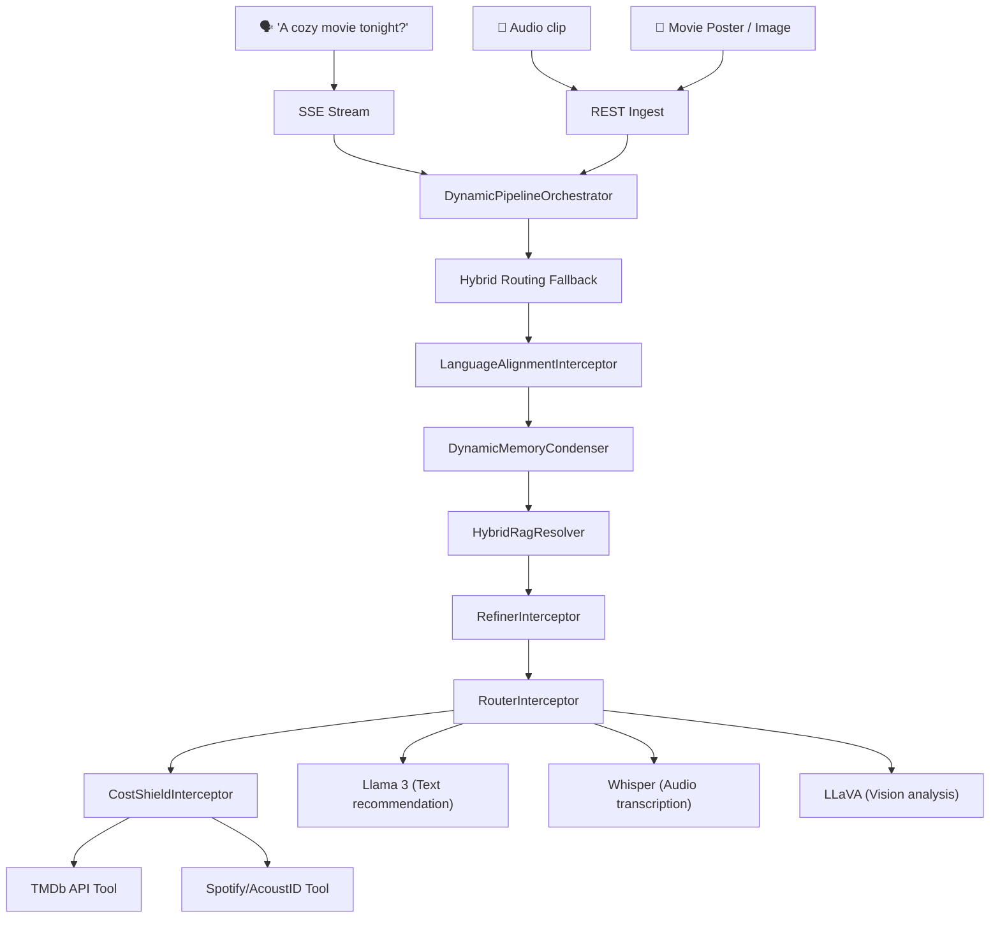

# Orasaka: Business Implementation Playbook

> Developer playbook demonstrating how to build a product (CinePulse) on Orasaka.

---

## 1. CinePulse Product Case Study

CinePulse is a multi-modal entertainment discovery platform:
- **Text Recommendations**: Moody/contextual query recommendations (e.g. "What to watch tonight?").
- **Audio Recognition**: Identifies movie soundtracks using audio fingerprints.
- **Visual Recognition**: Identifies movie screenshots, posters, or scenes.

| Screen | Purpose | Orasaka Pipeline |
| :--- | :--- | :--- |
| **Dashboard** | Recommendation feed | `UserContextResolver` + `HybridRagResolver` |
| **Recognition** | Visual/Audio media matching | `Vision` + `Audio` pre-processor pipeline |
| **Watchlist** | Saved watchlist tracking | JPA persistence (Postgres) |
| **Studio** | Generates teaser video trailers | `VideoEngine` (AnimateDiff-Lightning) |
| **Settings** | Streaming preferences and filter flags | `orasaka-identity` preference profile |

---

## 2. Architecture Mapping



---

## 3. Step-by-Step Implementation

### Step 1: Database Model (`orasaka-persistence/app`)
```java
@Entity
@Table(name = "cinepulse_movies")
public class MovieEntity {
    @Id private Long tmdbId;
    private String title;
    private String originalTitle;
    private String overview;
    private String genres; // JSON list
    private String posterPath;
    private Double imdbRating;
    private LocalDate releaseDate;
    
    @Convert(converter = JsonMapConverter.class)
    private Map<String, Boolean> streamingAvailability;
    
    @Column(columnDefinition = "vector(1536)")
    private float[] embedding; // PGVector embedding
}
```

- **Migration (`V12__cinepulse_movies.sql`)**:
  ```sql
  CREATE TABLE cinepulse_movies (
      tmdb_id BIGINT PRIMARY KEY,
      title VARCHAR(500) NOT NULL,
      overview TEXT,
      genres JSONB NOT NULL DEFAULT '[]',
      poster_path VARCHAR(255),
      imdb_rating DECIMAL(3,1),
      streaming_availability JSONB NOT NULL DEFAULT '{}',
      embedding vector(1536)
  );
  CREATE INDEX idx_movies_genres ON cinepulse_movies USING GIN (genres);
  CREATE INDEX idx_movies_embedding ON cinepulse_movies USING ivfflat (embedding vector_cosine_ops);
  ```

### Step 2: Register Tools (`orasaka-tools`)
```java
@Component
public class TmdbLookupTool {
    @Tool(description = "Search TMDb movies metadata")
    public MovieResult searchMovie(@ToolParam("Title query") String query) { ... }

    @Tool(description = "Check streaming availability across platforms")
    public StreamingResult checkAvailability(@ToolParam("TMDb ID") Long tmdbId, @ToolParam("Country code") String country) { ... }
}
```

### Step 3: Embed Movies Catalog (RAG)
```java
@Service
public class MovieEmbeddingService {
    private final EmbeddingModel embeddingModel;
    private final MovieRepository movieRepository;

    @Transactional
    public void embedMovieCatalog(List<MovieEntity> movies) {
        movies.forEach(movie -> {
            String text = String.format("%s. %s.", movie.getTitle(), movie.getOverview());
            movie.setEmbedding(embeddingModel.embed(text));
        });
        movieRepository.saveAll(movies);
    }
}
```

### Step 4: Controller Mapping (`orasaka-gateway`)
```java
@RestController
@RequestMapping("/api/v1/cinepulse")
public class CinePulseController {
    private final AiClient aiClient;

    @PostMapping("/recommend")
    public Flux<ChatResponse> recommend(@RequestBody RecommendRequest req, @RequestHeader("Authorization") String token) {
        return aiClient.stream(AiRequest.builder()
            .prompt(req.query())
            .context(Context.fromToken(token))
            .tools("tmdb-lookup")
            .build());
    }
}
```

---

## 4. Operational Playbook

### Build Sequence
```bash
# 1. Build identity logic
mvn clean install -pl orasaka-identity

# 2. Compile gateway API with dependencies
mvn clean compile -pl orasaka-gateway -am

# 3. Build CLI executable
npm run build --prefix orasaka-cli

# 4. Install UI dependencies
npm install --prefix orasaka-ui
```

### Start Services
```bash
# Docker databases, Redis & RabbitMQ
docker compose -f infra/docker-compose.yml up -d

# Spin up Ollama
ollama serve &
ollama pull llama3.2:latest
```

### CLI Multi-Modal Usage
```bash
# Authenticate
npx orasaka login user@example.com password123

# Prompt Recommendations
npx orasaka chat "Romantic movie recommendation for tonight"

# Identify Soundtrack Audio
npx orasaka chat --audio "var/soundtrack.mp3" "What movie is this song from?"

# Analyze Movie Poster Image
npx orasaka chat --image "var/poster.png" "Who is the director of this movie?"

# Generate Teaser Video
npx orasaka video "An animated camera flythrough of a futuristic neon city" --duration 4 --output "scratch/teaser.mp4"
```

---

## 5. Environment Reference

| Key | Default | Purpose |
| :--- | :--- | :--- |
| `SPRING_DATASOURCE_URL` | `jdbc:postgresql://localhost:5432/orasaka_db` | Main PostgreSQL database |
| `REDIS_URL` | `redis://localhost:6379` | Cache rate limits & tokens |
| `SPRING_RABBITMQ_HOST` | `localhost` | RabbitMQ event broker |
| `VIDEO_WORKER_PORT` | `8188` | Local Python SVD XT worker probe port |
| `TMDB_API_KEY` | *(required)* | TMDb metadata client |
| `ACOUSTID_API_KEY` | *(required)* | Audio fingerprinting service |
| `NEXTAUTH_SECRET` | *(required)* | BFF cookie encryption |

---

## Related Documentation
- [Developer Onboarding Guide](101.md)
- [Architecture Reference](ARCHITECTURE.md)
- [ADR Indexes Log](CONTEXT.md)
- [Automation & Workers](AUTOMATION.md)
