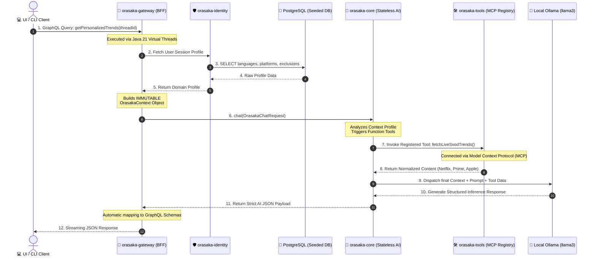

# Orasaka Business Implementation Blueprint

This reference document outlines how to design, scaffold, and implement a commercial business feature vertical inside the Orasaka monorepo architecture. 

To demonstrate the decoupled power of the framework, we will build a real-world startup use case: **CinePulse AI — A Hyper-Personalized, Cross-Platform SVOD Recommendation & Trend Engine**.

---

## 🎯 The Business Use Case: "CinePulse AI"

### The Problem
Users are experiencing "subscription fatigue" and choice paralysis. Content is fragmented across Netflix, Amazon Prime TV, Apple TV, Disney+, and others. No centralized system knows what is trending right now across all platforms while filtering those trends based on a user's unique psychological profile, mood, and historical tastes.

### The Solution with Orasaka
An AI agent infrastructure that:
1. Retrieves active global streaming trends and deep metadata via autonomous MCP (Model Context Protocol) Servers or specialized web-scraping tools.
2. Normalizes & Filters the raw, chaotic payload into structured data.
3. Cross-References the trends against an immutable, secure `OrasakaContext` profile representing the active customer's preferences.
4. Outputs tailored recommendations, categorical micro-trends, and cross-platform dashboards via GraphQL Subscriptions to the frontend UI/CLI.

## 🏛️ Architecture Blueprint & Execution Pipeline

The execution flow complies entirely with Orasaka’s unidirectional dependency and decoupling design principles. The data flows sequentially from the presentation layer down to the core engine, which pulls live external data via the tools layout before resolving context against the identity records.


## 💡 Core Concepts & Best Practices

### 1. Context-Injection Decoupling Mandate
The core architectural directive of Orasaka is that `orasaka-core` must remain **completely stateless and domain-agnostic**. 
* **The Anti-Pattern**: Injecting database entities, transaction managers, or user schemas directly into the AI module.
* **The Orasaka Pattern**: The Core is an isolated processing box. It only knows how to process raw text prompts, register arbitrary function callbacks, and accept an immutable `OrasakaContext`. The Gateway is solely responsible for pulling user preferences from `orasaka-identity` and packing them into the context envelope before hitting the core.

### 2. High-Concurrency Execution via Virtual Threads
All network orchestration tasks (querying the identity database, invoking independent MCP scraping tools, and waiting for slow downstream AI token inferences) are heavily I/O-bound. 
* Always execute gateway controllers using Java 21's `Executors.newVirtualThreadPerTaskExecutor()`. This allows your service vertical to handle thousands of concurrent client interactions without crashing local dev machine memory pools.

### 3. Strict Tool Payload Invariance
Every function tool mapped within `orasaka-tools` to retrieve real-world data must exclusively accept and return Java 21 Records. This enforces strict serialization schemas that the LLM engine can parse during the *Tool Calling* phase without runtime data corruption.

## 🛠️ Step-by-Step Implementation Guide

### Step 1: Tool Definition in orasaka-tools (The Knowledge Aggregators)
We avoid hardcoding third-party scraping logic inside our core processing unit. We declare a custom execution tool leveraging Spring AI's tool call mechanics or an external MCP server connection block to fetch live catalogs.

Create a Java Record to model the raw target payload:

```java
package com.orasaka.tools.media;

public record SvodTrendRequest(String platform, int topN) {}
public record MediaCatalogPayload(String title, String platform, String genre, double rating, String synopsis) {}
```
Register the tool configuration bean inside orasaka-tools:


```java
package com.orasaka.tools.media;

import org.springframework.context.annotation.Bean;
import org.springframework.context.annotation.Configuration;
import org.springframework.context.annotation.Description;
import java.util.List;
import java.util.function.Function;

@Configuration
public class SvodMediaToolsConfiguration {

    @Bean
    @Description("Fetch live trending charts and content data from streaming giants like Netflix, Amazon Prime, and Apple TV")
    public Function<SvodTrendRequest, List<MediaCatalogPayload>> fetchLiveSvodTrends() {
        return request -> {
            if ("netflix".equalsIgnoreCase(request.platform())) {
                return List.of(
                    new MediaCatalogPayload(
                        "Cyberpunk 2077: Edgerunners", 
                        "Netflix", 
                        "Sci-Fi/Anime", 
                        8.6, 
                        "A street kid trying to survive in a technology and body modification-obsessed city of the future."
                    )
                );
            }
            return List.of();
        };
    }
}
```

### Step 2: Prompt Layout & Context Injectors in orasaka-core
The core engine remains completely stateless. It accepts the user prompt along with an immutable OrasakaContext populated by the gateway.

System Prompt Template layout:
```text
You are the CinePulse AI Engine, an elite platform media consultant. 
Your customer is authenticated under the following strict profile boundaries:
- Active Language: {CONTEXT_LANGUAGE}
- Excluded Genres/Triggers: {CONTEXT_EXCLUSIONS}
- Preferred Platforms: {CONTEXT_PLATFORMS}

You must use your streaming analysis tools to query Netflix, Amazon Prime, and Apple TV. 
Extract real-world trending data, discard platform-biased promotions, filter the list according to the user's explicit profile boundaries, and map the final recommendations into the requested JSON structural layout.
```
### Step 3: Gateway Integration & Schema Stitching (orasaka-gateway)

The GraphQL layer acts as the orchestrator. It queries the identity database to fetch the active session profile, packages it into an immutable record, and hands it over to the Core execution client.

Define the GraphQL Schema Extension (schema.graphqls):
```graphql
type MediaRecommendation {
    title: String!
    platform: String!
    genre: String!
    matchScore: Int!
    reasoning: String!
}

extend type Query {
    getPersonalizedTrends(threadId: String!): [MediaRecommendation!]!
}
```
Implement the Resolver (Virtual Threads Mandate):

```java
package com.orasaka.gateway.media;

import com.orasaka.core.client.OrasakaAiClient;
import com.orasaka.core.context.OrasakaContext;
import com.orasaka.core.model.OrasakaChatRequest;
import com.orasaka.core.model.OrasakaChatResponse;
import com.orasaka.gateway.config.OrasakaSecurityFilter;
import com.orasaka.identity.service.IdentityService;
import com.orasaka.identity.domain.User;
import org.springframework.graphql.data.method.annotation.Argument;
import org.springframework.graphql.data.method.annotation.QueryMapping;
import org.springframework.security.core.context.SecurityContextHolder;
import org.springframework.stereotype.Controller;
import java.util.List;
import java.util.concurrent.CompletableFuture;
import java.util.concurrent.ExecutorService;
import java.util.concurrent.Executors;

@Controller
public class CinePulseGraphQLController {

    private final IdentityService identityService;
    private final OrasakaAiClient aiClient;
    private final ExecutorService virtualThreadExecutor;

    public CinePulseGraphQLController(IdentityService identityService, OrasakaAiClient aiClient) {
        this.identityService = identityService;
        this.aiClient = aiClient;
        this.virtualThreadExecutor = Executors.newVirtualThreadPerTaskExecutor();
    }

    private User getCurrentUser() {
        var auth = SecurityContextHolder.getContext().getAuthentication();
        if (auth != null && auth.getPrincipal() instanceof User user) {
            return user;
        }
        return identityService.getUser(OrasakaSecurityFilter.DEV_ADMIN_USER_ID);
    }

    @QueryMapping
    public CompletableFuture<List<MediaRecommendation>> getPersonalizedTrends(@Argument String threadId) {
        User userProfile = getCurrentUser();
        
        return CompletableFuture.supplyAsync(() -> {
            // Build thread-safe context populated from identity profile
            OrasakaContext context = new OrasakaContext(
                userProfile.id().toString(),
                threadId,
                userProfile.preferences(),
                userProfile.authorities()
            );

            // Package as unified Chat Request
            OrasakaChatRequest request = new OrasakaChatRequest(
                "Analyze global matrix trends and cross-reference with my subscription preferences.",
                null,
                null,
                context
            );

            // Execute via Core Engine
            OrasakaChatResponse response = aiClient.chat(request);

            return MediaParser.parseStructuredPayload(response.content());
        }, virtualThreadExecutor);
    }
}
```

### Step 4: Activating Passive Caching & RAG Ingestion

Since CinePulse calls upstream streaming API catalogs which change infrequently throughout the day, we can avoid redundant network traffic and reduce latency by activating Orasaka's generic passive caching and RAG ingestion directly in the configuration.

Add the following configuration to your `application.yml`:

```yaml
orasaka:
  tools:
    configs:
      fetchLiveSvodTrends:
        cache:
          enabled: true
          ttlSeconds: 3600 # Cache results in Caffeine + Postgres for 1 hour
        rag:
          enabled: true
          chunkerType: JSON_ARRAY # Use the custom JSON chunker strategy
          sourceTable: orasaka_tools_rag_source
```

By declaring these configurations:
1. **Dynamic Caching**: When `fetchLiveSvodTrends` is invoked, the AI engine's `CachingToolCallback` decorator intercepts the request, checks the cache key (the input parameters JSON string), and if present, returns the cached result without executing the underlying function.
2. **Background Ingestion**: The `OrasakaBackgroundScheduler` will automatically pick up this tool for ingestion, scanning the `orasaka_tools_rag_source` database table for non-ingested items matching `tool_id = 'fetchLiveSvodTrends'` and parsing them using the JSON array chunker strategy.

---

## 🚀 Key Takeaways for your Next Startup Feature

1. **Keep orasaka-core Pure**: Never pollute the core logic with your business database tables. The core only needs to know how to map raw prompt strings, handle tool outputs, and enforce session memory boundaries.
2. **Leverage MCP Servers**: If you need to add a new data provider (like an Apple TV catalog scraper), build it as a separate mini-node/python script implementing the Model Context Protocol (MCP), register it inside `orasaka-tools`, and the AI will pick it up automatically without rewriting your Java code.
3. **Profile Isolation**: If the user modifies their settings on the frontend (`orasaka-ui`), those updates go straight to `orasaka-identity`. The very next query to the Gateway will automatically pull the updated `OrasakaContext` and alter the AI behavior instantly.
