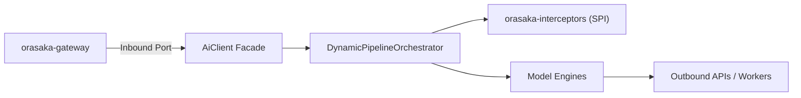
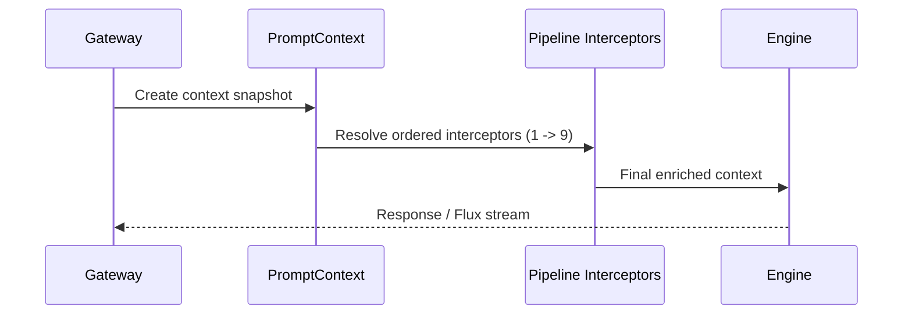
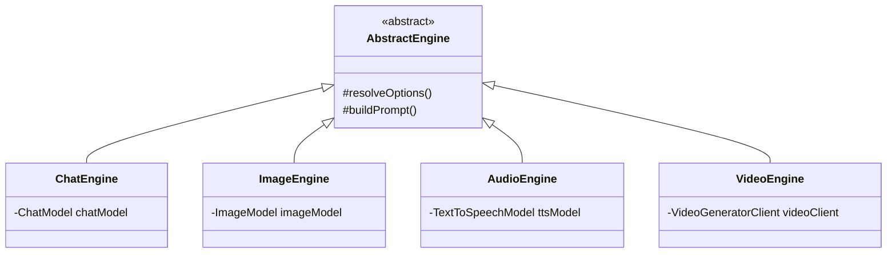

# Orasaka Core Engine: Architecture & Pipeline

> Deep-dive into the `orasaka-core` module — the stateless, Spring AI-powered orchestration library.

---

## 1. Architectural Position

`orasaka-core` is the central orchestration library. It is strictly stateless, web-agnostic, database-agnostic, and security-context-agnostic. It wraps Spring AI (`1.1.6`) under a single entry facade: `AiClient`.



---

## 2. The AiClient Facade & Request Records

All AI operations invoke the unified `AiClient`:
```java
public interface AiClient {
    ChatResponse chat(ChatRequest request);
    Flux<ChatResponse> stream(ChatRequest request);
    AudioResponse audio(AudioRequest request);
    ImageResponse image(ImageRequest request);
    VideoResponse video(VideoRequest request);
}
```

Request payloads are immutable Java `record`s enforcing compact constructor validation boundaries (`ERR-106`, `ERR-116`).

---

## 3. Dynamic Pipeline Orchestrator

The orchestrator executes a sequence of `PromptContextInterceptor` beans. It can be bypassed using:
`orasaka.core.orchestration.enabled=false`.

### Routing Modes (`orasaka.core.orchestration.routing.mode`)
- **DETERMINISTIC**: Database-driven order configured in `pipeline_interceptor_config`.
- **AGENTIC**: LLM-driven runtime intent classification.

### Kill-Switch
If `orasaka.security.disable-ai=true`, any interceptor returning `isAiDependent() == true` raises a `SecurityException`.

### Core Interceptor Chain Blueprint

| Order | Interceptor | Module | AI-Dep | Purpose |
| :---: | :--- | :--- | :---: | :--- |
| 1 | `UserContextResolver` | context | No | RBAC & rate-limiting tier |
| 2 | `SystemContextInjector` | context | No | Hardware status & env tags |
| 3 | `LanguageAlignmentInterceptor` | translation | No | English reasoning enforcement |
| 3 (DB: 3) | `RagInterceptor` | enrichment | No | Vector store retrieval and context injection |
| 4 (DB: 4) | `McpInterceptor` | enrichment | No | External MCP knowledge resolution |
| 5 (DB: 5) | `MemoryInterceptor` | enrichment | No | Conversation history prepend (FIFO window) |
| 6 (DB: 6) | `RefinerInterceptor` | reformulation | Yes | Fuzzy query to precise instruction refinement |
| 7 (DB: 7) | `RouterInterceptor` | reformulation | Yes | Intent to optimal provider routing |
| 8 (DB: 8) | `ToolInterceptor` | tooling | No | Dynamic tool callback attachment |
| 9 (DB: 9) | `MediaInterceptor` | validation | No | Base64 media extraction and multimodal assembly |
| - | `CostShieldInterceptor` | validation | No | Offloads to cloud if host memory > 85% |
| Inf | `QuantumValidationAdvisor` | validation | Yes | 4-tier closed-loop validation |



---

## 4. Engine Topology

Engines map core models to Spring AI integrations:



---

## 5. Outbound Ports & Lifecycle Policies

- **Interface-Driven Boundaries**: Outbound ports (e.g. `ChatGeneratorClient`, `VideoGeneratorClient`) live as public interfaces in `domain.ports.outbound`. Implementations reside in infrastructure packages as package-private beans.
- **Resource Recovery**: Streams and SSE channels must register completion/timeout hooks (`onCompletion`, `.doFinally()`) to dispose subscriptions (`Disposable.dispose()`) and prevent memory leaks.
- **Hikari Database Connection Eviction**:
  ```yaml
  hikari:
    maximum-pool-size: 10
    minimum-idle: 2
    idle-timeout: 30000            # Evict idle connections in 30s
    max-lifetime: 60000            # Recycle before DB timeout
    connection-timeout: 5000       # Fail fast in 5s
  ```

---

## 6. Model Catalog & Chat Configuration

- **Database Model Catalog**: Image, video, and speech models reside in the `orasaka_models` table. Cached via Caffeine TTL.
- **Chat Model Resolution Cascade**:
  1. `ORASAKA_OLLAMA_MODEL` environment variable (highest priority)
  2. `spring.ai.ollama.chat.options.model` YAML value
  3. Auto-detected default (first non-embedding model from Ollama tags catalog)

---

## Related Documentation
- [Developer Onboarding Guide](101.md)
- [Architecture Reference](ARCHITECTURE.md)
- [ADR Index Log](CONTEXT.md)
