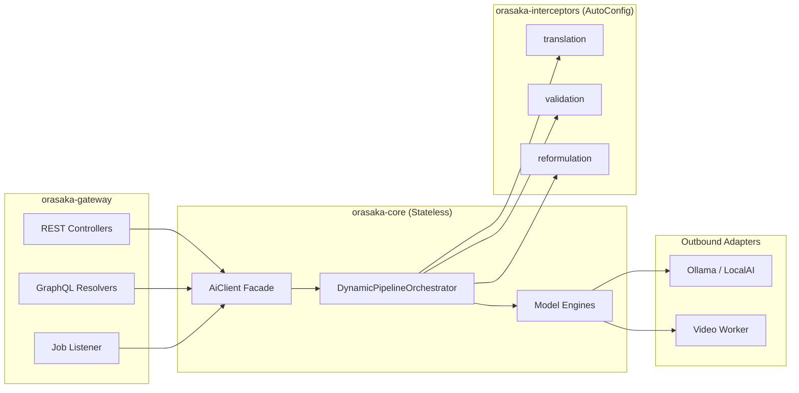
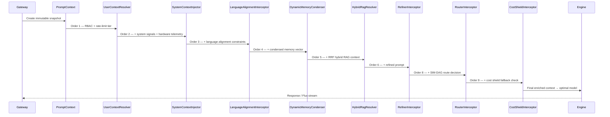
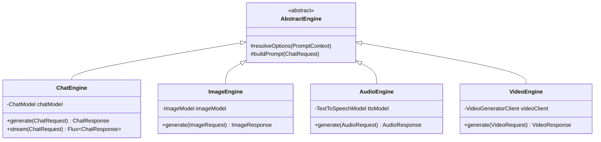

# Orasaka Core Engine: Architecture & Pipeline Specification

> Technical deep-dive into the `orasaka-core` module — the stateless, Spring AI-powered orchestration library that drives all AI capabilities across chat, image, audio, and video modalities.

---

## 1. Architectural Position

`orasaka-core` is the **isolated, standalone orchestration library** at the center of the Orasaka hexagonal architecture. It is 100% agnostic of:

- HTTP protocols, web frameworks, and servlet containers
- User storage, active sessions, and authentication state
- Database connections and persistence layers

It depends strictly on `spring-ai-core` 1.1.6 and exposes a single unified facade: the `AiClient` port.



---

## 2. The AiClient Unified Facade

The `AiClient` interface is the single inbound port exposed to the gateway module. All AI operations flow through this contract:

```java
public interface AiClient {
    ChatResponse chat(ChatRequest request);
    Flux<ChatResponse> stream(ChatRequest request);
    AudioResponse audio(AudioRequest request);
    ImageResponse image(ImageRequest request);
    VideoResponse video(VideoRequest request);
}
```

### Request/Response Domain Records

All request records implement the polymorphic `AiRequest` interface, sharing `prompt()` and `context()` as a common contract:

```java
public interface AiRequest {
    String prompt();   // Common user input
    Context context(); // Execution context (session, preferences)
}
```

Each record adds domain-specific fields:

| Record | Implements | Domain-Specific Fields |
|--------|-----------|----------------------|
| `ChatRequest` | `AiRequest` | `messages` (history), `settings` |
| `ImageRequest` | `AiRequest` | `width`, `height`, `model`, `settings` |
| `AudioRequest` | `AiRequest` | `voice`, `model`, `settings` |
| `VideoRequest` | `AiRequest` | `durationSeconds`, `model`, `jobId`, `inputPath`, `outputPath`, `settings` |

All records are **immutable** with self-validating compact constructors (defensive copies via `Map.copyOf`, `List.copyOf`).

> [!IMPORTANT]
> Spring AI type signatures (`org.springframework.ai.*`) are strictly encapsulated inside `orasaka-core`. They must never leak into gateway controllers, CLI modules, or identity layers.

---

## 3. Context-Matrix Orchestration Pipeline

Before any prompt reaches the AI models, it passes through the `DynamicPipelineOrchestrator` — a runtime engine that resolves an ordered chain of `PromptContextInterceptor` beans. The pipeline can be disabled via `orasaka.core.orchestration.pipeline.enabled=false` for zero-allocation bypass.

### Routing Modes

The orchestrator supports two routing strategies via `orasaka.core.orchestration.routing.mode`:

| Mode | Resolution Strategy |
|:---|:---|
| `DETERMINISTIC` (default) | Database-driven ordering via `PipelineConfigProvider`. Admin-controlled execution sequence. |
| `AGENTIC` | LLM-driven runtime sequence generation based on payload intent analysis. |

### Security Governance Kill-Switch

When `orasaka.security.disable-ai=true`, the orchestrator throws a `SecurityException` for any interceptor returning `isAiDependent() == true`. Non-AI interceptors (user context, memory, tools) continue operating normally.

### Interceptor Modules

Interceptors are extracted into standalone Maven submodules under `orasaka-interceptors/`, loaded dynamically via Spring Boot `AutoConfiguration.imports`:

| Module | Interceptors | Responsibility |
|:---|:---|:---|
| `orasaka-interceptor-translation` | `LanguageAlignmentInterceptor` | Forces LLM reasoning in English, renders output in user's native language |
| `orasaka-interceptor-validation` | `CostShieldInterceptor` | Monitors hardware telemetry, dynamically falls back to cloud APIs |
| `orasaka-interceptor-reformulation` | `RefinerInterceptor`, `RouterInterceptor`, `ReformulationUtils` | Query refinement, intent routing, SIM-DAG decomposition |

### Full Interceptor Chain (2026 Blueprint)

| Order | Interceptor | Module | AI-Dependent |
|:---:|:---|:---|:---:|
| 1 | `UserContextResolver` | core (legacy) | ❌ |
| 2 | `SystemContextInjector` | core (legacy) | ❌ |
| 3 | `LanguageAlignmentInterceptor` | translation | ❌ |
| 4 | `DynamicMemoryCondenser` | reformulation | ❌ |
| 5 | `HybridRagResolver` | reformulation | ❌ |
| 6 | `RefinerInterceptor` | reformulation | ✅ |
| 8 | `RouterInterceptor` | reformulation | ✅ |
| 9 | `CostShieldInterceptor` | validation | ❌ |

> [!IMPORTANT]
> Interceptors 3–5 and 9 are part of the 2026 target architecture. They are defined as interfaces with stub implementations that pass-through context unchanged. Full implementations will be phased in via tracked ADRs.

### Pipeline Flow



### Custom Interceptor Example

```java
@Component
public class PirateInterceptor implements PromptContextInterceptor {

    @Override
    public PromptContext intercept(PromptContext context) {
        context.getMetadata().put("system_prompt", "Always reply like a pirate.");
        return context;
    }

    @Override
    public int getOrder() {
        return 9; // After CostShieldInterceptor
    }
}
```

### Prompt Templates

#### Refinement Template (`prompts/system-refinement.st`)

```text
You are the Refiner Interceptor of the Orasaka core processing engine.
Your task is to rewrite the user's latest message to be explicit, complete, and self-contained,
incorporating relevant facts from the active conversation history and the RRF context matrix.

Conversation History:
{history}

RRF Context Matrix:
{ragContext}

Latest Message:
{message}

Refined Output:
```

#### Routing Template (`prompts/system-router.st`)

```text
You are the Router Interceptor of the Orasaka core routing mesh.
Classify the user intent to select the optimal model category and provider.
For multi-intent tasks, decompose into a sequential SIM-DAG execution graph.

Intent categories:
- IMAGE: if prompt requests image generation, drawing, or painting.
- SPEECH: if prompt requests voice generation or speech synthesis.
- CODE_SANDBOX: if prompt requires python execution or math solving.
- VIDEO: if prompt requests video generation or animation.
- CHAT: general conversational queries.

JSON Output structure:
{
  "intent": "IMAGE" | "SPEECH" | "CODE_SANDBOX" | "VIDEO" | "CHAT",
  "reasoning": "Brief explanation of routing choice",
  "dagSteps": [] // Optional: ordered sub-tasks for multi-intent decomposition
}
```

### End-to-End Pipeline Execution Example

**1. Raw Input**: User sends *"make an illustration of it"* in a thread discussing a "cyberpunk skyline".

**2. Language Alignment** (`LanguageAlignmentInterceptor`): Forces internal reasoning chain to English.

**3. Memory Condensation** (`DynamicMemoryCondenser`): Last 3 turns raw + older turns condensed to session fact vector.

**4. RRF Context** (`HybridRagResolver`): BM25 sparse ∩ PGVector dense → fused context matrix under tenant isolation.

**5. Refinement** (`RefinerInterceptor`):
> *"Generate an illustration of a beautiful neon cyberpunk skyline."*

**6. Routing** (`RouterInterceptor`):
```json
{
  "intent": "IMAGE",
  "reasoning": "User prompt asks to generate an illustration of the cyberpunk skyline discussed in conversation history.",
  "dagSteps": []
}
```

**7. Cost Shield** (`CostShieldInterceptor`): Memory at 42% — local execution approved.

**8. Execution**: Request routed to active Text-to-Image engine (`stable-diffusion-xl`).

**9. SSE Stream** (`POST /api/v1/chat/stream/{conversationId}`):
```text
event: message
data: {"text": "Generating image..."}

event: redirect
data: {"jobId": "550e8400-...", "category": "image"}
```

---

## 4. Engine Architecture

The engine layer resolves AI models natively via Spring AI constructor-injected interfaces:



---

## 5. Outbound Port Interfaces

Cross-module interaction follows the Interface-Driven Boundaries rule. All outbound ports are defined as interfaces in `com.orasaka.core.domain.ports.outbound`:

| Port Interface | Implementation | Location |
|---------------|---------------|----------|
| `ChatGeneratorClient` | `ChatGeneratorClientImpl` | `core.infrastructure.adapter.ai` |
| `ImageGeneratorClient` | `ImageGeneratorClientImpl` | `core.infrastructure.adapter.ai` |
| `AudioGeneratorClient` | `AudioGeneratorClientImpl` | `core.infrastructure.adapter.ai` |
| `VideoGeneratorClient` | `VideoGeneratorClientImpl` | `core.infrastructure.adapter.ai` |
| `FeatureToggleProvider` | `FeatureToggleProviderImpl` | `gateway.infrastructure.config` |

> [!NOTE]
> Concrete implementations must remain **package-private**. They are not part of the module's public API surface.

---

## 6. Resource Management, Backpressure & Anti-Leak Policy

### 6.1 Lifecycle Handshakes

Every HTTP SSE channel, WebSocket session, and reactive `Flux` stream must register an explicit heartbeat timeout and tie its closure to an automated resource-safe hook:

- **SSE Emitters**: `onCompletion`, `onTimeout`, `onError` callbacks must dispose the underlying `Flux` subscription via `Disposable.dispose()`.
- **Reactive Streams**: All `Flux` pipelines must include `.doFinally(signal -> cleanup())` or equivalent lifecycle hooks to guarantee resource release on cancel, error, or complete.
- **`@PreDestroy` Purge**: Services holding emitter registries (e.g., `JobStreamService`) must implement `@PreDestroy` methods that `complete()` and clear all active emitters on shutdown.

> [!CAUTION]
> No SSE or Flux stream may exist without an explicit programmatic `.close()` or lifecycle destruction hook. Orphaned subscriptions cause memory leaks and CPU overhead.

### 6.2 Database Pool Recycling

Database connection channels must enforce aggressive eviction to prevent zombie statement leakage:

```yaml
hikari:
  maximum-pool-size: 10          # dev: 5, prod: 20
  minimum-idle: 2
  idle-timeout: 30000            # 30s — evict idle connections aggressively
  max-lifetime: 60000            # 60s — force recycling before PostgreSQL timeout
  leak-detection-threshold: 10000 # 10s — log warnings for un-returned connections
  connection-timeout: 5000       # 5s — fail fast on exhausted pool
```

### 6.3 Supervisor Task Scope

Job visibility follows a role-based access matrix:

| Role | Query Scope | Dashboard View |
|:---|:---|:---|
| `USER` | Jobs filtered strictly to `userId` | Personal task history only |
| `ADMIN` | Bypasses user filter — queries all platform jobs | Real-time audit view of ALL concurrent tenants |

The `JobController.getJobs()` endpoint enforces this via `user.authorities().contains("ROLE_ADMIN")` gate.

### 6.4 Memory-Aware Execution (CostShieldInterceptor)

During heavy inference (especially video generation), the engine monitors hardware telemetry:

1. **Threshold violation**: Unified memory usage > 85%
2. **Route-swapping**: Lightweight tasks offloaded to user's private encrypted cloud API keys (OpenAI, Anthropic)
3. **Queue throttling**: Heavy media rendering held in non-blocking Virtual Thread queues
4. **Resynchronization**: Local execution resumes when usage drops below 70%

### 6.5 Virtual Thread Mandate

Every blocking action, network invocation, remote model inference, or vector database retrieval executes inside un-pinned Virtual Threads via `Executors.newVirtualThreadPerTaskExecutor()`.

---

## 7. Event-Driven Worker Layer

The core engine decouples from downstream executions via AMQP (RabbitMQ):

| Exchange | Routing Key | Consumer | Purpose |
|----------|-------------|----------|---------|
| `orasaka.jobs.exchange` | `orasaka.jobs.routingKey` | `JobListener` | Dispatch heavy async jobs |
| `orasaka.jobs.exchange` | `orasaka.progress.routingKey` | Gateway SSE | Receive worker progress updates |

### Worker Extension Points

Developers can write specialized workers in any language, subscribe to the queue, and process tasks:

```
[Core Engine] → AMQP → [Python Video Worker]
                     → [Rust Audio Transcoder]  (custom)
                     → [Go Image Optimizer]     (custom)
```

---

## 8. Configuration Namespace

Core configuration uses a **hybrid resolution strategy**: database-driven model catalog for media capabilities, with YAML/env overrides for infrastructure endpoints and the active chat model.

### 8.1 Database-Driven Model Catalog

All image, video, speech, and vision models are stored in the `orasaka_models` table (Flyway V9) and managed via the admin UI (`AdminModelController`). The `CatalogModelManager` service provides cached access with Caffeine TTL.

```sql
-- Table: orasaka_models
-- Columns: id, model_name, model_label, category, options, is_default
-- Categories: 'speech', 'image', 'video', 'vision'
```

Admin can:
- Add/remove models per category
- Set a default model per category (`is_default = true`)
- Configure voice options (speech models)

### 8.2 Chat Model Resolution

The active chat model follows a **priority cascade**:

1. `ORASAKA_OLLAMA_MODEL` environment variable (highest priority)
2. `spring.ai.ollama.chat.options.model` YAML property
3. Auto-detected: first non-embedding model from Ollama `/api/tags` catalog

This is resolved by `OllamaModelCatalogProvider.getActiveChatModel()`.

### 8.3 Infrastructure Configuration (YAML/env)

```yaml
orasaka:
  core:
    orchestration:
      pipeline:
        enabled: true                # Toggle interceptor pipeline on/off
      routing:
        mode: DETERMINISTIC          # DETERMINISTIC (DB-driven) or AGENTIC (LLM-driven)
  security:
    disable-ai: false                # Governance kill-switch — blocks all AI-dependent interceptors
  video-worker:
    url: ${ORASAKA_VIDEO_WORKER_URL:http://localhost:8188}

spring:
  ai:
    ollama:
      base-url: ${ORASAKA_OLLAMA_URL:http://localhost:11434}
      chat:
        options:
          model: ${ORASAKA_OLLAMA_MODEL:}  # Fallback if env not set
```

> [!NOTE]
> The `orasaka.core.models.chat/image/video` namespace shown in older documentation is **deprecated**. Image/video/speech models are now resolved from the database catalog. The chat model uses the Spring AI / env var cascade above.

---

## Related Documentation

| Document | Description |
|----------|-------------|
| [Developer Guide 101](101.md) | Developer onboarding & core concepts |
| [Architecture Reference](ARCHITECTURE.md) | System topology & module boundaries |
| [API Reference](API_REFERENCE.md) | Public types, facades & endpoint specs |
| [ADR Log](CONTEXT.md) | 31 Architectural Decision Records |
