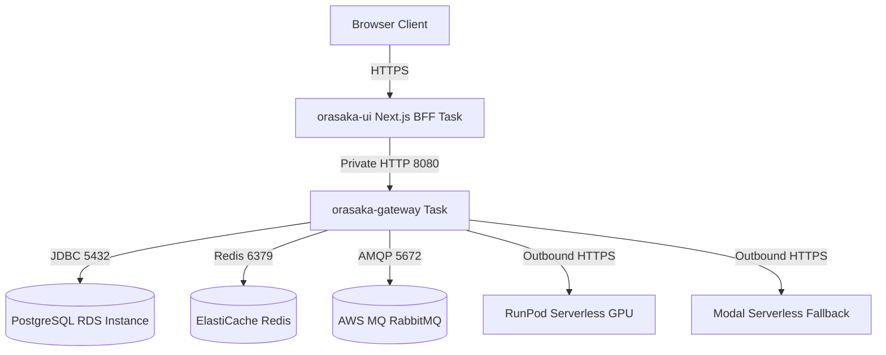

# Production Deployment Guide (IaC)

> Production-grade Infrastructure-as-Code (IaC) deployment for the Orasaka monorepo on AWS, RunPod, and Modal.

---

## 1. Infrastructure Topology

GPU-intensive workloads (video and image generation) run on serverless GPU providers (RunPod and Modal) to scale to zero, while core databases and BFF orchestration containers reside in a secure AWS VPC.



### Provisioning Sequence
1. **GPU Serverless Compute**: Deploy RunPod dockerized templates and Modal app runtimes to fetch routing URLs.
2. **Network & Middleware (AWS)**: Spin up VPC, Subnets, NAT Gateways, RDS instance, Redis ElastiCache replication groups, and RabbitMQ brokers.
3. **Application Tasks (AWS ECS)**: Deploy ECS Fargate tasks for `orasaka-gateway` and `orasaka-ui`, injecting middleware endpoints and API tokens.

---

## 2. Directory Layout (`infra/`)

- `brokers-infra/`: Production tuning configs (PostgreSQL parameter limits, RabbitMQ bounds).
- `compute-nodes/`: Dockerfiles for RunPod templates (`Dockerfile.worker`) and Modal endpoints (`modal_app.py`).
- `web-backend/` / `web-frontend/`: Task wrappers for ECS deployment.
- `terraform/`: Configuration files:
  - `main.tf`: Dependencies and module mappings.
  - `variables.tf` / `outputs.tf`: Variable constraints.
  - `modules/`: Submodules for `aws-vpc`, `aws-brokers`, `aws-compute-ecs`, `compute-runpod`, `compute-modal`.

---

## 3. Remote State Locking & Setup

Terraform state is stored in an S3 bucket with locking managed via a DynamoDB table.

```hcl
terraform {
  backend "s3" {
    bucket         = "orasaka-terraform-state-prod"
    key            = "orasaka/prod/terraform.tfstate"
    region         = "us-east-1"
    dynamodb_table = "orasaka-tf-state-lock"
    encrypt        = true
  }
}
```

### Build Commands
```bash
cd infra/terraform
terraform init
terraform plan -out=prod.tfplan
terraform apply prod.tfplan
```

---

## 4. Port Ingress Rules

| Source | Target | Port | Protocol | Purpose |
| :--- | :--- | :--- | :--- | :--- |
| Public | ALB | `443` | TCP | Public Frontend Ingress |
| ALB | Next.js BFF | `3000` | TCP | UI container port |
| Next.js BFF | Java Gateway | `8080` | TCP | BFF internal proxy target |
| Java Gateway | PostgreSQL | `5432` | TCP | Database access |
| Java Gateway | Redis | `6379` | TCP | Rate limits & sessions |
| Java Gateway | RabbitMQ | `5672` | TCP | Async job queue |

---

## 5. GPU Serverless Providers

### RunPod Serverless (`compute-runpod`)
- Handles text-to-video (SVD XT) and stable-diffusion.
- Configured with `min_replicas = 0` to scale down to zero when idle.
- Ingestion endpoint: `https://api.runpod.ai/v2/<endpoint-id>/run`.

### Modal Serverless (`compute-modal`)
- Fallback compute layer for LLM (Llama / Phi-3) and TTS inference.
- Run files compiled via `modal_app.py`. Authenticate with `MODAL_TOKEN_ID` and `MODAL_TOKEN_SECRET`.

---

## 6. Inference Fallback Routing

If the primary GPU worker (e.g. RunPod / Stable Video Diffusion node on port 8188) fails with connection timeouts, the backend `VideoGeneratorClientImpl` triggers a fallback to the LocalAI image generation engine to produce a static animation frame.

- Fallback Target: LocalAI base-url on port 8085 (invoking `/v1/images/generations`).
- Configuration:
  ```yaml
  spring:
    ai:
      localai:
        base-url: ${SPRING_AI_LOCALAI_BASE_URL:http://localhost:8085}
  ```

---

## 7. ECS Tasks Tuning & Secrets

- **Hikari Connection Tuning**:
  - `maximum-pool-size: 50`
  - `minimum-idle: 10`
  - `leak-detection-threshold: 2000`
- **Secrets Manager**: ECS task definitions load secrets dynamically (no raw values in task templates).
- **Probes**:
  - Liveness: `/actuator/health/liveness`
  - Readiness: `/actuator/health/readiness` (verifies PostgreSQL, Redis, RabbitMQ connectivity).
