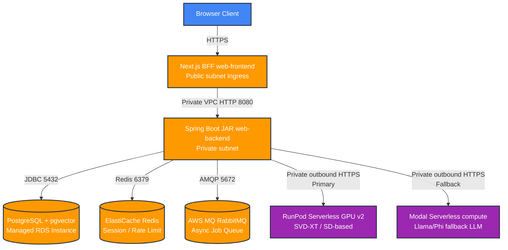

# 🥷 Orasaka Infrastructure Deployment Guide (IaC)

This document serves as the single source of truth for the production deployment of the Orasaka monorepo application. It covers our unified Infrastructure-as-Code (IaC) deployment model powered by Terraform, orchestrating AWS, RunPod, and Modal simultaneously.

---

## 🏛️ 1. Infrastructure Architecture Overview

Orasaka's production deployment isolates high-traffic, specialized GPU workloads (video and image generation) on serverless providers while keeping user sessions, auth context, orchestration pipelines, and relational database state secured inside a private AWS Virtual Private Cloud (VPC).



### Multi-Provider Orchestration Sequencing
To ensure seamless resource links and dependency propagation, Terraform executes deployment steps in a strict linear sequence:
1. **Compute Nodes Provisioning**: Deploy RunPod serverless templates and Modal apps to fetch endpoint URLs.
2. **Network and Shared Brokers Provisioning**: Spin up the AWS VPC, Private Subnets, Route Tables, NAT Gateways, PostgreSQL RDS instance, Redis ElastiCache replication group, and RabbitMQ broker.
3. **Application Stack Deployment**: Deploy AWS ECS Fargate Task Definitions for the Java Backend and Next.js Frontend. Terraform automatically injects the PostgreSQL database credentials and RunPod/Modal serverless endpoint URLs directly into the Fargate container task environment variables.

---

## 📂 2. Directory Structure Layout

The IaC structures are centralized within `ops/deploy/`:

```
ops/deploy/
├── brokers-infra/          # Production broker tuning configs
│   ├── pg-tuning.conf      # PostgreSQL parameter tuning for pgvector workloads
│   └── rabbitmq.conf       # RabbitMQ production queue and memory settings
├── compute-nodes/          # GPU inference worker definitions
│   ├── Dockerfile.worker   # RunPod-optimized worker container image
│   ├── modal_app.py        # Modal serverless app entry point
│   └── runpod.toml         # RunPod serverless template configuration
├── web-backend/            # Java backend Dockerfile (ECS Fargate)
├── web-frontend/           # Next.js BFF Dockerfile (ECS Fargate)
└── terraform/              # Infrastructure-as-Code orchestration
    ├── providers.tf        # Provider configuration (AWS, RunPod, Modal) & S3 Backend
    ├── variables.tf        # Global variables (CIDRs, keys, image tags, credentials)
    ├── outputs.tf          # DNS targets, database endpoints, GPU worker URLs
    ├── main.tf             # Orchestration pipeline and module dependencies
    └── modules/
        ├── aws-vpc/        # Network setup: subnets, NAT Gateways, Security Groups
        ├── aws-brokers/    # Managed stateful layers: RDS, ElastiCache, RabbitMQ
        ├── aws-compute-ecs/# ECS clusters, Fargate task configs, Ingress
        ├── compute-runpod/ # RunPod Serverless template configuration
        └── compute-modal/  # Modal serverless app endpoint configuration
```

---

## 🔑 3. Prerequisites & Authentication Configuration

### Required CLI Tools
Ensure the following binaries are installed locally or on your CI/CD worker:
- **Terraform** (`>= 1.5.0`)
- **AWS CLI** (`>= 2.x`)
- **RunPod CLI** / Account access
- **Modal CLI** (`pip install modal`)

### Authentication Configuration
The Terraform configuration reads provider credentials from environment variables. Export them before executing deployment commands:

```bash
# AWS CLI Credentials
export AWS_ACCESS_KEY_ID="your-aws-access-key-id"
export AWS_SECRET_ACCESS_KEY="your-aws-secret-access-key"
export AWS_DEFAULT_REGION="us-east-1"

# RunPod Credentials
export RUNPOD_API_KEY="your-runpod-api-key"

# Modal Credentials
export MODAL_TOKEN_ID="your-modal-token-id"
export MODAL_TOKEN_SECRET="your-modal-token-secret"
```

---

## 💾 4. Terraform State Storage (Production-Grade State Locking)

To prevent resource state corruption and support multi-user operations safely, local state storage is disabled. State files are stored remotely in an AWS S3 bucket with execution locking managed through a DynamoDB table.

### Bootstrapping State Resources
Ensure the target S3 Bucket and DynamoDB table exist before running deployment tasks. Create them via AWS CLI if necessary:

```bash
# Create the S3 Bucket for Terraform State
aws s3api create-bucket --bucket orasaka-terraform-state-prod --region us-east-1

# Enable Versioning on the Bucket
aws s3api put-bucket-versioning --bucket orasaka-terraform-state-prod --versioning-configuration Status=Enabled

# Create the DynamoDB Table for State Locking
aws dynamodb create-table \
    --table-name orasaka-tf-state-lock \
    --attribute-definitions AttributeName=LockID,AttributeType=S \
    --key-schema AttributeName=LockID,KeyType=HASH \
    --provisioned-throughput ReadCapacityUnits=5,WriteCapacityUnits=5
```

The remote state configuration is locked inside `providers.tf`:

```hcl
terraform {
  backend "s3" {
    bucket         = "orasaka-terraform-state-prod"
    key            = "orasaka/prod/terraform.tfstate"
    region         = "us-east-1"
    dynamodb_table = "orasaka-tf-state-lock"
    encrypt        = true
  }
}
```

### Execution Lifecycles
```bash
cd ops/deploy/terraform

# Initialize backend, modules, and providers
terraform init

# Validate configuration format and variables
terraform fmt -check
terraform validate

# Review the execution plan
terraform plan -out=prod.tfplan

# Apply the deployment to production
terraform apply prod.tfplan
```

---

## 🛡️ 5. Network Shielding & Security Topology (`aws-vpc`)

The networking module (`modules/aws-vpc`) builds an isolated network framework to protect stateful layers from the public internet.

- **Public Subnets**: Host the Application Load Balancers (ALBs) facing the internet and NAT Gateways.
- **Private Subnets**: Host ECS Fargate containers for the Java Backend and Next.js BFF.
- **Stateful Subnets**: Tightly restricted subnets hosting PostgreSQL, Redis, and RabbitMQ.
- **NAT Gateways**: Allow Fargate backend tasks to safely invoke outbound GPU endpoints (RunPod/Modal API endpoints) without exposing private IPs to inbound public traffic.

### Ingress Port Security Group Rules
| Source | Target | Port | Protocol | Purpose |
| :--- | :--- | :--- | :--- | :--- |
| Any (Public) | ALB | `443` | TCP | HTTPS Ingress to Frontend |
| ALB | Next.js BFF | `3000` | TCP | Frontend proxy target |
| Next.js BFF | Java Backend | `8080` | TCP | BFF internal API proxy |
| Java Backend | PostgreSQL RDS | `5432` | TCP | JDBC database writes/reads |
| Java Backend | Redis | `6379` | TCP | Session state & Rate limiting |
| Java Backend | RabbitMQ | `5672` / `15672` | TCP | AMQP Async task queuing |

---

## 🗄️ 6. Shared Broker Services Configuration (`aws-brokers`)

### PostgreSQL + pgvector
Provisioned via Amazon RDS with the `pgvector` extension enabled.
- **Auto-Migrations**: Handled fully at Java runtime startup via Flyway migrations (`classpath:db/migration`). Hibernate DDL generation or manual SQL commands are disabled.
- **Tuning Parameters**:
  - `shared_buffers`: Set to `25%` of instance RAM.
  - `effective_cache_size`: Set to `75%` of instance RAM.
  - `work_mem`: Increased to support vector indexes (`ivfflat` or `hnsw` indexes for vector similarity checks).

### ElastiCache Redis
Used as a multi-tier session store and rate-limiting bucket registry.
- Provisioned as a replication group with failover across availability zones.

### AWS MQ RabbitMQ
Used as an asynchronous job queue for heavy generation workloads (SVD XT Video generation).
- Encrypted at rest via KMS and mapped privately to Java Task queues.

---

## 🎬 7. GPU Inference Endpoints Configuration

Orasaka bypasses running deep-learning models in the JVM by proxying inference workloads through a multi-cloud serverless topology. This ensures our AWS infrastructure remains highly optimized for I/O and orchestration, while GPU compute scales to zero on third-party clouds.

### 7.1 RunPod Serverless GPU (`compute-runpod`)
RunPod handles high-intensity media tasks (Text-to-Video SVD XT video rendering, Stable Diffusion Image generation).

- **Explicit Provisioning**: The `compute-runpod` Terraform module explicitly provisions serverless endpoints. It references the custom worker image located at `ops/deploy/compute-nodes/Dockerfile.worker`, ensuring the environment is perfectly tailored for our inference tasks.
- **Concurrency & Limits**: Terraform defines strict network concurrency limits (`workers_max` and `workers_min`) mapped to your API tier. Setting `min_replicas = 0` controls standby costs, scaling instantly to GPU instances (RTX 4090 / A100) on demand.
- **Network Policies**: Inbound traffic is secured. API payloads must carry authenticated context.
- **Inbound Trigger**: `https://api.runpod.ai/v2/<endpoint-id>/run`

**Troubleshooting RunPod:**
- *Cold Starts*: If scaling from zero takes > 15s, check your container image size. Ensure `Dockerfile.worker` is optimized.
- *API Errors*: Verify `RUNPOD_API_KEY` is loaded correctly into the ECS task definitions via AWS Secrets Manager.

### 7.2 Modal Serverless Compute (`compute-modal`)
Modal handles conversational LLMs (Llama 3.1, Phi-3) and acts as an instant-boot fallback compute layer.

- **Lifecycle & Deployment**: The `compute-modal` Terraform configuration orchestrates the deployment of the Modal Python runtime framework (`ops/deploy/compute-nodes/modal_app.py`). This script registers the inference hooks and caches model weights.
- **Secrets Management**: Secrets (like Hugging Face tokens or internal routing keys) are securely exposed to Modal containers using Modal Secrets (`modal.Secret.from_name(...)`), which are managed during deployment.
- **Auto-Scaling Thresholds**: The configuration sets concurrent limits, idle timeouts, and maximum container counts to prevent runway costs during traffic spikes.
- **Execution Hook**: Configured with fast cold-start container caches via `modal_app.py`.

**Troubleshooting Modal:**
- *Authentication*: Ensure `MODAL_TOKEN_ID` and `MODAL_TOKEN_SECRET` are correctly configured in your CI/CD runner prior to deployment.
- *Memory Limits*: If the model fails to load, verify the `gpu="..."` and memory parameters within `modal_app.py` match your target model size.

---

## ⚡ 8. Inference Fallback Routing

To guarantee high availability and SLA compliance, the Java backend incorporates a sophisticated **Circuit-Breaker and Inference Fallback Topology**.

The `AbstractEngine` in the Java backend acts as the core orchestrator. When an inference request is dispatched, it attempts the primary API call to the RunPod GPU Endpoint. If RunPod experiences a cold-start timeout, an HTTP `504` Gateway Timeout, or a rate limit exception, the orchestrator instantly breaks the circuit and routes the task to the Modal Serverless App.

### Architectural Routing Flow

```text
[ECS Fargate Core] ──(Try Primary API Call)──► [RunPod GPU Endpoint]
       │
       └──(On Timeout / Cold Start Fallback)──► [Modal Serverless App]
```

### Spring Boot Configuration Template
This dynamic fallback mechanism is strictly parameterized within `ai-models.yml`:
```yaml
orasaka:
  ai:
    video-worker:
      primary-url: ${CLOUD_LOAD_BALANCER_URL:https://api.runpod.ai/v2/...}
      fallback-url: ${MODAL_LOAD_BALANCER_URL:https://<workspace>--<app>.modal.run}
      connection-timeout-sec: 15
```

---

## 🚢 9. Application Deployments on ECS Fargate (`aws-compute-ecs`)

### Java 21 Spring Boot Monolith
The Java backend operates on Virtual Threads (`newVirtualThreadPerTaskExecutor`) to handle heavy concurrent I/O.
- **HikariCP Connection Pool Tuning**: Virtual threads can execute database calls rapidly, potentially starving connection pools. HikariCP settings must be tuned:
  - `maximum-pool-size`: Set to `50` or higher based on database instance capacity.
  - `minimum-idle`: `10`
  - `leak-detection-threshold`: `2000` (detects thread leaks early).
- **Actuator Health Probes**:
  - Liveness probe: `/actuator/health/liveness` (checks memory, container status).
  - Readiness probe: `/actuator/health/readiness` (checks connection to PostgreSQL, Redis, and RabbitMQ before routing traffic).

### Next.js BFF Standalone BFF
- Built via multi-stage Node execution outputting to `.next/standalone`.
- **BFF Environment variables**:
  - `GATEWAY_URL`: Configured to the internal ALB target (`http://orasaka-backend.local:8080`).
  - `NEXTAUTH_URL`: The public-facing HTTPS domain (e.g. `https://app.orasaka.io`).

---

## 🤖 10. Secrets, Security & Network Shielding

- **Zero Hardcoded Secrets**: Container task definitions load credentials dynamically from AWS Secrets Manager.
- **Outbound Encryption**: All database and broker traffic is forced over SSL (`sslmode=require` for JDBC, TLS enabled on Redis and MQ).
- **Static Analysis Gate**: The backend builds run under ArchUnit checks to verify mapper boundary constraints and package-private encapsulations.
