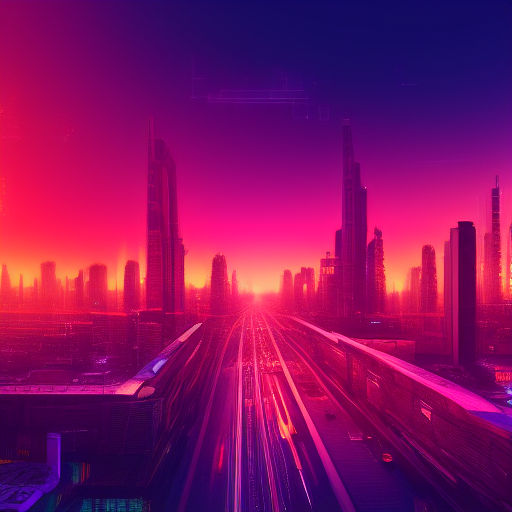

# 🤖 Seeded & Tested AI Models in Orasaka

Orasaka is designed with model-agnostic ports and adapters. Below is the comprehensive documentation of pre-seeded and tested models across all modalities, including their exact REST/GraphQL API inputs/outputs, CLI commands, dynamic UI accents, and the internal Cognitive Context-Matrix Pipeline execution flow.

---

## 🎙️ 1. Speech (Text-to-Speech)

Speech models convert textual prompts into raw synthesized audio. Requests are routed dynamically based on active catalog defaults.

| Model Name | Model Label | Category | Voice / Option Selections |
| :--- | :--- | :--- | :--- |
| `piper-en-low` | Piper Low (en) | Speech | `Ryan`, `Low` |
| `piper-en-medium-ryan` | Piper Ryan (en) | Speech | `Ryan`, `Medium` |
| `piper-fr-medium` | Piper Medium (fr) | Speech | `Medium`, `Fr` |
| `tts-1` | OpenAI TTS-1 | Speech | `Alloy`, `Echo`, `Fable`, `Onyx`, `Nova`, `Shimmer` |

### Input / Output Payload Schema

*   **REST Ingress Point**: `POST /api/v1/chat/speech`
*   **Request JSON Payload**:
    ```json
    {
      "model": "piper-en-medium-ryan",
      "text": "Hello, this is a local speech synthesis verification test running on macOS bare-metal.",
      "voice": "Ryan"
    }
    ```
*   **Response Output**: `{"jobId": "UUID-string", "status": "PENDING"}` (Returns HTTP 202 Accepted)
*   **Resulting Asset**: Standard `audio/wav` or `audio/mpeg` stored under `var/orasaka-uploads/{userId}/{jobId}/output/speech.wav`.
*   **CLI Trigger Command**:
    ```bash
    orasaka-cli chat --speech "Hello from Orasaka" --save output.wav
    ```

---

## 🎨 2. Image (Text-to-Image)

Image models generate static visuals (cybernetic interfaces, blueprints, visual graphics) from text.

| Model Name | Model Label | Category | Rationale / Target |
| :--- | :--- | :--- | :--- |
| `sdxl-turbo-gguf` | SDXL Turbo (GGUF) | Image | Optimized for fast local CPU/GPU execution. |
| `sd-1.5-apple-coreml` | SD 1.5 (Apple CoreML) | Image | Native CoreML execution on Apple Silicon. |
| `stable-diffusion-xl` | Stable Diffusion XL | Image | High-fidelity SDXL generation. |

### Input / Output Payload Schema

*   **REST Ingress Point**: `POST /api/v1/chat/image`
*   **Request JSON Payload**:
    ```json
    {
      "prompt": "A beautiful neon cyberpunk skyline",
      "model": "stable-diffusion-xl"
    }
    ```
*   **Response Output**: `{"jobId": "UUID-string", "status": "PENDING"}` (Returns HTTP 202 Accepted)
*   **Resulting Asset**: Standard `image/png` stored under `var/orasaka-uploads/{userId}/{jobId}/output/image.png`.
*   **CLI Trigger Command**:
    ```bash
    orasaka-cli chat --gen-image "A beautiful neon cyberpunk skyline" --save skyline.png
    ```

---

## 🎬 3. Video (Text-to-Video)

Video models execute intensive, asynchronous rendering workflows. Jobs are processed using a Python worker (`orasaka-video-worker`) connecting to the shared RabbitMQ broker.

| Model Name | Model Label | Category | Target / Engine |
| :--- | :--- | :--- | :--- |
| `stable-video-diffusion-img2vid-xt` | Stable Video Diffusion XT | Video | Primary tested model on macOS Metal/MPS pipeline. |
| `animatediff-lightning-mps` | AnimateDiff Lightning (MPS) | Video | Dynamic generation using AnimateDiff on MPS. |
| `apple-coreml-video-pipeline` | Apple CoreML Video Pipeline | Video | Native Metal execution via CoreML wrappers. |

### Input / Output Payload Schema

*   **REST Ingress Point**: `POST /api/v1/ai/video`
*   **Request JSON Payload**:
    ```json
    {
      "prompt": "A cinematic shot of cyberpunk streets, neon lighting, heavy rain",
      "image": "550e8400-e29b-41d4-a716-446655440002",
      "model": "stable-video-diffusion-img2vid-xt",
      "durationSeconds": 4
    }
    ```
*   **Response Output**: `{"jobId": "UUID-string", "status": "PENDING"}` (Returns HTTP 202 Accepted)
*   **Resulting Asset**: An MP4 video file stored under `var/orasaka-uploads/{userId}/{jobId}/output/video.mp4`.
*   **CLI Trigger Command**:
    ```bash
    orasaka-cli video "A cinematic shot of cyberpunk streets" --save output.mp4
    ```

---

## 👁️ 4. Vision (Multimodal Ingestion)

Vision models process multimodal tasks such as poster analysis and visual element tagging.

| Model Name | Model Label | Category | Ingestion Execution |
| :--- | :--- | :--- | :--- |
| `llama3.2-vision:latest` | Llama 3.2 Vision (latest) | Vision | Tested on macOS Metal/MPS host (Ollama vision model). |
| `llava:latest` | LLaVA (latest) | Vision | Fallback Ollama vision model. |
| `llava:v1.6` | LLaVA (v1.6) | Vision | High-resolution LLaVA model. |
| `bakllava:latest` | BakLLaVA (latest) | Vision | Backup Ollama multimodal vision model. |

### Input / Output Payload Schema

*   **REST Ingress Point**: `POST /api/v1/media/analyze-image`
*   **Request JSON Payload**:
    ```json
    {
      "model": "llama3.2-vision:latest",
      "prompt": "Identify elements in this poster",
      "assetId": "550e8400-e29b-41d4-a716-446655440002"
    }
    ```
*   **Response Output**: `{"jobId": "UUID-string", "status": "PENDING"}` (Returns HTTP 202 Accepted)
*   **Resulting Analysis**: Plaintext analysis response stored in the job's result field:
    ```json
    {
      "analysis": "This image shows a high-tech console with a glowing orange theme, displaying system diagnostics and charts in a sleek dark theme."
    }
    ```
*   **CLI Trigger Command**:
    ```bash
    orasaka-cli chat --image "/path/to/poster.jpg"
    ```

---

## 📝 5. Audio (Speech-to-Text / Transcriptions)

Audio transcriptions are processed via Whisper models. The gateway preprocessor extracts the audio file, feeds it to the Whisper engine, and writes the transcription.

| Model Name | Model Label | Category | Target / Engine |
| :--- | :--- | :--- | :--- |
| `whisper-1` | Whisper (OpenAI/Local) | Audio | Default speech-to-text transcriber. |

### Input / Output Payload Schema

*   **REST Ingress Point**: `POST /api/v1/media/analyze-audio`
*   **Request JSON Payload**:
    ```json
    {
      "assetId": "550e8400-e29b-41d4-a716-446655440003",
      "threadId": "550e8400-e29b-41d4-a716-446655440004"
    }
    ```
*   **Response Output**: `{"jobId": "UUID-string", "status": "PENDING"}` (Returns HTTP 202 Accepted)
*   **Resulting Transcription**: Plaintext transcription result:
    ```json
    {
      "transcript": "Hello, this is a local speech synthesis verification test running on macOS bare-metal."
    }
    ```
*   **CLI Trigger Command**:
    ```bash
    orasaka-cli chat --audio "/path/to/recording.wav"
    ```


## 🎬 Verified Local Execution Media

To ensure transparency and verify that local model outputs are completely uncorrupted, the following assets represent real execution cycles captured on the Apple Silicon M1 node:

### 🖼️ Image Generation Output Blueprint
Below is the verified image blueprint output from Stable Diffusion 1.5:

> [!TIP]
> **Curious how this was generated?** Read the detailed [**Generation Prompt & Context**](assets/orasaka/output/image/sd-1.5/stable-diffusion-cpp/prompt.md) (`prompt.md`) which logs the exact LLM orchestrator reasoning, parameters, seed, and the telemetry captured during the macOS Metal inference run!



### 📹 Cinematic Video Sequence
Watch the hardware-accelerated cinematic video sequence generated on the local Apple Silicon pipeline using AnimateDiff-Lightning:

> [!TIP]
> **Production Transparency:** Orasaka logs the full context of every media generation. Read the [**Video Pipeline Prompt & Execution Logs**](assets/orasaka/output/video/animatediff-lightning/diffusers-pytorch/prompt.md) (`prompt.md`) to see how the orchestrator instructed the Python worker and the actual MPS render times achieved.

<div align="center">
  <video src="https://github.com/user-attachments/assets/4a643384-358b-4b6d-b02f-1a4c037bbc0b" autoplay loop muted playsinline controls width="100%" style="max-width: 600px;"></video>
</div>
